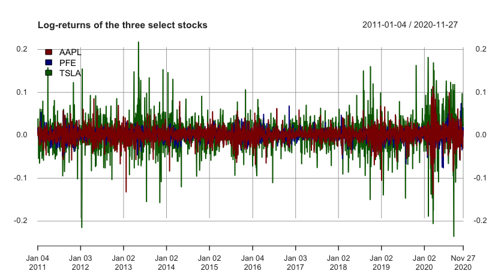

# Heterocedasticidad condicionada

## Modelos ARCH y GARCH Univariados

Estos modelos de Heterocedásticidad Condicional Autoregresiva (ARCH, por sus siglas en inglés) y modelos Heterocedásticidad Condicional Autoregresiva Generalizados (GARCH, por sus siglas en inglés) tienen la característica de modelar situaciones como las que ilustra la Figutra \@ref(fig:GARCHReturn). Es decir: 1) existen zonas donde la variación de los datos es mayor y zonas donde la variación es más estable --a estas situaciones se les conoce como de variabilidad por clúster--, y 2) los datos corresponden a innformación de alta frecuencia.

```{r GARCHReturn, fig.cap = "Rendimientos (diferenccias logarítmicas) de tres acciones seleccionadas: Apple, Pfizer, Tesla, enero 2011 a noviembre de 2020", fig.align='center', echo=FALSE, out.width="100%"}



```


Para plantear el modelo supongamos --por simplicidad-- que hemos construido y estimado un modelo AR(1). Es decir, asumamos que el proceso subyacente para la media condicional está dada por:
\begin{equation}
    X_t = a_0 + a_1 X_{t-1} + U_t
    (\#eq:em1)
\end{equation}

Donde $|a_1|< 1$ para garantizar la convergencia del proceso en el largo plazo, en el cual:
\begin{eqnarray*}
    \mathbb{E}[X_t] & = & \frac{a_0 }{1 - a_1} = \mu \\
    Var[X_t] & = & \frac{\sigma^2}{1 - a_1^2}
\end{eqnarray*}

Ahora, supongamos que este tipo de modelos pueden ser extendidos y generalizados a un modelo ARMA(p, q), que incluya otras variables exogénas. Denotemos a como $\mathbf{Z}_t$ al conjunto que incluye los componentes AR, MA y variables exogénas que pueden explicar a $X_t$ de forma que el proceso estará dado por:
\begin{equation}
    X_t = \mathbf{Z}_t \boldsymbol{\beta} + U_t
        (\#eq:em2)
\end{equation}

Donde $U_t$ es un proceso estacionario que representa el error asociado a un proceso ARMA(p, q) y donde siguen diendo válidos los supuestos:
\begin{eqnarray*}
    \mathbb{E}[U_t] & = & 0 \\
    Var[U_t^2] & = & \sigma^2
\end{eqnarray*}

No obstante, en este caso podemos suponer que existe autocorrelación en el término de error que puede ser capturada por un porceso similar a uno de medias móviles (MA) dado por:
\begin{equation}
    U_t^2 = \gamma_0 + \gamma_1 U_{t-1}^2 + \gamma_2 U_{t-2}^2 + \ldots + \gamma_q U_{t-q}^2 + \nu_t
        (\#eq:em3)
\end{equation}

Donde $\nu_t$ es un ruido blanco y $U_{t-i} = X_{t-i} - \mathbf{Z}_{t-i} \boldsymbol{\beta}$, $i = 1, 2 ,\ldots $. Si bien los procesos son estacionarios por los supuestos antes enunciados, la varianza condicional estará dada por:
\begin{eqnarray*}
    \sigma^2_{t | t-1} & = & Var[ U_t | \Omega_{t-1} ] \\
    & = & \mathbb{E}[ U^2_t | \Omega_{t-1} ]
\end{eqnarray*}

Donde $\Omega_{t-1} = \{U_{t-1}, U_{t-2}, \ldots \}$ es el conjunto de toda la información pasada de $U_t$ y observada hasta el momento $t-1$, por lo que:
\begin{equation*}
    U_t | \Omega_{t-1} \sim \mathbb{D}(0, \sigma^2_{t | t-1})
\end{equation*}

Así, de forma similar a un proceso MA(q) podemos decir que la varianza condicional tendrá efectos ARCH de orden $q$ (ARCH(q)) cuando:
\begin{equation}
    \sigma^2_{t | t-1} = \gamma_0 + \gamma_1 U_{t-1}^2 + \gamma_2 U_{t-2}^2 + \ldots + \gamma_q U_{t-q}^2
        (\#eq:ARCHEffect)
\end{equation}

Donde $\mathbb{E}[\nu_t] = 0$ y $\gamma_0$ y $\gamma_i \geq 0$, para $i = 1, 2, \ldots, q-1$ y  $\gamma_q > 0$. Estas condiciones son necesarias para garantizar que la varianza sea positiva. En general, la varianza condicional se expresa de la forma $\sigma^2_{t | t-1}$, no obstante, para facilitar la notación, nos referiremos en cada caso a esta simplemente como $\sigma^2_{t}$.

Podemos generalizar está situación si asumimos a la varianza condicional como dependiente de lo valores de la varianza rezagados, es decir, como si fuera un proceso AR de orden $p$ para la varianza y juntandolo con la ecuación \@ref(eq:ARCHEffect). Bollerslev (1986) y Taylor (1986) generalizaron el problema de heterocedásticidad condicional. El modelo se conoce como GARCH(p, q), el cual se especifica como:
\begin{equation}
    \sigma^2_t = \gamma_0 + \gamma_1 U_{t-1}^2 + \gamma_2 U_{t-2}^2 + \ldots + \gamma_q U_{t-q}^2 + \beta_1 \sigma^2_{t-1} + \beta_2 \sigma^2_{t-2} + \ldots + \beta_p \sigma^2_{t-p}
    (\#eq:GARCHEffect)
\end{equation}

Donde las condiciones de no negatividad son que $\gamma_0 > 0$, $\gamma_i \geq 0$, $i = 1, 2, \ldots, q-1$, $\beta_j \geq 0$, $j = 1, 2, \ldots, p-1$, $\gamma_q > 0$ y $\beta_p > 0$. Además, otra condición de convergencia es que:
\begin{equation*}
    \gamma_1 + \ldots + \gamma_q + \beta_1 + \ldots + \beta_p < 1
\end{equation*}

Usando el operador rezago $L$ en la ecuación \@ref(eq:GARCHEffect) podemos obtener:
\begin{equation}
    \sigma^2_t = \gamma_0 + \alpha(L) U_t^2 + \beta(L) \sigma^2_t
        (\#eq:GARCHEffectL)
\end{equation}

De donde podemos establecer:
\begin{equation}
    \sigma^2_t = \frac{\gamma_0}{1 - \beta(L)} + \frac{\alpha(L)}{1 - \beta(L)} U_t^2         (\#eq:em4)
\end{equation}

Por lo que la ecuación \@ref(eq:GARCHEffect) del GARCH(p, q) representa un ARCH($\infty$):
\begin{equation}
    \sigma^2_t = \frac{a_0}{1 - b_1 - b_2 - \ldots - b_p} + \sum_{i = 1}^\infty U_{t-i}^2 
            (\#eq:em5)
\end{equation}

## Ejemplo
```{r message=FALSE, warning=FALSE, warning=FALSE, message=FALSE , fig.align='center', out.width="100%",  fig.align='center', out.width="100%", warning=FALSE, message=FALSE}
#install.packages("pacman")
#pacman nos permite cargar varias librerias en una sola línea
library(pacman)
pacman::p_load(tidyverse,BatchGetSymbols,ggplot2,lubridate,readxl,forecast,stats,stargazer,knitr,tseries, aTSA, TSA, rugarch)
```

```{r fig.show='hide', message=FALSE, , echo=TRUE, fig.align='center', out.width="100%", warning=FALSE,  fig.align='center', out.width="100%", warning=FALSE, message=FALSE}
#Primero determinamos el lapso de tiempo
pd<-as.Date("2002/9/30") #primer fecha
pd
#> [1] "2021-09-18"
ld<- as.Date("2021/09/30")#última fecha
ld
#Intervalos de tiempo
int<-"monthly"

#Datos a elegir
dt<-c("AMZN")

#Descargando los valores
data1<- BatchGetSymbols(tickers = dt,
                       first.date = pd,
                       last.date = ld,
                       freq.data = int,
                       do.cache = FALSE,
                       thresh.bad.data = 0)

#Generando data frame con los valores
data_precio_amzn<-data1$df.tickers
colnames(data_precio_amzn)
```

```{r, fig.align='center', out.width="100%", warning=FALSE, message=FALSE, fig.align='center', out.width="100%"}
#original
price_amazn_ts<-ts(data_precio_amzn$price.open, frequency = 12, start=c(2002,09))
#logartimo
lprice_amazn_ts<-ts(log(data_precio_amzn$price.open), frequency = 12,start=c(2002,09))
#diferencias logaritmicas(cambio porcential)
dlprice_amazn_ts<-ts(log(data_precio_amzn$price.open)-lag(log(data_precio_amzn$price.open),1), frequency = 12, start=c(2002,10))
dlprice_amazn_ts<-na.omit(dlprice_amazn_ts)
```

```{r, fig.align='center', out.width="100%", warning=FALSE, message=FALSE}
auto.arima(price_amazn_ts)
arima021 <- arima(price_amazn_ts,
                  order=c(0,2,1),
                  method = "ML")
```

```{r, fig.cap="Serie de tiempo de los retornos de año en los últimos 20 años", warning=FALSE, message=FALSE,  fig.align='center', out.width="100%", warning=FALSE, message=FALSE}
plot(arima021)
```

```{r,  fig.align='center', out.width="100%", warning=FALSE, message=FALSE}
resarima021 <- resid(arima021)^2
```

```{r amazn20, fig.cap="Serie de tiempo de los retornos de año en los últimos 20 años", warning=FALSE, message=FALSE,  fig.align='center', out.width="100%", warning=FALSE, message=FALSE}
plot(resarima021)
```

```{r,  fig.align='center', out.width="100%", warning=FALSE, message=FALSE}
auto.arima(resarima021, trace = T)
garch.amzn <- ugarchspec(mean.model = list(armaOrder=c(0,2,1)),
                         variance.model = list(garchOrder=c(0,1,1)))
garch.amzn011 <- ugarchfit(spec = garch.amzn, 
                           data = price_amazn_ts)
garch.amzn011
summary(garch.amzn011)
```
```{r, fig.align='center', out.width="100%", warning=FALSE, message=FALSE}
f.garch.amzn011 <- ugarchforecast(garch.amzn011, n.ahead=12)
f.garch.amzn011
```

## Ejemplo
Realice el mismo procedimiento pero con la serie de tiempo de diferencias logaritmicas.