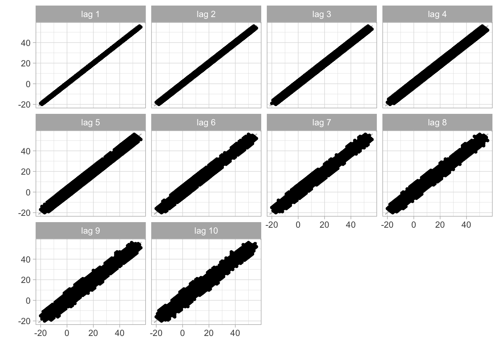

# Estacionariedad

## El problema
Los fundamentos de las series de tiempo están basados en la
estacionalidad. Una serie de tiempo ${r_t}$ que estudia los retornos de
un activo a lo largo de tiempo es *estrictamente estacionaria* si la
distribución conjunta de los retornos $(r_{t1},\dots,r_{t1})$ es
*exactamente idéntica* en $(r_{t1+T},\dots,r_{t1+T})$, es decir cuando
pasa $T$ años, por ejemplo. En otras palabras, definiremos a una serie
de tiempo como un vector de variables ${X_t}$ aleatorias de dimensión
$T$, dado como: 

\begin{equation}
    X_1, X_2, X_3, \ldots ,X_T
\end{equation} 

Es decir, definiremos a una serie de tiempo como una
realización de un proceso estocástico --o un Proceso Generador de Datos
(PGD). Consideremos una muestra de los múltiples posibles resultados de
muestras de tamaño $T$, la colección dada por: 

\begin{equation}
    \{X^{(1)}_1, X^{(1)}_2, \ldots, X^{(1)}_T\}
    (\#eq:variast)
\end{equation}

Eventualmente podríamos estar dispuestos a observar este proceso
indefinidamente, de forma tal que estemos interesados en observar a la
secuencia dada por $\{ X^{(1)}_t \}^{\infty}_{t = 1}$, lo cual no
dejaría se ser sólo una de las tantas realizaciones o secuencias del
proceso estocástico original de la ecuación \@ref(eq:variast).

```{=tex}
\begin{eqnarray*}
    & \{X^{(2)}_1, X^{(2)}_2, \ldots, X^{(2)}_T\} & \\
    & \{X^{(3)}_1, X^{(3)}_2, \ldots, X^{(3)}_T\} & \\
    & \{X^{(4)}_1, X^{(4)}_2, \ldots, X^{(4)}_T\} & \\
    & \vdots & \\
    & \{X^{(j)}_1, X^{(j)}_2, \ldots, X^{(j)}_T\} & 
\end{eqnarray*}
```
Por lo mismo, cada cambio que se hace al vector $\{ X^{(1)}_t \}$ es
parte del mismo proceso estocástico, por lo que la serie de tiempo es:

```{=tex}
\begin{equation}
    \{ X_1, X_2, \ldots, X_T \}
        \label{variast}
\end{equation}
```
El proceso estocástico de dimensión $T$ puede ser completamente descrito
por su función de distribución multivariada de dimensión $T$. No
obstante, sólo nos enfocaremos en sus primer y segundo momentos, es
decir, en sus medias o valores esperados $\mathbb{E} (X_t)$

Para $t = 1, 2, \ldots, T$:

```{=tex}
\begin{equation*}
\left[
    \begin{array}{c}
    \mathbb{E}[X_1], \mathbb{E}[X_2], \ldots, \mathbb{E}[X_T]
    \end{array}
\right]
\end{equation*}
```

De sus variazas: 

\begin{equation*}
    Var[X_t] = \mathbb{E}[(X_t - \mathbb{E}[X_t])^2]
\end{equation*} Para $t = 1, 2, \ldots, T$, y de sus $T(T-1)/2$
covarianzas: \begin{equation*}
    Cov[X_t,X_s] = \mathbb{E}[(X_t - \mathbb{E}[X_t])(X_s - \mathbb{E}[X_s])]
\end{equation*}

Para $t < s$. Por lo tanto, en la forma matricial podemos escribir lo siguiente: 
\begin{equation*}
\left[
    \begin{array}{c c c c}
    Var[X_1] & Cov[X_1,X_2] & \cdots & Cov[X_1,X_T] \\
    Cov[X_2,X_1] & Var[X_2] & \cdots & Cov[X_2,X_T] \\
    \vdots & \vdots & \ddots & \vdots \\
    Cov[X_T,X_1] & Cov[X_T,X_2] & \cdots & Var[X_T] \\
    \end{array}
\right]
\end{equation*}

\begin{equation}
= \left[
    \begin{array}{c c c c}
    \sigma_1^2 & \rho_{12} & \cdots & \rho_{1T} \\
    \rho_{21} & \sigma_2^2 & \cdots & \rho_{2T} \\
    \vdots & \vdots & \ddots & \vdots \\
    \rho_{T1} & \rho_{T2} & \cdots & \sigma_T^2 \\
    \end{array}
\right]
(\#eq:MATCOV)
\end{equation}

Donde es claro que en la matriz de la ecuación \@ref(eq:MATCOV) existen $T(T-1)/2$ covarianzas distintas, ya que se cumple que $Cov[X_t,X_s] = Cov[X_s,X_t]$, para $t \neq s$. A menudo, esas covarianzas son denominadas como _autocovarianzas_ puesto que ellas son covarianzas entre variables aleatorias pertenecientes al mismo proceso estocástico pero en un momento $t$ diferente. Si el proceso estocástico tiene una distribución normal multivariada, su función de distribución estará totalmente descrita por sus momentos de primer y segundo orden.

### Ergocidad

Esto implica que los momentos muestrales, los cuales son calculados en la base de una serie de tiempo con un número finito de observaciones, conforme el tiempo $T \rightarrow \infty$ sus correspondientes momentos muestrales, tienden a los verdaderos valores poblacionales, los cuales definiremos como $\mu$, para la media, y $\sigma^2_X$ para la varianza. _En pocas palabras, conforme los momentos muestrales aumenten tanto que tiendan al infinito, entonces nos acercamos a valores poblacionales de la media y la varianza_.
 Este concepto sólo es cierto si asumimos que
 
\begin{eqnarray*}
    \mathbb{E}[X_t] = \mu_t = \mu \\
    Var[X_t] = \sigma^2_X
\end{eqnarray*} 
Más formalmente, se dice que el PGD o el proceso estocástico es ergódico en la media si:
\begin{equation}
    \displaystyle\lim_{T \to \infty}{\mathbb{E} \left[ \left( \frac{1}{T} \sum^{T}_{t = 1} (X_t - \mu) \right) ^2 \right]} = 0
\end{equation}

y ergódico en la varianza si:
\begin{equation}
    \displaystyle\lim_{T \to \infty}{\mathbb{E} \left[ \left( \frac{1}{T} \sum^{T}_{t = 1} (X_t - \mu) ^2 - \sigma^2_X \right) ^2 \right]} = 0
\end{equation}
+
Estas condiciones se les conoce como _propiedades de consistencia_ para las variables aleatorias. Sin embargo, éstas no pueden ser probadas. Por ello se les denomina como un supuesto que pueden cumplir algunas de las series. Más importante aún: **un proceso estocástico que tiende a estar en equilibrio estadístico en un orden ergódico, es estacionario**.

### Tipos de Estacionariedad

Definiremos a la estacionariedad por sus momentos del correspondiente proceso estocástico dado por $\{X_t\}$:

- _Estacionariedad en media_: Un proceso estocástico es estacionario en media si $E[X_t] = \mu_t = \mu$ es constante para todo $t$.

- _Estacionariedad en varianza_: Un proceso estocástico es estacionario en varianza si $Var[X_t] = \mathbb{E}[(X_t - \mu_t)^2] = \sigma^2_X = \gamma(0)$ es constante y finita para todo $t$.

- _Estacionariedad en covarianza_: Un proceso estocástico es estacionario en covarianza si $Cov[X_t,X_s] = \mathbb{E}[(X_t - \mu_t)(X_s - \mu_s)] = \gamma(|s-t|)$ es sólo una función del tiempo y de la distancia entre las dos variables aleatorias. Por lo que no depende del tiempo denotado por $t$ (no depende de la información contemporánea).

- _Estacionariedad débil_: Como la estacionariedad en varianza resulta de forma inmediata de la estacionariedad en covarianza cuando se asume que $s = t$, un proceso estocástico es débilmente estacionario cuando es estacionario en media y covarianza. __ESTE ES EL MÁS COMÚN Y POSIBLE__, por lo que es el que estudiaremos.

### Función de Autocorrelación (ACF)
Para ampliar la discusión, es posible calcular la fuerza o intensidad de la dependencia de las variables aleatorias dentro de un proceso estocástico, ello mediante el uso de las autocovarianzas. Cuando las covarianzas son normalizadas respecto de la varianza, el resultado es un término que es independiente de las unidad de medida aplicada, y se conoce como la _función de autocorrelación_.

Por su parte, un estimador consistente de la función de autocorrelación estará dado por:
\begin{equation}
    \hat{\rho}(\tau) = \frac{\sum^{T - \tau}_{t=1} (X_t - \hat{\mu})(X_{t+\tau} - \hat{\mu})}{\sum^T_{t=1} (X_t - \hat{\mu})^2} = \frac{\hat{\gamma}(\tau)}{\hat{\gamma}(0)} \mbox{, para } \tau = 1, 2, \ldots, T-1
    (\#eq:EqAutoCorr)
\end{equation}

El estimador de la ecuación \@ref(eq:EqAutoCorr) es asintóticamente insesgado y __es relevante puesto que nos dice si una serie de tiempo con estacionariedad débil  esta serialmente correlacionada si y solo si $\hat{\rho}(\tau)\neq0$__.

### Ruido Blanco

Supongamos una serie de tiempo denotada por: $\{U_t\}^T_{t = 0}$. Decimos que el proceso estocástico $\{U_t\}$ es un _proceso estocástico puramente aleatorio_ o es un _proceso estocástico de ruido blanco o caminata aleatoria_, si éste tiene las siguientes propiedades: 

- $\mathbb{E}[U_t] = 0$, $\forall t$
    
- $Var[U_t] = \mathbb{E}[(U_t - \mu_t)^2] = \mathbb{E}[(U_t - \mu)^2] = \mathbb{E}[(U_t)^2] = \sigma^2$, $\forall t$
    
- $Cov[U_t,U_s] = \mathbb{E}[(U_t - \mu_t)(U_s - \mu_s)] = \mathbb{E}[(U_t - \mu)(U_s - \mu)] = \mathbb{E}[U_t U_s] = 0$, $\forall t \neq s$.
- $\hat{\rho}(\tau)=0$

En palabras. Un proceso $U_t$ es un ruido blanco si su valor promedio es cero (0), tiene una varianza finita y constante, y además no le importa la historia pasada, así su valor presente no se ve influenciado por sus valores pasados no importando respecto de que periodo se tome referencia.

Para procesos estacionarios, dicha función de autocorrelación esta dada por:
\begin{equation}
    \rho(\tau) = \frac{\mathbb{E}[(X_t - \mu)(X_{t+\tau} - \mu)]}{\mathbb{E}[(X_t - \mu)^2]} = \frac{\gamma(\tau)}{\gamma(0)} 
\end{equation}

## Estimación
### Dependencias


```r
#install.packages("pacman")
#pacman nos permite cargar varias librerias en una sola línea
library(pacman)
pacman::p_load(tidyverse,BatchGetSymbols,ggplot2,lubridate,readxl,forecast,stats)
```

## Caminata


```r

set.seed(1234)
# Utilizaremos una función guardada en un archivo a parte
# Llamamos a la función:
source("funciones/Caminata.R")

# Definimos argumentos de la función
Opciones <- c(-1, 1)
#
Soporte <- 10000

# Vamos a réplicar el proceso con estos parámetros
Rango <- 200
#
Caminos <- 10

#

for(i in 1:Caminos){
  TT <- data.matrix(data.frame(Caminata(Opciones, Soporte)[1]))
  #
  G_t <- data.matrix(data.frame(Caminata(Opciones, Soporte)[2]))
  #
  plot(TT, G_t, col = "blue", type = "l", ylab = "Ganancias", xlab = "Tiempo", ylim = c(-Rango,Rango))
  #
  par(new = TRUE)
  #
  i <- i +1
}
#
par(new = FALSE)
```

<div class="figure" style="text-align: center">

<p class="caption">(\#fig:Caminata10)Ejemplo de 10 trayectorias de la caminata aleatoria, cuando sólo es posible cambios de +1 y -1</p>
</div>

Así, el proceso estocástico dado por la caminata alaeatoria sin un
término de ajuste es estacionario en media, pero no en varianza o en
covarianza, y consecuentemente, en general no estacionario, condición
que contraria al caso del proceso simple descrito en $U_t$.

Es facil ver que muchas de las posibilidades de realización de este
proceso estocástico (series de tiempo) pueden tomar cualquiera de las
rutas consideradas en el Figura \@ref(fig:Caminata10). Ahora analicemos
un solo camino.

## Un camino


```r
#Generamos datos
  TT1 <- data.matrix(data.frame(Caminata(Opciones, Soporte)[1]))
  G_t1 <- data.matrix(data.frame(Caminata(Opciones, Soporte)[2]))
#Creemos un data frame
  dt_caminata<-data.frame(TT1,G_t1)
  colnames(dt_caminata)<-c("t","ganancias")
  head(dt_caminata)
#>   t ganancias
#> 1 1        -1
#> 2 2        -2
#> 3 3        -1
#> 4 4        -2
#> 5 5        -3
#> 6 6        -4
#plot
  plot(TT1, G_t1, col = "blue", type = "l", ylab = "Ganancias", xlab = "Tiempo", ylim = c(-Rango,Rango))
```

<div class="figure">

<p class="caption">(\#fig:Caminata1)Una Caminata aleatoria cuando sólo es posible cambios de +1 y -1</p>
</div>

Hay que convertirlo a serie de tiempo


```r
#serie de tiempo
caminata_ts<-ts(G_t1,start=1,end=Soporte)
```

### Estacionariedad Caminata


```r
ACF_caminata_ts<-acf(caminata_ts,na.action = na.pass, main = "Función de Autocorrelación de una Caminata")
```

<div class="figure">

<p class="caption">(\#fig:ACFCAMINATA1)Función de Autocorrelación de una Caminata</p>
</div>

Como se comentó con anterioridad en la Figura \@ref(fig:ACFCAMINATA1) es
evidente que la Caminata si tiene autocorrelacion, por lo que nuestro
plot de autocorrelacion tiene valores muy altos en todos los lags.
Veamos los lags.


```r
gglagplot(caminata_ts,lags=10,do.lines=FALSE,colour=FALSE)+theme_light()
```

<div class="figure">

<p class="caption">(\#fig:LAGSCAMINATA1)Lags de una sola caminata</p>
</div>

De nuevo, esto al ser creado de manera estandarizada estamos seguros de
que va a ser estacionario en la medio, por lo mismo los lags de la
Figura \@ref(fig:LAGSCAMINATA1) se ven tan correlacionados.

## Precios de un activo


```r
#Primero determinamos el lapso de tiempo
pd<-Sys.Date()-(365*20) #primer fecha
pd
#> [1] "2002-11-05"
ld<-Sys.Date() #última fecha
ld
#> [1] "2022-10-31"
#Intervalos de tiempo
int<-"monthly"
#Datos a elegir
dt<-c("AMZN")
dt2<-c("TSLA")
#Descargando los valores
data1<- BatchGetSymbols(tickers = dt,
                       first.date = pd,
                       last.date = ld,
                       freq.data = int,
                       do.cache = FALSE,
                       thresh.bad.data = 0)
#Generando data frame con los valores
data_precio_amzn<-data1$df.tickers
colnames(data_precio_amzn)
#>  [1] "ticker"              "ref.date"           
#>  [3] "volume"              "price.open"         
#>  [5] "price.high"          "price.low"          
#>  [7] "price.close"         "price.adjusted"     
#>  [9] "ret.adjusted.prices" "ret.closing.prices"

#necesitamos convertir la serie de tiempo de precios en retornos continuos compuestos de los precios de apertura
data_precio_amzn$ccrAMZN<-c(NA ,100*diff(log(data_precio_amzn$price.open)))#agregamos un valor NA al principio
data_precio_amzn$ccrAMZN#estos son los retornos
#>   [1]           NA  25.95111955 -22.98950701  13.39221448
#>   [5]   0.95260416  14.27998202  11.55626991  24.11122449
#>   [9]  -0.46684144  13.08785513  11.63599301   3.89974592
#>  [13]  12.48104071  -0.73260401  -3.06108260  -4.08140972
#>  [17] -16.32741069   0.99457279   0.06902105   9.61879412
#>  [21]  11.67844638 -33.59147712  -0.57381482   7.69997922
#>  [25] -18.78100714  15.60691856  11.66713068  -4.43506452
#>  [29] -20.41392362  -1.23405211  -6.96531282   9.64353557
#>  [33]  -6.77486160  30.02382912  -5.40177077   6.39945115
#>  [37] -12.58398922  20.12391421  -2.92703823  -7.77281354
#>  [41] -15.93630872  -2.10477279  -4.11970307  -1.60415929
#>  [45]  10.64572285 -37.21478392  15.01070027   3.59739571
#>  [49]  17.58906665   5.43570463  -4.00357496  -1.90531667
#>  [53]   3.54637914   1.33891100  42.77167396  11.98170332
#>  [57]  -0.13070948  12.66409736   2.27857959  15.63296023
#>  [61]  -6.26135927   2.56510858   5.74113839 -18.78533471
#>  [65] -21.72447597  13.78662202   7.15014819   3.44753666
#>  [69] -11.63053849   5.54650897   8.53074641 -14.71605773
#>  [73] -24.20236452 -29.39126222  20.09953181  13.15576837
#>  [77]   8.77225235  13.27882326   9.60320128  -2.73678724
#>  [81]   7.64068237   2.50334747  -6.96036997  13.59745291
#>  [85]  24.90536163  14.32806129  -0.50514401 -10.08447333
#>  [89]  -3.70473986  13.45839135   1.02565002  -9.33660068
#>  [93] -13.76436786   8.99531736   5.87517724  21.76202538
#>  [97]   4.58513429   8.56726887   1.22598823  -6.16865517
#> [101]   1.74979032   4.53458328   7.93222740  -0.25978671
#> [105]   4.72685785   9.04110889  -4.41608958   0.80039290
#> [109]  -4.18766494  -8.13529694  -8.68550170  -1.18960511
#> [113]   3.43828044   9.60224827  14.70991690  -9.58159747
#> [117]   9.53799598   2.08880372   5.85976366   2.83140800
#> [121]  -8.65274050   7.52661134   1.39202437   4.89612270
#> [125]  -2.12710012   1.39936277  -5.02332605   5.76221809
#> [129]   3.66491122   8.27850152  -6.24554343   9.85520147
#> [133]  15.15285156   8.73395739  -0.05013788 -10.51934673
#> [137]  -0.06687288  -5.92858190 -10.58568315   2.74371861
#> [141]   4.15753522  -3.80625428   8.04816141  -5.42111518
#> [145]  -5.03065911   9.90317538  -7.85404256  11.32156221
#> [149]   8.43295383  -2.32429615  13.01462014   1.54061721
#> [153]   2.05813986  20.15392877  -7.39490376   2.34828935
#> [157]  20.47843365   7.17052347  -2.62563883 -12.67694180
#> [161]  -3.85435390   5.96629237  11.72089295   8.23387458
#> [165]  -0.49783030   5.76252931   1.44112456   8.10699776
#> [169]  -4.52676184  -6.00796092   0.72964776   8.98955770
#> [173]   2.83447462   4.01536256   4.38443827   7.35281333
#> [177]  -2.61760725   2.36894617  -1.20285851  -2.07377928
#> [181]  13.68712240   5.85471090  -0.00427124  20.93976645
#> [185]   4.63815978  -6.55115525   9.77684681   4.61358018
#> [189]   2.75160333   5.84583306  12.74521370  -0.22279328
#> [193] -21.94794383   8.60716489 -18.86826361  11.20213025
#> [197]   0.98664739   8.39682297   7.12720047  -9.38002536
#> [201]   8.85565506  -2.70183034  -5.58782369  -1.36520548
#> [205]   2.37757442   0.91249016   3.83805218   6.98245156
#> [209]  -5.31693095   1.37938043  18.97247680   4.64889431
#> [213]  11.92308161  14.25393454   9.27398656  -8.41337555
#> [217]  -4.66642316   4.05671846   2.52393793  -0.84885499
#> [221]  -3.59427728  -0.31861156  11.12179968  -7.17375312
#> [225]   5.72503641  -2.40180912   4.18486227  -6.11473001
#> [229]   2.18899134   5.30616390  -5.62793333 -11.06465380
#> [233]   1.80527180   7.20896224 -29.34750864  -0.11853658
#> [237] -13.99459654  23.88072732  -6.86965832 -10.37744549
#tenemos 20 retornos a lo largo de 20 años
```

Veamos la serie de tiempo


```r
ret_20_amazn<-ggplot(data=data_precio_amzn, aes(x=ref.date))+geom_line(aes(y=ccrAMZN))+labs(title="Retornos de AMZN en los últimos 20 años",y="Retornos", x="Años")+theme_light()
ret_20_amazn
```

<div class="figure">

<p class="caption">(\#fig:amazn20)Serie de tiempo de los retornos de año en los últimos 20 años</p>
</div>

### Serie de tiempo

Primero que nada es importante cargar los datos a un objeto series de
tiempo. Esto nos lo permite la función ts(). Además debemos serciorarnos
de que los datos esten en orden cronológico.


```r
data_precio_amzn<-data_precio_amzn[order(data_precio_amzn$ref.date),]
head(data_precio_amzn)#dado que ya estaba en orden cronológico nuestro df no cambia
#> # A tibble: 6 × 11
#>   ticker ref.date     volume price…¹ price…² price…³ price…⁴
#>   <chr>  <date>        <dbl>   <dbl>   <dbl>   <dbl>   <dbl>
#> 1 AMZN   2002-11-05   3.76e9   0.932    1.23   0.91    1.17 
#> 2 AMZN   2002-12-02   3.11e9   1.21     1.25   0.922   0.944
#> 3 AMZN   2003-01-02   3.38e9   0.960    1.16   0.928   1.09 
#> 4 AMZN   2003-02-03   2.32e9   1.10     1.12   0.980   1.10 
#> 5 AMZN   2003-03-03   3.28e9   1.11     1.40   1.07    1.30 
#> 6 AMZN   2003-04-01   4.39e9   1.28     1.46   1.21    1.43 
#> # … with 4 more variables: price.adjusted <dbl>,
#> #   ret.adjusted.prices <dbl>, ret.closing.prices <dbl>,
#> #   ccrAMZN <dbl>, and abbreviated variable names
#> #   ¹​price.open, ²​price.high, ³​price.low, ⁴​price.close
#hagamos el objeto ts
ret_amazn_ts<-ts(data_precio_amzn$ccrAMZN)
plot(ret_amazn_ts)#de esta manera podemos ver que se cargo bien debido a que es igual al ggplot
```


### Estacionariedad


```r
#MA_m5<-forecast::ma(ret_amazn_ts,order=11,centre=TRUE)
#plot(ret_amazn_ts)+lines(MA_m5, col="red", lwd=2)
gglagplot(ret_amazn_ts,lags=20,do.lines=FALSE,colour=FALSE)+theme_light()
```

<div class="figure">

<p class="caption">(\#fig:amazn20LAG)Lag Plot que nos muestra la correlación entre 20 lags</p>
</div>


```r
ACF_ret_amazn_ts<-acf(ret_amazn_ts,na.action = na.pass)
```

<div class="figure">

<p class="caption">(\#fig:amazn20ACF)Función de Autocorrelación de los retornos de AMZN en los ultimos 20 años</p>
</div>

La Figura \@ref(fig:amazn20LAG) nos idica la manera en la que se
correlacionan los lags, evidentemente no se puede ver ningún tipo de
correlacioo1ón visible. Similarmente la Figura \@ref(fig:amazn20ACF) en
donde se muestra la función de autocorrelación. Expecto al primer lag
--que muestra correlacion debido a que se esta comparando consigo
mismo-- es evidente que no hay correlacioo1ón fuerte entre ninguno de
los lags. Por lo mismo, sería difícil poder encontrar y estimar valores
futuros debido a que la Figura \@ref(fig:amazn20LAG) y la Figura
\@ref(fig:amazn20ACF) indican que la serie de tiempo de los retornos de
AMZN de la Figura \@ref(fig:amazn20) es **completamente aleatorio y no
hay estacionariedad**.
