# Procesos estacionarios univariados

En este capítulo analizaremos el método o metodología de análisis de
series de tiempo propuesto por Box y Jenkins (1970). Los modelos
propuestos dentro de está metodología o conjunto de métodos se han
vuelto indispensables para efectos de realizar pronósticos de corto
plazo.

En este sentido, se analizarán los métodos más importantes en series de
tiempo: Autoregresivos (AR) y de Medias Móviles (MA). Asimismo, se
realizará un análisis de los procesos que resultan de la combinación de
ambos, conocida como ARMA, los cuales son más comúnmente usados para
realizar pronósticos.

## Procesos Autoregresivos (AR)

Los procesos autoregresivos tienen su origen en el trabajo de Cochrane y
Orcutt de 1949, mediante el cual analizaron los residuales de una
regresión clásica como un proceso autoregresivo. Puede consultarse el
apéndice para la discusión del modelo de regresión clásica.

### AR(1)

Como primer caso analizaremos al proceso autoregresivo de primer orden,
$AR(1)$, el cual podemos definir como una Ecuación Lineal en Diferencia
Estocástica de Primer Orden. Diremos que una Ecuación Lineal en
Diferencia de Primer Orden es estocástica si en su representación
analítica considera un componente estocástico como en la ecuación
\@ref(eq:EDOEst1) descrita a continuación:

\begin{equation}
    X_t = a_0 + a_1 X_{t-1} + U_t
(\#eq:EDOEst1)
\end{equation}

Donde $a_0$ es un término constante, $U_t$ es un proceso estacionario,
con media cero (0), una varianza finita y constante ($\sigma^2$) y una
covarianza que depende de la distancia entre $t$ y cualquier $t-s$
($\gamma_s$)--que no depende de los valores pasados o futuros de la
variable--, $X_0$ es el valor inicial de $X_t$. No obstante, en general
vamos a asumir que la covarianza será cero (0), por lo que tendremos un
proceso puramente aleatorio. Considerando la ecuación \@ref(eq:EDOEst1) y
un proceso de sustitución sucesivo podemos establecer lo siguiente,
empezando con $X_1$: \begin{eqnarray*}
    X_{1} & = & a_0 + a_1 X_{0} + U_{1}
\end{eqnarray*}

Para $X_2$: \begin{eqnarray*}
X_{2} & = & a_0 + a_1 X_{1} + U_{2} \\
    & = & a_0 + a_1 (a_0 + a_1 X_{0} + U_{1}) + U_{2} \\
    & = & a_0 + a_1 a_0 + a_1^2 X_{0} + a_1 U_{1} + U_{2}
\end{eqnarray*}

Para $X_3$: \begin{eqnarray*}
X_{3} & = & a_0 + \alpha X_{2} + U_{3} \\
    & = & a_0 + a_1 (a_0 + a_1 a_0 + a_1^2 X_{0} + a_1 U_{1} + U_{2}) + U_{3} \\
    & = & a_0 + a_1 a_0 + a_1^2 a_0 + a_1^3 X_{0} + a_1^2 U_{1} + a_1 U_{2} + U_{3}
\end{eqnarray*}

Así, para cualquier $X_t$, $t = 1, 2, 3, \ldots$, obtendríamos:
\begin{eqnarray}
X_{t} & = & a_0 + a_1 X_{t - 1} + U_{t} \nonumber \\
    & = & a_0 + a_1 (a_0 + a_1 a_0 + a_1^2 a_0 + \ldots + a_1^{t-2} a_0 + a_1^{t-1} X_{0} \nonumber \\
    &   & + a_1^{t-2} U_{1} + \ldots + a_1 U_{t - 2} + U_{t - 1}) + U_{t} \nonumber \\
    & = & a_0 + a_1 a_0 + a_1^2 a_0 + a_1^3 a_0 + \ldots + a_1^{t-1} a_0 + a_1^{t} X_{0} \nonumber \\
    &   & + a_1^{t-1} U_{1} + \ldots a_1^2 U_{t - 2} + a_1 U_{t - 1} + U_{t} \nonumber \\
    & = & (1 + a_1 + a_1^2 + a_1^3 + \ldots + a_1^{t-1}) a_0 + a_1^{t} X_{0} \nonumber \\
    &   & + a_1^{t-1} U_{1} + \ldots + a_1^2 U_{t - 2} + a_1 U_{t - 1} + U_{t}  \nonumber\\
    & = & \frac{1 - a_1^t}{1 - a_1} a_0 + a_1^{t} X_{0} + \sum^{t-1}_{j = 0} a_1^{j} U_{t - j} 
    (\#eq:EDOSSol)
\end{eqnarray}

De esta forma en la ecuación \@ref(eq:EDOSSol) observamos un proceso que
es explicado por dos partes: una que depende del tiempo y otra que
depende de un proceso estocástico. Asimismo, debe notarse que la
condición de convergencia es idéntica que en el caso de ecuaciones en
diferencia estudiadas al inicio del curso: $\lvert a_1 \lvert < 1$, por
lo que cuando $t \to \infty$, la expresión \@ref(eq:EDOSSol) será la
siguiente: 

\begin{equation}
    X_t = \frac{1}{1 - a_1} a_0 + \sum^{\infty}_{j = 0} a_1^{j} U_{t - j}
    (\#eq:EDOSLP)
\end{equation}

Así, desaparece la parte dependiente del tiempo y únicamente prevalece
la parte que es dependiente del proceso estocástico. Esta es la solución
de largo plazo del proceso $AR(1)$, la cual depende del proceso
estocástico. Notemos, además, que esta solución implica que la variable
o la serie de tiempo $X_t$ es tambien un proceso estocástico que hereda
las propiedades de $U_t$. Así, $X_t$ es también un proceso estocástico
estacionario, como demostraremos más adelante.

Observemos que la ecuación \@ref(eq:EDOSLP) se puede reescribir si
consideramos la formulación que en la literatura se denomina como la
descomposición de Wold, en la cual se define que es posible asumir que
$\psi_j = a_1^j$ y se considera el caso en el cual
$\lvert a_1 \lvert< 1$, de esta forma tendremos que por ejemplo cuando:
\begin{equation*}
    \sum^{\infty}_{j = 0} \psi^2_j = \sum^{\infty}_{j = 0} a_1^{2j} = \frac{1}{1 - a_1^2} 
\end{equation*}

Alternativamente y de forma similar a las ecuaciones en diferencia
estudiadas previamente podemos escribir el proceso $AR(1)$ mediante el
uso del operador rezago como: 

\begin{eqnarray}
    X_t & = & a_0 + a_1 L X_t + U_t \nonumber \\
    X_t - a_1 L X_t & = & a_0 + U_t \nonumber \\
    (1 - a_1 L) X_t & = & a_0 + U_t \nonumber \\
    X_t & = & \frac{a_0}{1 - a_1 L} + \frac{1}{1 - a_1 L} U_t
    (\#eq:AR1)
\end{eqnarray}

En esta última ecuación retomamos el siguiente término para reescribirlo
como: 

\begin{equation}
    \frac{1}{1 - a_1 L} = 1 + a_1 L + a_1^2 L^2 + a_1^3 L^3 + \ldots
    (\#eq:AR2)
\end{equation}

Tomando este resultado para sustituirlo en ecuación \@ref(eq:AR1),
obtenemos la siguiente expresión: 

\begin{eqnarray}
X_t & = & (1 + a_1 L + a_1^2 L^2 + a_1^3 L^3 + \ldots) a_0 + (1 + a_1 L + a_1^2 L^2 + a_1^3 L^3 + \ldots) U_t \nonumber \\
    & = & (1 + a_1 + a_1^2 + a_1^3 + \ldots) a_0 + U_t + a_1 U_{t-1} + a_1^2 U_{t-2} + a_1^3 U_{t-3} + \ldots \nonumber \\
    & = & \frac{a_0}{1 - a_1} + \sum^{\infty}_{j = 0} a_1^j U_{t-j}
    (\#eq:AR1Sol)
\end{eqnarray}

Donde la condición de convergencia y estabilidad del proceso descrito en
esta ecuación es que $\lvert a_1 \lvert < 1$. Por lo que hemos
demostrado que mediante el uso del operador de rezago es posible llegar
al mismo resultado que obtuvimos mediante el procedimiento de
sustituciones iterativas.

La ecuación \@ref(eq:AR1Sol) se puede interpretar como sigue. La
solución o trayectoria de equilibrio de un AR(1) se divide en dos
partes. La primera es una constante que depende de los valores de $a_0$
y $a_1$. La segunda parte es la suma ponderada de las desviaciones o
errores observados y acumulados en el tiempo hasta el momento $t$.

Ahora obtendremos los momentos que describen a la serie de tiempo cuando
se trata de un porceso $AR(1)$. Para ello debemos obtener la media, la
varianza y las covarianzas de $X_t$. Para los siguientes resultados
debemos recordar y tener en mente que si $U_t$ es un proceso puramente
aleatorio, entonces:

1.  $\mathbb{E}[U_t] = 0$ para todo $t$
2.  $Var[U_t] = \sigma^2$ para todo $t$
3.  $Cov[U_t, U_s] = 0$ para todo $t \neq s$

Dicho lo anterior y partiendo de la ecuación \@ref(eq:AR1Sol), el primer
momento o valor esperado de la serie de tiempo será el siguiente:
\begin{eqnarray}
\mathbb{E}[X_t] & = & \mathbb{E} \left[ \frac{a_0}{1 - a_1} + \sum^{\infty}_{j = 0} a_1^j U_{t-j} \right] \nonumber \\
    & = & \frac{a_0}{1 - a_1} + \sum^{\infty}_{j = 0} a_1^j \mathbb{E}[U_{t-j}] \nonumber \\
    & = & \frac{a_0}{1 - a_1} = \mu
    (\#eq:AR1m1)
\end{eqnarray}

Respecto de la varianza podemos escribir la siguiente expresión a partir
de la ecuación \@ref(eq:AR1Sol): 

\begin{eqnarray}
Var[X_t] & = & \mathbb{E}[(X_t - \mu)^2] \nonumber \\
    & = & \mathbb{E} \left[ \left( \frac{a_0}{1 - a_1} + \sum^{\infty}_{j = 0} a_1^j U_{t-j} - \frac{a_0}{1 - a_1} \right)^2 \right] \nonumber \\
    & = & \mathbb{E}[(U_{t} + a_1 U_{t-1} + a_1^2 U_{t-2} + a_1^3 U_{t-3} + \ldots)^2] \nonumber \\
    & = & \mathbb{E}[U^2_{t} + a_1^2 U^2_{t-1} + a_1^4 U^2_{t-2} + a_1^6 U^2_{t-3} + \ldots \nonumber \\
    &   & + 2 a_1 U_t U_{t-1} + 2 a_1^2 U_t U_{t-2} + \ldots] \nonumber \\
    & = & \mathbb{E}[U^2_{t}] + a_1^2 \mathbb{E}[U^2_{t-1}] + a_1^4 \mathbb{E}[U^2_{t-2}] + a_1^6 \mathbb{E}[U^2_{t-3}] + \ldots \nonumber \\
    & = & \sigma^2 + a_1^2 \sigma^2 + a_1^4 \sigma^2 + a_1^6 \sigma^2 + \ldots \nonumber \\
    & = & \sigma^2 (1 + a_1^2 + a_1^4 + a_1^6 + \ldots) \nonumber \\
    & = & \sigma^2 \frac{1}{1 - a_1^2} = \gamma(0)
    (\#eq:AR1Var)
\end{eqnarray}

Previo a analizar la covarianza de la serie recordemos que para el
proceso puramente aleatorio $U_t$ su varianza y covarianza puede verse
como $\mathbb{E}[U_t, U_s] = \sigma^2$, para $t = s$, y
$\mathbb{E}[U_t, U_s] = 0$, para cualquier otro caso, respectivamente.

Dicho lo anterior, partiendo de la ecuación \@ref(eq:AR1Sol) la
covarianza de la serie estará dada por: 

\begin{eqnarray}
Cov(X_t, X_{t-\tau}) & = & \mathbb{E}[(X_t - \mu)(X_{t-\tau} - \mu)] \nonumber \\
    & = & \mathbb{E} \left[ \left( \frac{a_0}{1 - a_1} + \sum^{\infty}_{j = 0} a_1^j U_{t-j} - \frac{a_0}{1 - a_1} \right) \right. \nonumber \\
    &   & \left. \times \left( \frac{a_0}{1 - a_1} + \sum^{\infty}_{j = 0} a_1^j U_{t-\tau-j} - \frac{a_0}{1 - a_1} \right) \right] \nonumber \\
    & = & a_1^{\tau} \mathbb{E}[U^2_{t-\tau} + a_1 U^2_{t-\tau-1} + a_1^2 U^2_{t-\tau-2} + a_1^3 U^2_{t-\tau-3} + \ldots] \nonumber \\
    & = & a_1^{\tau} \sigma^2 \frac{1}{1 - a_1^2} = \gamma(\tau)
    (\#eq:AR1Cov)
\end{eqnarray}

Notése que con estos resultados en las ecuaciones \@ref(eq:AR1Var) y
\@ref(eq:AR1Cov) podemos construir la función de autocorrelación teórica
como sigue: 

\begin{eqnarray}
\rho(\tau) & = & \frac{\gamma(\tau)}{\gamma(0)} \nonumber \\
    & = & a_1^\tau
    (\#eq:emi1)
\end{eqnarray}

Donde $\tau = 1, 2, 3, \ldots$ y $\lvert a_1 \lvert < 1$. Este último
resultado significa que cuando el proceso autoregresivo es de orden 1
(es decir, AR(1)) la función de autocorrelación teóricamente es igual al
parámetro $a_1$ elevado al número de rezagos considerados. No obstante,
note que esto no significa que la autocorrelación observada sea como lo
expresa en planteamiento anterior. Por el contrario, una observación
sencilla mostraría que la autocorrelación observada sería ligeramente
distinta a la autocorrelación teórica.

Ahora veámos algunos ejemplos. En el primer ejemplo simularemos una
serie y mostraremos el analísis de un proceso construído considerando un
proceso puramente aleatorio como componente $U_t$.[^pe_univariados-1]
Por su parte, en un segundo ejemplo aplicaremos el análisis a una serie
de tiempo de una variable económica observada.[^pe_univariados-2]

[^pe_univariados-1]: El procedimiento e implementación del ejercicio
    está en el archivo R denominado Clase 4 del repositorio de GitHub.

[^pe_univariados-2]: El procedimiento e implementación del ejercicio
    está en el archivo R denominado Clase 5 del repositorio de GitHub.

Para el primer ejemplo consideremos un proceso dado por la forma de un
$AR(1)$ como en la ecuación \@ref(eq:AR1) cuya solución esta dada por la
ecuación \@ref(eq:AR1Sol). En especifico, supongamos que el término o
componente estocástico $U_t$ es una serie generada a partir de numeros
aleatorios de una función normal con media $0$ y desviación estándar
$4$. Los detalles del proceso simulado se muestra en las siguientes
gráficas.

#### EJEMPLO AR(1)


```r
library(ggplot2)
library(dplyr)
library(readxl)
library(latex2exp)
source("funciones/arroots.R")
source("funciones/plot.armaroots.R")
source("funciones/maroots.R")

# Parametros:
a0 <- 5; a1 <- 0.9; X_0 <- (a0/(1 - a1)); T <- 1000
```

Por lo tanto tenemos la serie de tiempo $AR(1)$:
$$ X_t= 5+0.9X_{t-1}+U_t$$


```r
# Definimos un data frame para almacenar el proceso, agregamos una columna para el tiempo
X_t <- data.frame(Tiempo = c(0:T))

#  Parte estocastica de la serie de tiempo:
set.seed(12345)

# Agregamos un término estocástico al data frame
X_t$U_t <- rnorm(T+1, mean = 0, sd = 4)
```

En este caso el termino estocastico tiene una media de $0$ y una
desviación estándar constante $\sigma^2=4$


```r
# Agregamos columnas con NA's para un proceso teorico y uno real
X_t$X_t <- NA
X_t$XR_t <- NA

# La serie teórica inicia en un valor inicial X_0
X_t$X_t[1] <- X_0

# La serie real inicia en un valor inicial X_0
X_t$XR_t[1] <- X_0

# Agregamos una columna para la función de Autocorrelación teórica:
X_t$rho <-NA

for (i in 2:(T + 1)) {
  # Real:
  X_t$XR_t[i] = a0 + a1*X_t$XR_t[i-1] + X_t$U_t[i-1]
  
  # Teórico:
  X_t$X_t[i] = X_t$X_t[i-1] + (a1^(i-1))*X_t$U_t[i-1]
  
  # Autocorrelación:
  X_t$rho[i-1] = a1^(i-1)
}

head(X_t)
#>   Tiempo        U_t      X_t     XR_t      rho
#> 1      0  2.3421153 50.00000 50.00000 0.900000
#> 2      1  2.8378641 52.10790 52.34212 0.810000
#> 3      2 -0.4372133 54.40657 54.94577 0.729000
#> 4      3 -1.8139887 54.08785 54.01398 0.656100
#> 5      4  2.4235498 52.89769 51.79859 0.590490
#> 6      5 -7.2718239 54.32877 54.04228 0.531441
```


```
#> Warning: Using `size` aesthetic for lines was deprecated in ggplot2
#> 3.4.0.
#> ℹ Please use `linewidth` instead.
```

<div class="figure" style="text-align: center">
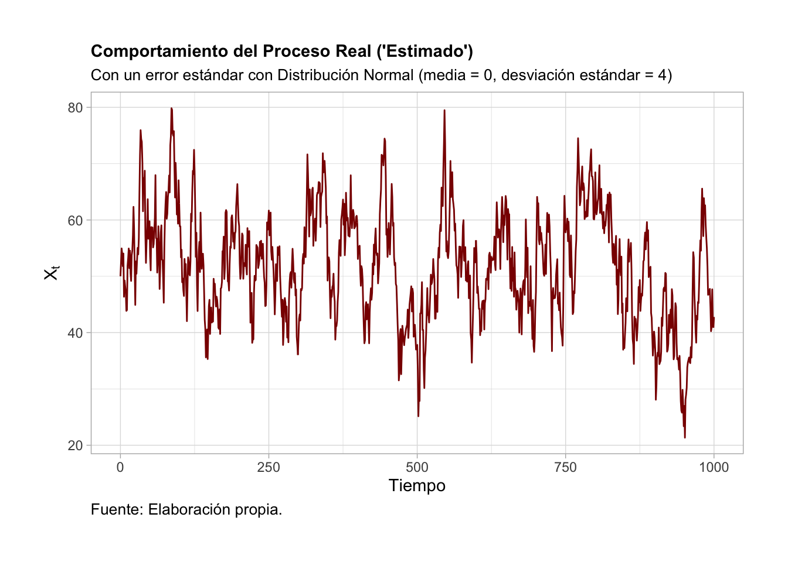
<p class="caption">(\#fig:GAR1Real)AR(1) considerando $X_t=5+0.9X_{t-1}+U_t$ ; $X_0=50$ y que $U_t$~$N(0, 4)$ y que $U_t \sim \mathcal{N}(0, 4)$</p>
</div>


```r

ggplot(data = X_t, aes(x = Tiempo, y = X_t)) + 
  geom_line(size = 0.5, color = "#0F531C") +
  theme_light() + 
  xlab("Tiempo") + 
  ylab(TeX("$X_t$")) + 
  theme(plot.title = element_text(size = 11, face = "bold", hjust = 0)) + 
  theme(plot.subtitle = element_text(size = 10, hjust = 0)) + 
  theme(plot.caption = element_text(size = 10, hjust = 0)) +
  theme(plot.margin = unit(c(1,1,1,1), "cm")) +
  labs(
    title = "Comportamiento del Proceso Teórico",
    subtitle = "Con un error con Distribución Normal (media = 0, desviación estándar = 4)",
    caption = "Fuente: Elaboración propia."
  )
```

<div class="figure" style="text-align: center">

<p class="caption">(\#fig:GAR1Teo)$X_t = \frac{5}{1 - 0.9} + \sum_{j = 0}^{t-1} 0.9^j U_{t-j}$, y que $U_t \sim \mathcal{N}(0, 4)$}</p>
</div>


```r

acf(X_t$XR_t, lag.max = 30, col = "blue", 
    ylab = "Autocorrelacion",
    xlab="Rezagos", 
    main="Funcion de Autocorrelacion Real")
```

<div class="figure" style="text-align: center">

<p class="caption">(\#fig:GAR1FACr)Función de autocorrelación de un AR(1): $\rho(\tau)=\frac{\gamma(	au)}{\gamma(0)}$</p>
</div>


```r

barplot(X_t$rho[1:30], names.arg = c(1:30), col = "blue", border="blue", density = c(10,20), 
        ylab = "Autocorrelacion", 
        xlab="Rezagos", 
        main="Funcion de Autocorrelacion Teórica")
```

<div class="figure" style="text-align: center">
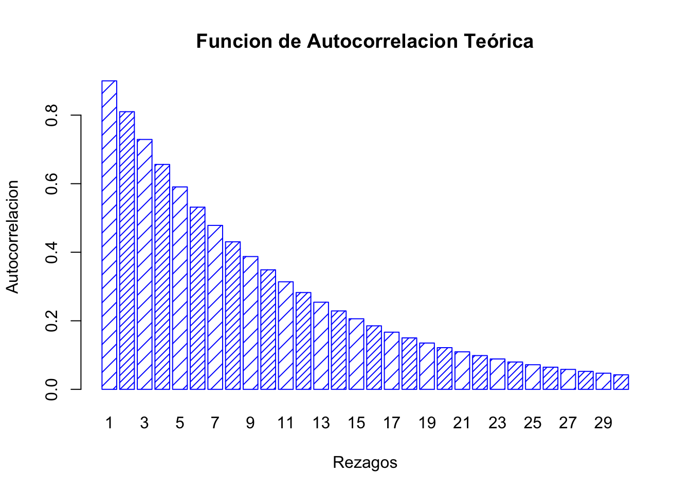
<p class="caption">(\#fig:GAR1FACt-1)Función de autocorrelación de un AR(1): $\rho(\tau)= a_1^\tau$</p>
</div>

```r

acf(X_t$XR_t, lag.max = 30, col = "blue", 
    ylab = "Autocorrelacion",
    xlab="Rezagos", 
    main="Funcion de Autocorrelacion Real")
```

<div class="figure" style="text-align: center">

<p class="caption">(\#fig:GAR1FACt-2)Función de autocorrelación de un AR(1): $\rho(\tau)= a_1^\tau$</p>
</div>


```r

ggplot(data = X_t, aes(x = Tiempo)) +
  geom_line(aes(y = XR_t), size = 0.5, color = "darkred") +
  geom_line(aes(y = X_t), size = 1, color = "#0F531C") +
  theme_bw() + 
  xlab("Tiempo") + 
  ylab(TeX("$X_t$")) + 
  theme(plot.title = element_text(size = 11, face = "bold", hjust = 0)) + 
  theme(plot.subtitle = element_text(size = 10, hjust = 0)) + 
  theme(plot.caption = element_text(size = 10, hjust = 0)) +
  theme(plot.margin = unit(c(1,1,1,1), "cm")) +
  labs(
    title = "Comportamiento de los Procesos Real y Teórico",
    subtitle = "Con un error con Distribución Normal (media = 0, desviación estándar = 4)",
    caption = "Fuente: Elaboración propia."
  )
```

<div class="figure" style="text-align: center">

<p class="caption">(\#fig:GAR1Com)AR(1) considerando en conjunto $X_t = 5 + 0.9 X_{t-1} + U_t$; $X_0 = 50$ y $X_t = \frac{5}{1 - 0.9} + \sum_{j = 0}^{t-1} 0.9^j U_{t-j}$, y que $U_t \sim \mathcal{N}(0, 4)$</p>
</div>

La Figura \@ref(fig:GAR1Real) ilustra el comportamiento que se debería
observar en una serie considerando el procedimiento iterativo de
construcción. Por su parte, la Figura \@ref(fig:GAR1Teo) ilustra el
proceso o trayectoria de la solución de la serie de tiempo. Finalmente,
las Figuras \@ref(fig:GAR1FACr) y \@ref(fig:GAR1FACr) muestran el
correlograma calculado considerando una función de autocorrelación
aplicada al porceso real y una función de autocorrelación aplicada al
proceso teórico, respectivamente.

Recordemos que una trayectoria de equilibrio o solución de un $AR(1)$ es
como se muestra en la ecuación \@ref(eq:AR1Sol). Así, nuestra serie
simulada cumple con la característica de que los errores son más
relevantes cuando la serie es corta. Por el contrario, los errores son
menos relevantes, cuando la serie es muy larga. La Figura
\@ref(fig:GAR1Com) ilustra esta observación de la trayectoria de
equilibrio.


### AR(2)

Una vez analizado el caso de $AR(1)$ analizaremos el caso del $AR(2)$.
La ecuación generalizada del proceso autoregresivo de orden 2 (denotado
como $AR(2)$) puede ser escrito como: 

\begin{equation}
    X_t = a_0 + a_1 X_{t-1} + a_2 X_{t-2} + U_t
    (\#eq:AR2Eq)
\end{equation}

Donde $U_t$ denota un proceso puramente aleatorio con media cero ($0$), varianza constante ($\sigma^2$) y autocovarianza cero ($Cov(U_t, U_s) = 0$, con $t \neq s$), y un parametro $a_2 \neq 0$. Así, utilizando el operador rezago podemos reescribir la ecuación \@ref(eq:AR2Eq) como:
\begin{eqnarray*}
    X_t - a_1 X_{t-1} - a_2 X_{t-2} & = & a_0 + U_t \\
    (1 - a_1 L^1 - a_2 L^2) X_t & = & a_0 + U_t
\end{eqnarray*}

Donde, vamos a denotar a $\alpha (L) = (1 - a_1 L^1 - a_2 L^2)$, y lo llamaremos como un polinomio que depende del operador rezago y que es distinto de cero. De esta forma podemos reescribir a la ecuación \@ref(eq:AR2Eq)  como:
\begin{equation}
    \alpha(L) X_t = a_0 + U_t
    (\#eq:AR2Eq1)
\end{equation}

Ahora, supongamos que existe el inverso multiplicativo del polinomio $\alpha(L)$, el cual será denotado como: $\alpha^{-1}(L)$ y cumple con que:
\begin{equation}
    \alpha^{-1}(L) \alpha(L) = 1   
      (\#eq:AR2Eq2)
\end{equation}

Así, podemos escribir la solución a la ecuación \@ref(eq:AR2Eq) como:
\begin{equation}
    X_t = \alpha^{-1}(L) \delta + \alpha^{-1}(L) U_t
\end{equation}

Si utilizamos el hecho que $\alpha^{-1}(L)$ se puede descomponer a través del procedimiento de Wold en un polinomio de forma similar el caso de $AR(1)$, tenemos que:
\begin{equation}
    \alpha^{-1}(L) = \psi_0 + \psi_1 L + \psi_2 L^2 + \ldots
      (\#eq:AR2Eq3)
\end{equation}

Por lo tanto, el inverso multiplicativo $\alpha^{-1}(L)$ se puede ver como:
\begin{equation}
    1 = (1 - a_1 L^1 - a_2 L^2) (\psi_0 + \psi_1 L + \psi_2 L^2 + \ldots)
      (\#eq:InvAlpha)
\end{equation}

Desarrollando la ecuación \@ref(eq:InvAlpha) tenemos la sigueinte expresión:

\begin{eqnarray}
    1 & = & \psi_0 & + & \psi_1 L & + & \psi_2 L^2 & + & \psi_3 L^3 & + & \ldots \\
     &  &  & - & a_1 \psi_0 L & - & a_1 \psi_1 L^2 & - & a_1 \psi_2 L^3 & - & \ldots \\
    & &  &  &  & - & a_2 \psi_0 L^2  & - & a_2 \psi_1 L^3 & - & \ldots
\end{eqnarray}

Ahora, podemos agrupar todos los términos en función del exponente asociado al operador rezago $L$. La siguiente es una solución partícular y es una de las múltiples que podrían existir que cumpla con la ecuación \@ref(eq:InvAlpha). Sin embargo, para efectos del análisis sólo necesitamos una de esas soluciones. Utilizaremos las siguientes condiciones que deben cumplirse en una de las posibles soluciones:

\begin{eqnarray}
    L^0 : &   & \Rightarrow & \psi_0 = 1 \\
    L : & \psi_1 - a_1 \psi_0 = 0 & \Rightarrow & \psi_1 = a_1$ \\
    L^2 : & \psi_2 - a_1 \psi_1 - a_2 \psi_0 = 0 & \Rightarrow & \psi_2 = a^2_1 + a_2 \\
    L^3 : & \psi_3 - a_1 \psi_2 - a_2 \psi_1 = 0 & \Rightarrow & \psi_3 = a^3_1 + 2 a_1 a_2$ \\
    \vdots & \vdots & \vdots & \vdots
\end{eqnarray}

De esta forma podemos observar que en el límite siempre obtendremos una ecuación del tipo $\psi_j - a_1 \psi_{j-1} - a_2 \psi_{j-2} = 0$ asociada a cada uno de los casos en que exista un $L^j$, donde $j \neq 0, 1$, y la cual siempre podremos resolver conociendo que las condiciones iniciales son: $\psi_0 = 1$ y $\psi_1 = a_1$.

Así, de las relaciones antes mencionadas y considerando que $\alpha^{-1} (L)$ aplicada a una constante como $a_0$, tendrá como resultado otra constante. De esta forma podemos escribir que la solución del proceso AR(2) en la ecuación \@ref(eq:AR2Eq) será dada por una expresión como sigue:
\begin{equation}
    X_t = \frac{\delta}{1 - a_1 - a_2} + \sum^{\infty}_{j = 0} \psi_{t - j} U_{t - j}
    (\#eq:AR2EqSol)
\end{equation}

Donde todos los parametros $\psi_i$ está determinado por los parámtros $a_0$, $a_1$ y $a_2$. En particular, $\psi_0 = 1$ y $\psi_1 = a_1$ como describimos anteriormente. Al igual que en el caso del $AR(1)$, en la ecuación \@ref(eq:AR2EqSol) las condiciones de estabilidad estarán dadas por las soluciones del siguiente polinomio característico:^[Note que raíces son equivalentes al inversio de las del polinomio dado por $\lambda^2 a_2 - \lambda a_1 - 1 = 0$.]
\begin{equation}
    \lambda^2 - \lambda a_1 - a_2 = 0
    (\#eq:AR2EqSol1)
\end{equation}

Así, la condición de estabilidad de la trayectoria es que $\lvert\lambda_i\lvert < 1$, para $i = 1, 2$. Es decir, es necesario que cada una de las raíces sea, en valor absoluto, siempre menor que la unidad. Estas son las condiciones de estabilidad para el proceso $AR(2)$. 

Finalmente, al igual que en un $AR(1)$, a continuación determinamos los momentos de una serie que sigue un proceso $AR(2)$. Iniciamos con la determinación de la media de la serie:
\begin{equation}
    \mathbb{E}[X_t] = \mu = \frac{a_0}{1 - a_1 - a_2}
    (\#eq:AR2EqSol2)
\end{equation}

Lo anterior es cierto puesto que $\mathbb{E}[U_{t - i}] = 0$, para todo $i = 0, 1, 2, \ldots$. Para determinar la varianza utilizaremos las siguientes relaciones basadas en el uso del valor esperado, varianza y covarianza de la serie. Adicionalmente, para simplificar el trabajo asumamos que $a_0 = 0$, lo cual implica que $\mu = 0$. Dicho lo anterior, partamos de:
\begin{eqnarray}
    \mathbb{E}[X_t X_{t - \tau}] & = & \mathbb{E}[(a_1 X_{t-1} + a_2 X_{t-2} + U_t) X_{t - \tau}]\\
    & = & a_1 \mathbb{E}[X_{t - 1} X_{t - \tau}] + a_2 \mathbb{E}[X_{t - 2} X_{t - \tau}] + \mathbb{E}[U_{t} X_{t - \tau}]
    (\#eq:AR2EqSol3)
\end{eqnarray}

Donde $\tau = 0, 1, 2, 3, \ldots$ y que $\mathbb{E}[U_{t} X_{t - \tau}] = 0$ para todo $\tau \neq 0$.^[Es fácil demostrar está afirmación, sólo requiere de desarrollar la expresión y utilizar el hecho de que $U_t$ es un proceso pueramente aleatorio, por lo que la covarianza es cero (0).] Dicho esto, podemos derivar el valor del valor esperado para diferentes valores de $\tau$:


\begin{eqnarray}
    \tau = 0: & \gamma(0) & = & \alpha_1 \gamma(1) + \alpha_2 \gamma(2) + \sigma^2 \\
    \tau = 1: & \gamma(1) & = & \alpha_1 \gamma(0) + \alpha_2 \gamma(1) \\
    \tau = 2: & \gamma(2) & = & \alpha_1 \gamma(1) + \alpha_2 \gamma(0) \\
    \vdots & \vdots & \vdots & \vdots
\end{eqnarray}

Donde debe ser claro que $\mathbb{E}[(X_{t} - \mu)(X_{t - \tau} - \mu)] = \mathbb{E}[X_{t} X_{t - \tau}] = \gamma(\tau)$. Así, en general cuando $\tau \neq 0$:
\begin{equation}
    \gamma(\tau) = a_1 \gamma(\tau - 1) + a_2 \gamma(\tau - 2)
\end{equation}

Realizando la sustitución recursiva y solucionando el sistema respectivo obtenemos que las varianza y covarianzas estaran determinadas por:
\begin{equation}
    Var[X_t] = \gamma(0) = \frac{1 - a_2}{(1 + a_2)[(1 - a_2)^2 - a^2_1]} \sigma^2
    (\#eq:AR2EqSol5)
\end{equation}

\begin{equation}
    \gamma(1) = \frac{a_1}{(1 + a_2)[(1 - a_2)^2 - a^2_1]} \sigma^2
    (\#eq:AR2EqSol6)
\end{equation}

\begin{equation}
    \gamma(2) = \frac{a^2_1 + a_2 - a^2_2}{(1 + a_2)[(1 - a_2)^2 - a^2_1]} \sigma^2
    (\#eq:AR2EqSol7)
\end{equation}

Recordemos que las funciones de autocorrelación se obtienen de la división de cada unas de las funciones de covarianza ($\gamma(\tau)$) por la varianza ($\gamma(0)$). Así, podemos construir la siguiente expresión:
\begin{equation}
    \rho(\tau) - a_1 \rho(\tau - 1) - a_2 \rho(\tau - 2) = 0
    (\#eq:AR2EqSol8)
\end{equation}


Para el segundo ejemplo consideremos una aplicación a una serie de
tiempo en especifico:

#### EJEMPLO AR(2)

Recordando el tema pasado y la serie en la que evaluamos los cambios de
precio del ACTIVO AMZN como si fueran retornos:


```r
#install.packages("pacman")
#pacman nos permite cargar varias librerias en una sola línea
library(pacman)
pacman::p_load(tidyverse,BatchGetSymbols,ggplot2,lubridate,readxl,forecast,stats,stargazer,knitr)
```


```r
#Primero determinamos el lapso de tiempo
pd<-as.Date("2002/9/01") #primer fecha
pd
#> [1] "2002-09-01"
#> [1] "2021-09-18"
ld<- as.Date("2021/10/01")#última fecha
ld
#> [1] "2021-10-01"
#Intervalos de tiempo
int<-"monthly"

#Datos a elegir
dt<-c("AMZN")

#Descargando los valores
data1<- BatchGetSymbols(tickers = dt,
                       first.date = pd,
                       last.date = ld,
                       freq.data = int,
                       do.cache = FALSE,
                       thresh.bad.data = 0)

#Generando data frame con los valores
data_precio_amzn<-data1$df.tickers
colnames(data_precio_amzn)
#>  [1] "ticker"              "ref.date"           
#>  [3] "volume"              "price.open"         
#>  [5] "price.high"          "price.low"          
#>  [7] "price.close"         "price.adjusted"     
#>  [9] "ret.adjusted.prices" "ret.closing.prices"
```


```r
ret_20_amazn<-ggplot(data=data_precio_amzn, aes(x=ref.date))+
  geom_line(aes(y=price.open))+
  labs(title="Precios de apertura de AMZN en los últimos 20 años",y="Retornos", x="Año")+
  theme_light()
ret_20_amazn
```

<div class="figure" style="text-align: center">

<p class="caption">(\#fig:amazn20)Serie de tiempo de los precios de apertura de año en los últimos 20 años</p>
</div>


Primero que nada es importante cargar los datos a un objeto series de
tiempo. Esto nos lo permite la función ts(). Además debemos serciorarnos
de que los datos esten en orden cronológico.


```r
data_precio_amzn<-data_precio_amzn[order(data_precio_amzn$ref.date),]
head(data_precio_amzn)#dado que ya estaba en orden cronológico nuestro df no cambia
#> # A tibble: 6 × 10
#>   ticker ref.date     volume price…¹ price…² price…³ price…⁴
#>   <chr>  <date>        <dbl>   <dbl>   <dbl>   <dbl>   <dbl>
#> 1 AMZN   2002-09-03   2.92e9   0.736   0.896   0.712   0.796
#> 2 AMZN   2002-10-01   4.07e9   0.812   1.01    0.800   0.968
#> 3 AMZN   2002-11-01   4.13e9   0.961   1.23    0.91    1.17 
#> 4 AMZN   2002-12-02   3.11e9   1.21    1.25    0.922   0.944
#> 5 AMZN   2003-01-02   3.38e9   0.960   1.16    0.928   1.09 
#> 6 AMZN   2003-02-03   2.32e9   1.10    1.12    0.980   1.10 
#> # … with 3 more variables: price.adjusted <dbl>,
#> #   ret.adjusted.prices <dbl>, ret.closing.prices <dbl>,
#> #   and abbreviated variable names ¹​price.open,
#> #   ²​price.high, ³​price.low, ⁴​price.close
#hagamos el objeto ts
price_amazn_ts<-ts(data_precio_amzn$price.open, frequency = 12)
plot(price_amazn_ts)#de esta manera podemos ver que se cargo bien debido a que es igual al ggplot
```

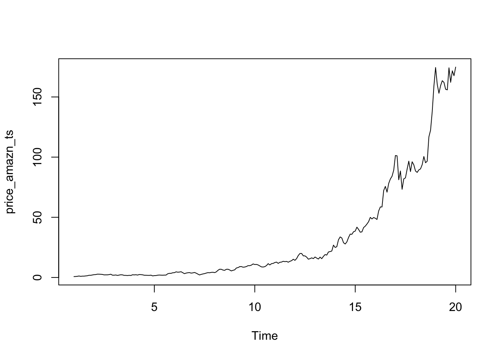

Dado que queremos saber si existe un proceso $AR(2)$ en estos cambio
debemos calcularlo. Para ello utilizamos la función $lm()$ que realizará una regresión lineal y veremos la relación de los valores con sus valores pasados en $t-2$:


```r
priceopen<-data_precio_amzn$price.open
priceopen_amazn<-data.matrix(priceopen)
lags<-function(mat,p){
  for(i in 1:p){
    uno<-mat[,1]
    mat<-cbind(mat,lag(uno,i))}
  as.data.frame(mat)
}

df.lags<-lags(priceopen_amazn,2)
ar2_amazn<-lm(V1~., data=df.lags)
```

Veamos la tabla de la regresión lineal:


<table style="text-align:center"><caption><strong>AR(2) de los precios de apertura de AMZN</strong></caption>
<tr><td colspan="2" style="border-bottom: 1px solid black"></td></tr><tr><td style="text-align:left"></td><td><em>Dependent variable:</em></td></tr>
<tr><td></td><td colspan="1" style="border-bottom: 1px solid black"></td></tr>
<tr><td style="text-align:left"></td><td>V1</td></tr>
<tr><td colspan="2" style="border-bottom: 1px solid black"></td></tr><tr><td style="text-align:left">V2</td><td>0.944<sup>***</sup></td></tr>
<tr><td style="text-align:left"></td><td>(0.067)</td></tr>
<tr><td style="text-align:left">V3</td><td>0.076</td></tr>
<tr><td style="text-align:left"></td><td>(0.068)</td></tr>
<tr><td style="text-align:left">Constant</td><td>0.217</td></tr>
<tr><td style="text-align:left"></td><td>(0.342)</td></tr>
<tr><td colspan="2" style="border-bottom: 1px solid black"></td></tr><tr><td style="text-align:left">Observations</td><td>227</td></tr>
<tr><td style="text-align:left">R<sup>2</sup></td><td>0.991</td></tr>
<tr><td style="text-align:left">Adjusted R<sup>2</sup></td><td>0.991</td></tr>
<tr><td style="text-align:left">Residual Std. Error</td><td>4.202 (df = 224)</td></tr>
<tr><td style="text-align:left">F Statistic</td><td>12,966.920<sup>***</sup> (df = 2; 224) (p = 0.000)</td></tr>
<tr><td colspan="2" style="border-bottom: 1px solid black"></td></tr><tr><td style="text-align:left"><em>Note:</em></td><td style="text-align:left">(p<0.1)=[*], (p<0.05)=[**], (p<0.01)=[***]</td></tr>
</table>

La tabla anterior claramente indica que **hay una relación entre el valor del precio y sus valores anteriores en un proceso AR(2)**.

Así pues es importante modificar la serie de tiempo para ilustrar como se puede controlar los efectos de los autoregresores $AR(2)$. Para ello, utilizaremos la función $arima()$. En "order" tenemos un vector $c(p,d,q)$ que corresponde $p$ a el grado de AR, $d$ el grado de diferención y $q$ el grado de MA que utilizaremos. El valor $q$ quedaráá en $0$ por ahora pero será analizado más adelante.


```r
AR_price_amazn_ts<-arima(price_amazn_ts,order=c(2,0,0),method = "ML")
AR_price_amazn_pl<-Arima(price_amazn_ts,order=c(2,0,0),method = "ML")
```

Veamos si las raices inversas mantienen la estabilidad al ser menores a 1.

```r
autoplot(AR_price_amazn_ts)+theme_light()
```

<div class="figure" style="text-align: center">
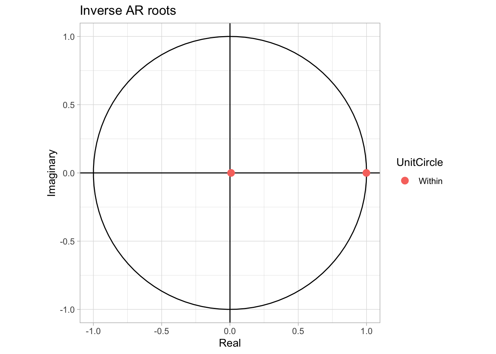
<p class="caption">(\#fig:amazn20root)Raices AR(2) Inversas de la serie de tiempo</p>
</div>
Claramente se puede en la Figura \@ref(fig:amazn20root) ver que los valores de las raices inversas están dentro del circulo unitario y, por consiguiente son menores a 1. Ahora veamos como se ve la estimación ajustada AR(2) con el plot original.


```r
plot(AR_price_amazn_pl$x,col="black", main = "Diferencia entre la serie de tiempo original y AR(2)",xlab="Tiempo",ylab="Precio")+lines(fitted(AR_price_amazn_pl),col="blue")
```

<div class="figure" style="text-align: center">
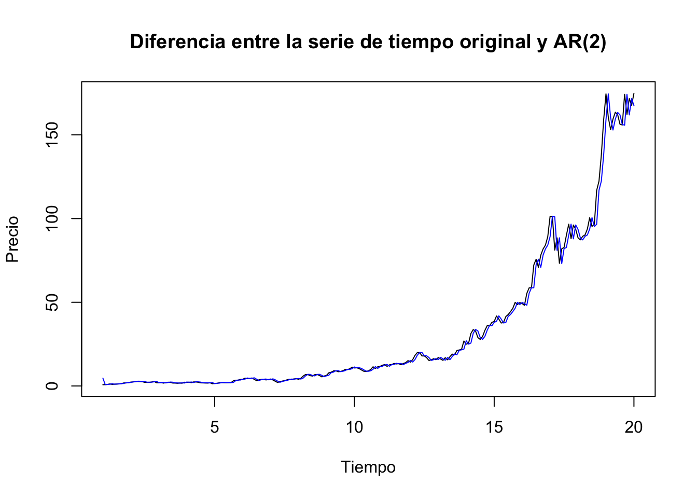
<p class="caption">(\#fig:amazn20AR2)Diferencia entre la serie de tiempo original de precios de AMZN y su AR(2)</p>
</div>

```
#> integer(0)
```
Consecuentemente en la Figura \@ref(fig:amazn20AR2) es posible ver la manera en la que se suaviza un poco la línea lo cual debe ayudarnos a hacer una mejor estimación. Ahora veamos $AR(p)$.


### AR(p)

Veremos ahora una generalización de los procesos autoregresivos (AR). Esta generalización es conocida como un proceso $AR(p)$ y que puede ser descrito por la siguiente ecuación en diferencia estocástica:
\begin{equation}
    X_t = a_0 + a_1 X_{t-1} + a_2 X_{t-2} + a_3 X_{t-3} + \ldots + a_p X_{t-p} + U_t
    (\#eq:ARpEq)
\end{equation}

Donde $a_p \neq 0$, y $U_t$ es un proceso puramente aleatorio con media cero (0), varianza constante ($\sigma^2$) y covarianza cero (0). Usando el operador rezago, $L^k$, para $k = 0, 1, 2, \ldots, p$, obtenemos la siguiente expresión de la ecuación \@ref(eq:ARpEq):
\begin{equation}
    (1 - a_1 L - a_2 L^2 - a_3 L^3 - \ldots - a_p L^p) X_t = a_0 + U_t
    (\#eq:ARpEq1)
\end{equation}

Definamos el polinomio $\alpha(L)$ como:
\begin{equation}
    \alpha(L) = 1 - a_1 L - a_2 L^2 - a_3 L^3 - \ldots - a_p L^p
    (\#eq:PolA)
\end{equation}

De forma similar que en los procesos $AR(1)$ y $AR(2)$, las condiciones de estabilidad del proceso $AR(p)$ estarán dadas por la solución de la ecuación característica:
\begin{equation}
    \lambda^p - a_1 \lambda^{p-1} - a_2 \lambda^{p-2} - a_3 \lambda^{p-3} - \ldots - a_p = 0
        (\#eq:PolA1)
\end{equation}

Así, solo si el polinomio anterior tiene raíces cuyo valor absoluto sea menor a uno ($\lvert\lambda_i\lvert < 1$) y si $1 - a_1 L  - a_2 L^2 - a_3 L^3  - \ldots - a_p L^p < 1$ podremos decir que el proceso es convergente y estable. Lo anterior significa que la ecuación \@ref(eq:PolA) puede expresarse en términos de la descomposición de Wold o como la suma infinita de términos como:
\begin{equation}
    \frac{1}{1 - a_1 L  - a_2 L^2 - a_3 L^3  - \ldots - a_p L^p} = \psi_0 + \psi_1 L + \psi_2 L^2 + \psi_3 L^3 + \ldots
(\#eq:PolA2)
\end{equation}

Donde, por construcción de $\alpha(L) \alpha^{-1}(L) = 1$ implica que $\psi_0 = 1$. De forma similar a los proceso AR(1) y AR(2), es posible determinar el valor de los coefieentes $\psi_j$ en términos de los coefientes $a_i$. Así, la solución del proceso $AR(p)$ estará dada por:
\begin{equation}
    X_t = \frac{a_0}{1 - a_1  - a_2 - a_3  - \ldots - a_p} + \sum^{\infty}_{j = 0} \psi_j U_{t-j}
    (\#eq:ARpEqSol)
\end{equation}

Considerando la solución de la ecuación \@ref(eq:ARpEq) expresada en la ecuación \@ref(eq:ARpEqSol) podemos determinar los momentos del proceso y que estarán dados por una media como:
\begin{equation}
    \mathbb{E}[X_t] = \mu = \frac{a_o}{1 - a_1  - a_2 - a_3  - \ldots - a_p}
        (\#eq:ARpEqSol1)
\end{equation}

Lo anterior, considerado que $\mathbb{E}[U_t] = 0$, para todo $t$. Para determinar la varianza del proceso, sin pérdida de generalidad, podemos definir una ecuación: $\gamma(\tau) = \mathbb{E}[X_{t - \tau} X_t]$, la cual (omitiendo la constante, ya que la correlación de una constante con cuaquier variable aleatoria que depende del tiempo es cero (0)) puede ser escrita como:
\begin{equation}
    \gamma(\tau) = \mathbb{E}[(X_{t - \tau}) \cdot (a_1 X_{t-1} + a_2 X_{t-2} + a_3 X_{t-3} + \ldots + + a_p X_{t-p} + U_t)]
        (\#eq:ARpEqSol2)
\end{equation}

Donde $\tau = 0, 1, 2, \ldots, p$ y $a_0 = 0$, lo que implica que $\mu = 0$. De lo anterior obtenemos el siguiente conjunto de ecuaciones mediante sustituciones de los valores de $\tau$:
\begin{eqnarray}
    \gamma(0) & = & a_1 \gamma(1) + a_2 \gamma(2) + \ldots + a_p \gamma(p) + \sigma^2 \nonumber \\
    \gamma(1) & = & a_1 \gamma(0) + a_2 \gamma(1) + \ldots + a_p \gamma(p-1) \nonumber \\
    \vdots \nonumber \\
    \gamma(p) & = & a_1 \gamma(p-1) + a_2 \gamma(p-2) + \ldots + a_p \gamma(0) \nonumber
\end{eqnarray}

De esta forma, es fácil observar que la ecuación general para $p > 0$ estará dada por:
\begin{equation}
    \gamma(p) - a_1 \gamma(\tau - 1) - a_2 \gamma(\tau - 2) - \ldots - a_p \gamma(\tau - p) = 0
    (\#eq:Gammap)
\end{equation}

Dividiendo la ecuación \@ref(eq:Gammap) por $\gamma(0)$, se obtiene la siguiente ecuación: 
\begin{equation}
    \rho(p) - a_1 \rho(\tau - 1) + a_2 \rho(\tau - 2) + \ldots + a_p \rho(\tau - p) = 0
        (\#eq:Gammap1)
\end{equation}

Así, podemos escribir el siguiente sistema de ecuaciones:
\begin{eqnarray}
    \rho(1) & = & a_1 + a_2 \rho(1) + a_3 \rho(2) + \ldots + a_p \rho(p-1) \nonumber \\
    \rho(2) & = & a_1 \rho(1) + a_2 + a_3 \rho(1) + \ldots + a_p \rho(p-2) \nonumber \\
    & \vdots & \nonumber \\
    \rho(p) & = & a_1 \rho(p-1) + a_2 \rho(p-2) + \ldots + a_p \nonumber
\end{eqnarray}

Lo anterior se puede expresar como un conjunto de vectores y matrices de la siguiente forma:
\begin{equation}
    \left[ 
    \begin{array}{c}
        \rho(1) \\
        \rho(2) \\
        \vdots \\
        \rho(p)
    \end{array} 
    \right]
    = 
    \left[ 
    \begin{array}{c c c c}
        1 & \rho(1) & \ldots & \rho(p - 1) \\
        \rho(1) & 1 & \ldots & \rho(p - 2) \\
        \rho(2) & \rho(1) & \ldots & \rho(p - 3) \\
        \vdots & \vdots & \ldots & \vdots \\
        \rho(p - 1) & \rho(p - 2) & \ldots & 1 \\
    \end{array} 
    \right]
    \left[ 
    \begin{array}{c}
        a_1 \\
        a_2 \\
        a_3 \\
        \vdots \\
        a_p \\
    \end{array} 
    \right]
(\#eq:Gammap2)
\end{equation}

De lo anterior podemos escribir la siguiente ecuación que es una forma alternativa para expresar los valores de los coefientes $a_i$ de la la solución del proceso $AR(p)$:
\begin{equation}
    \mathbf{\rho} = \mathbf{R} \mathbf{a}
  (\#eq:Gammap3)
\end{equation}

Es decir, podemos obtener la siguiente expresión:
\begin{equation}
    \mathbf{a} = \mathbf{R}^{-1} \mathbf{\rho}
    (\#eq:Gammap4)
\end{equation}

#### Ejemplo AR(p)

Veamos primero la función de autocorrelacion y el plot de los lags.


```r
pacf(price_amazn_ts, main="", lag.max = 60)
```

<div class="figure" style="text-align: center">

<p class="caption">(\#fig:pacfamzn)Función de Autocorrelación parcial de la serie de tiempo de AMZN</p>
</div>

```r
acf(price_amazn_ts, main="", lag.max = 60)
```

<div class="figure" style="text-align: center">

<p class="caption">(\#fig:acfamzn)Función de Autocorrelación de la serie de tiempo de AMZN</p>
</div>


```r
lag.plot(price_amazn_ts, main="", lags=5)
```

<div class="figure" style="text-align: center">
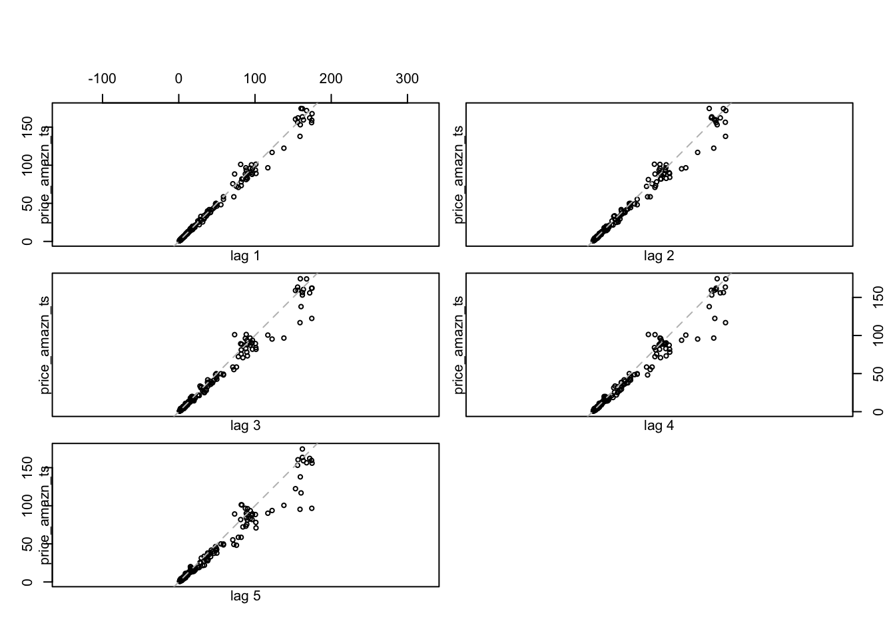
<p class="caption">(\#fig:LAGamazn20)5 plots de correlacion de los lags de la serie de tiempo de AMZN</p>
</div>
Dado que se puede ver en las Figuras \@ref(fig:acfamzn), \@ref(fig:pacfamzn) y \@ref(fig:LAGamazn20) que los valores de lag=1 tienen correlación resulta relevante hacer un AR(1), que corresponde a 1 años. Así pues:

AR:

```r
AR_price_amazn_ts_1<-arima(price_amazn_ts,order=c(1,0,0),method = "ML")
AR_price_amazn_pl_1<-Arima(price_amazn_ts,order=c(1,0,0),method = "ML")
```
Regresión lineal:

```r
df.lags.1<-lags(priceopen_amazn,1)
ar20_amazn<-lm(V1~., data=df.lags.1)
```


<table style="text-align:center"><caption><strong>AR(1) de los precios de apertura de AMZN</strong></caption>
<tr><td colspan="6" style="border-bottom: 1px solid black"></td></tr><tr><td style="text-align:left">Statistic</td><td>N</td><td>Mean</td><td>St. Dev.</td><td>Min</td><td>Max</td></tr>
<tr><td colspan="6" style="border-bottom: 1px solid black"></td></tr><tr><td style="text-align:left">V1</td><td>229</td><td>31.913</td><td>45.104</td><td>0.736</td><td>174.820</td></tr>
<tr><td style="text-align:left">V2</td><td>228</td><td>31.286</td><td>44.193</td><td>0.736</td><td>174.479</td></tr>
<tr><td colspan="6" style="border-bottom: 1px solid black"></td></tr><tr><td colspan="6" style="text-align:left">(p<0.1)=[*], (p<0.05)=[**], (p<0.01)=[***]</td></tr>
</table>


Raices:

```r
autoplot(AR_price_amazn_ts_1)+theme_light()
```

<div class="figure" style="text-align: center">
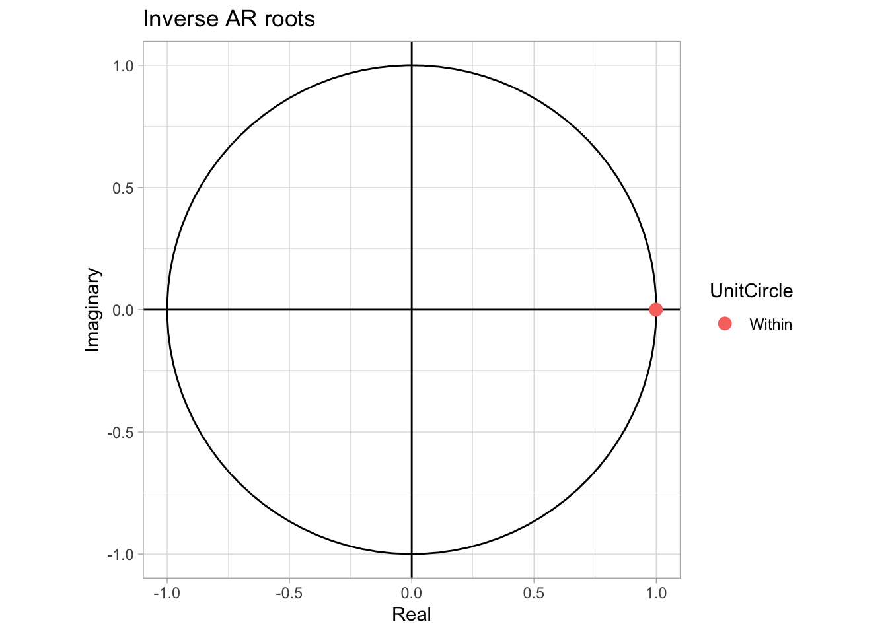
<p class="caption">(\#fig:amazn20root20)Raices AR(1) Inversas de la serie de tiempo</p>
</div>

Plot:

```r
plot(AR_price_amazn_pl_1$x,col="black", main = "Diferencia entre la serie de tiempo original y AR(1)",xlab="Tiempo",ylab="Precio")+lines(fitted(AR_price_amazn_pl_1),col="red")
```

<div class="figure" style="text-align: center">
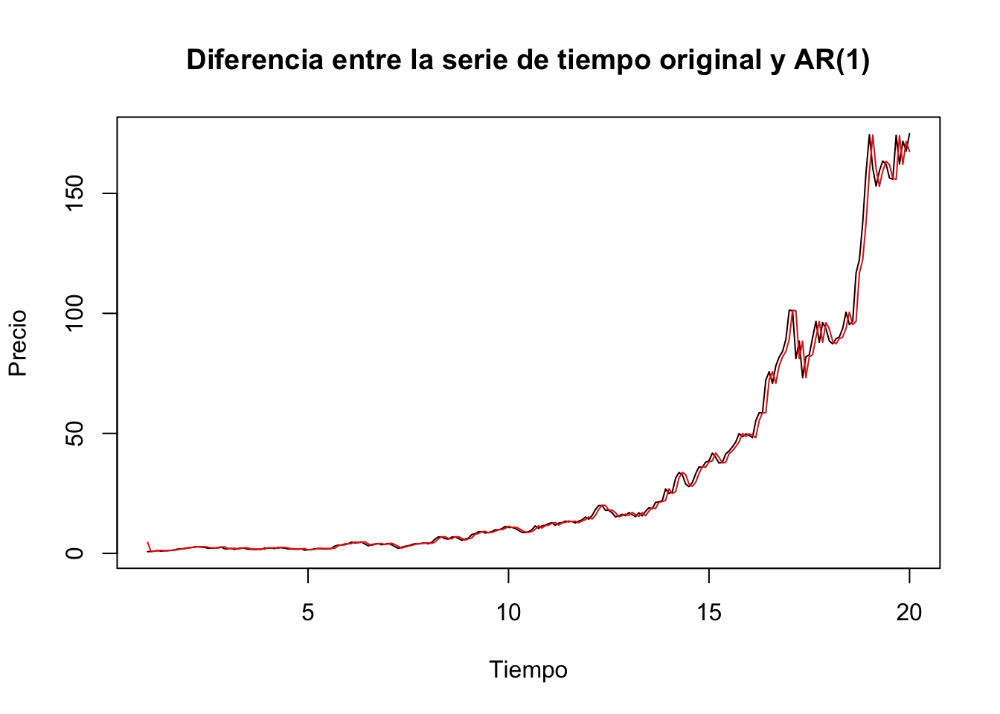
<p class="caption">(\#fig:amazn20AR20)Diferencia entre la serie de tiempo original de precios de AMZN y su AR(1)</p>
</div>

```
#> integer(0)
```
## Función de Autocorrelación Parcial

Ahora introduciremos el concepto de Función de Autocorrelación Parcial (PACF, por sus siglas en inglés). Primero, dadas las condiciones de estabilidad y de convergencia, si suponemos que un proceso AR, MA, ARMA o ARIMA tienen toda la información de los rezagos de la serie en conjunto y toda la información de los promedio móviles del término de error, resulta importante construir una métrica para distinguir el efecto de $X_{t - \tau}$ o el efecto de $U_{t - \tau}$ (para cualquier $\tau$) sobre $X_t$ de forma individual.

La idea es construir una métrica de la correlación que existe entre las diferentes varibles aleatorias, si para tal efecto se ha controlado el efecto del resto de la información. Así, podemos definir la ecuación que puede responder a este planteamiento como:
\begin{equation}
    X_t = \phi_{k1} X_{t-1} + \phi_{k2} X_{t-2} + \ldots + \phi_{kk} X_{t-k} + U_t
    (\#eq:PACFEq)
\end{equation}

Donde $\phi_{ki}$ es el coeficiente de la variable dada con el rezago $i$ si el proceso tiene un órden $k$. Así, los coeficientes $\phi_{kk}$ son los coeficientes de la autocorrelación parcial (considerando un proceso AR(k)). Observemos que la autocorrelaicón parcial mide la correlación entre $X_t$ y $X_{t-k}$ que se mantiene cuando el efecto de las variables $X_{t-1}$, $X_{t-2}$, $\ldots$ y $X_{t-k-1}$ en $X_{t}$ y $X_{t-k}$ ha sido eliminado.

Dada la expresión considerada en la ecuación \@ref(eq:PACFEq), podemos resolver el problema de establecer el valor de cada $\phi_{ki}$ mediante la solución del sistema que se representa en lo siguiente:

Table: (\#tab:foo1) Relación entre la Función de autocorrelación y la Función de autocorrelación parcial de una serie $X_t$.

|Modelo si:|Función de autocorrelación|Función de autocorrelación parcial|
|:---:|:---:|:---:|
| $MA(q)$ | Rompimientos en la función | No hay rompimientos |
| $AR(q)$ | No hay rompimientos | Rompimientos en la función |

\begin{equation}
    \left[ 
    \begin{array}{c}
        \rho(1) \\
        \rho(2) \\
        \vdots \\
        \rho(k)
    \end{array} 
    \right]
    = 
    \left[ 
    \begin{array}{c c c c}
        1 & \rho(1) & \ldots & \rho(k - 1)\\
        \rho(1) & 1 & \ldots & \rho(k - 2)\\
        \rho(2) & \rho(1) & \ldots & \rho(k - 3)\\
        \vdots & \vdots & \ldots & \vdots\\
        \rho(k - 1) & \rho(k - 2) & \ldots & 1\\
    \end{array} 
    \right]
    \left[ 
    \begin{array}{c}
        \phi_{k1} \\
        \phi_{k2} \\
        \phi_{k3} \\
        \vdots \\
        \phi_{kk} \\
    \end{array} 
    \right]
    (\#eq:PACFEq1)    
\end{equation}

Del cual se puede derivar una solución, resoviendo por el método de cramer, o cualquier otro método que consideremos y que permita calcular la solución de sistemas de ecuaciones.

Posterior al análisis analítico platearemos un enfoque para interpretar las funciones de autocorrelación y autocorrelación parcial. Este enfoque pretende aportar al principio de parcimonia, en el cual podemos identificar el número de parámetros que posiblemente puede describir mejor a la serie en un modelo ARMA(p, q).

En el Cuadro \@ref(tab:foo1) se muestra un resumen de las caranterísticas que debemos observar para determinar el número de parámetros de cada uno de los componentes AR y MA. Lo anterior por observación de las funciones de autocorrelación y autocorrelación parcial. Este enfoque no es el más formal, más adelante implemtaremos uno más formal y que puede ser más claro de cómo determinar el númeto de parámetros.

## Procesos de Medias Móviles (MA)

### MA(1)

Una vez planteado el proceso generalizado de $AR(p)$, iniciamos el planteamiento de los proceso de medias móviles, denotados como $MA(q)$. Iniciemos con el planteamiento del proceso $MA(1)$, que se puede escribir como una ecuación como la siguiente:
\begin{equation}
    X_t = \mu + U_t - b_1 U_{t-1}
    (\#eq:MA1Eq)
\end{equation}

O como:
\begin{equation}
    X_t - \mu = (1 - b_1 L) U_{t}
    (\#eq:MA1Eq1)
\end{equation}

Donde $U_t$ es un proceso puramente aleatorio, es decir, con $\mathbb{E}[U_t] = 0$, $Var[U_t] = \sigma^2$, y $Cov[U_t, U_s] = 0$. Así, un proceso $MA(1)$ puede verse como un proceso AR con una descomposición de Wold en la que $\psi_0 = 1$, $\psi_1 = - b_1$ y $\psi_j = 0$ para todo $j > 1$.

Al igual que los procesos autoregresivos, determinaremos los momentos de un proceso $MA(1)$. En el caso de la media observamos que será:
\begin{eqnarray}
    \mathbb{E}[X_t] & = & \mu + \mathbb{E}[U_t] - b_1 \mathbb{E}[U_{t - 1}] \nonumber \\
    & = & \mu
    (\#eq:MA1Eq2)
\end{eqnarray}

Por su parte la varianza estará dada por:
\begin{eqnarray}
    Var[X_t] & = & \mathbb{E}[(X_t - \mu)^2] \nonumber \\
    & = & \mathbb{E}[(U_t - b_1 U_{t-1})^2] \nonumber \\
    & = & \mathbb{E}[U_t^2 - 2 b_1 U_t U_{t-1} + b_1^2 U_{t - 1}^2] \nonumber \\
    & = &\mathbb{E}[U_t^2] - 2 b_1 \mathbb{E}[U_t U_{t-1}] + b_1^2 \mathbb{E}[U_{t - 1}^2]] \nonumber \\
    & = & \sigma^2 + b_1^2 \sigma^2 \nonumber \\
    & = & (1 + b_1^2) \sigma^2 = \gamma(0)
    (\#eq:MA1Eq3)
\end{eqnarray}

De esta forma, la varianza del proceso es constante en cualquier periodo $t$. Para determinar la covarianza utilizaremos la siguiente ecuación:
\begin{eqnarray}
    \mathbb{E}[(x_t - \mu)(x_{t + \tau} - \mu)] & = & \mathbb{E}[(U_t - b_1 U_{t-1})(U_{t + \tau} - b_1 U_{t + \tau - 1})] \nonumber \\
    & = & \mathbb{E}[U_t U_{t + \tau} - b_1 U_t U_{t + \tau - 1} - b_1 U_{t - 1} U_{t + \tau} \nonumber \\
    &   & + b_1^2 U_{t - 1} U_{t + \tau - 1}] \nonumber \\
    & = & \mathbb{E}[U_t U_{t + \tau}] - b_1 \mathbb{E}[U_t U_{t + \tau - 1}] \nonumber \\
    &   & - b_1 \mathbb{E}[U_{t - 1} U_{t + \tau}] + b_1^2 \mathbb{E}[U_{t - 1} U_{t + \tau - 1}]
    (\#eq:MA1Cov)
\end{eqnarray}

Si hacemos sustituciones de diferentes valores de $\tau$ en la ecuación \@ref(eq:MA1Cov) notaremos que la covarianza será distinta de cero únicamente para el caso de $\tau = 1, -1$. En ambos casos tendremos como resultado:
\begin{eqnarray}
    \mathbb{E}[(x_t - \mu)(x_{t + 1} - \mu)] & = & \mathbb{E}[(x_t - \mu)(x_{t - 1} - \mu)] \nonumber \\
    & = & - b_1 \mathbb{E}[U_t U_{t}] \nonumber \\
    & = & - b_1 \mathbb{E}[U_{t - 1} U_{t - 1}] \nonumber \\ 
    & = & - b_1^2 \sigma^2 = \gamma(1)
        (\#eq:MA1Cov1)
\end{eqnarray}

De esta forma tendremos que las funciones de autocorrelación estarán dadas por los siguientes casos:
\begin{eqnarray}
    \rho(0) & = & 1 \nonumber \\
    \rho(1) & = & \frac{- b_1}{1 + b_1^2} \nonumber \\
    \rho(\tau) & = & 0 \text{ para todo } \tau > 1 \nonumber 
\end{eqnarray}

Ahora regresando a la ecuación \@ref(eq:MA1Eq),e su solución la podemos expresar como:
\begin{eqnarray}
    U_ t & = & - \frac{\mu}{1 - b_1} + \frac{1}{1 - b_1 L} X_t \nonumber \\
    & = & - \frac{\mu}{1 - b_1} + X_t + b_1 X_{t-1} + b_1^2 X_{t-2} + \ldots \nonumber
\end{eqnarray}

Donde la condición para que se cumpla esta ecuación es que $\lvert b_1 \lvert< 1$. La manera de interpretar esta condición es como una condición de estabilidad de la solución y cómo una condición de invertibilidad. Notemos que un $MA(1)$ (y en general un $MA(q)$) es equivalente a un $AR(\infty)$, es decir, cuando se invierte un MA se genera un AR con infinitos rezagos.

En esta sección no desarrollaremos un ejemplo, primero explicaremos en qué consiste una modelación del tipo $MA(q)$ y después platearemos un ejemplo en concreto.

### MA(q)

En general, el proceso de medias móviles de orden $q$, $MA(q)$, puede ser escrito como:
\begin{equation}
    X_t = \mu + U_t - b_1 U_{t-1} - b_2 U_{t-2} - \ldots - b_q U_{t-q}
    (\#eq:MAqEQ)
\end{equation}

Podemos reescribir la ecuación \@ref(eq:MAqEQ) utilizando el operador rezago, así tendrémos el proceso de $MA(q)$ como:
\begin{eqnarray}
    X_t - \mu & = & (1 - b_1 L - b_2 L^2 - \ldots - b_q L^q) U_{t} \nonumber \\
    X_t - \mu & = & \beta(L) U_t
    (\#eq:MAqRed)
\end{eqnarray}

Donde $U_t$ es un proceso puramente aleatorio con $\mathbb{E}[U_t] = 0$, $Var[U_t] = \mathbb{E}[U_t^2] = 0$ y $Cov[U_t, U_s] = \mathbb{E}[U_t, U_s] = 0$, y $\beta(L) = 1 - b_1 L - b_2 L^2 - \ldots - b_q L^q$ es un polinomio del operador rezago $L$. la ecuación \@ref(eq:MAqRed) puede ser interpretada como un proceso $AR(q)$ sobre la serie $U_t$.

Ahora determinemos los momentos de un proceso $MA(q)$:
\begin{eqnarray}
    \mathbb{E}[X_t] & = & \mathbb{E}[\mu + U_t - b_1 U_{t-1} - b_2 U_{t-2} - \ldots - b_q U_{t-q}] \nonumber \\
    & = & \mu + \mathbb{E}[U_t] - b_1 \mathbb{E}[U_{t-1}] - b_2 \mathbb{E}[U_{t-2}] - \ldots - b_q \mathbb{E}[U_{t-q}] \nonumber \\
    & = & \mu
    (\#eq:MAqRed1)
\end{eqnarray}

En el caso de la varianza tenemos que se puede expresar como:
\begin{eqnarray}
    Var[X_t] & = & \mathbb{E}[(X_t - \mu)^2] \nonumber \\
    & = & \mathbb{E}[(U_t - b_1 U_{t-1} - b_2 U_{t-2} - \ldots - b_q U_{t-q})^2] \nonumber \\
    & = & \mathbb{E}[U_t^2 + b_1^2 U_{t-1}^2 + b_2^2 U_{t-2}^2 + \ldots + b_q^2 U_{t-q}^2 \nonumber \\
    &   & - 2 b_1 U_t U_{t - 1} - \ldots - 2 b_{q - 1} b_q U_{t - q + 1} U_{t - q}] \nonumber \\
    & = & \mathbb{E}[U_t^2] + b_1^2 \mathbb{E}[U_{t-1}^2] + b_2^2 \mathbb{E}[U_{t-2}^2] + \ldots + b_q^2 \mathbb{E}[U_{t-q}^2] \nonumber \\
    &   & - 2 b_1 \mathbb{E}[U_t U_{t - 1}] - \ldots - 2 b_{q - 1} b_q \mathbb{E}[U_{t - q + 1} U_{t - q}] \nonumber \\
    & = & \sigma^2 + b^2_1 \sigma^2 + b^2_2 \sigma^2 + \ldots + b^2_q \sigma^2 \nonumber \\
    & = & (1 + b^2_1 + b^2_2 + \ldots + b^2_q) \sigma^2
    (\#eq:MAqRed2)
\end{eqnarray}

En el caso de las covarianzas podemos utilizar una idea similar al caso del $AR(p)$, construir una expresión general para cualquier rezago $\tau$:
\begin{eqnarray}
    Cov[X_t, X_{t + \tau}] & = & \mathbb{E}[(X_t - \mu)(X_{t + \tau} - \mu)] \nonumber \\
    & = & \mathbb{E}[(U_t - b_1 U_{t-1} - b_2 U_{t-2} - \ldots - b_q U_{t-q}) \nonumber \\
    &   & (U_{t + \tau} - b_1 U_{t + \tau -1} - b_2 U_{t + \tau -2} - \ldots - b_q U_{t + \tau - q})] \nonumber
\end{eqnarray}

La expresión anterior se puede desarrollar para múltiples casos de $\tau = 1, 2, \ldots, q$. De esta forma tenemos el siguiente sistema:
\begin{eqnarray}
    \tau = 1 & : & \gamma(1) = (- b_1 + b_1 b_2 + \ldots + b_{q-1} b_q) \sigma^2 \nonumber \\
    \tau = 2 & : & \gamma(2) = (- b_2 + b_1 b_3 + \ldots + b_{q-2} b_q) \sigma^2 \nonumber \\
    & \vdots & \nonumber \\
    \tau = q & : & \gamma(q) = b_q \sigma^2 \nonumber
\end{eqnarray}

Donde $\gamma(\tau) = 0$ para todo $\tau > q$. Es decir, todas las autocovarianzas y autocorrelaciones con ordenes superiores a $q$ son cero (0). De esta forma, esta caracterítica teórica permite identificar el orden de $MA(q)$ visualizando la función de autocorrelación y verificando a partir de cual valor de rezago la autocorrelación es no significaiva.

Regresando al problema original que es el de determinar una solución para la eucación \@ref(eq:MAq_EQ), tenemos que dicha solución estará dada por un $AR(\infty)$ en términos de $U_t$:
\begin{eqnarray}
    U_t & = & - \frac{\mu}{1 - b_1 - b_2 - \ldots - b_q} + \beta(L)^{-1} X_t \nonumber \\
    &   & - \frac{\mu}{1 - b_1 - b_2 - \ldots - b_q} + \sum_{j = 0}^{\infty} c_j X_{t-j} 
    (\#eq:MAqEqSol)
\end{eqnarray}

Donde se cumple que: $1 = (1 - b_1 L^1 - b_2 L^2 - \ldots - b_q L^q)(1 - c_1 L - c_2 L^2 - \ldots)$ y los coeficientes $c_j$ se pueden determinar por un método de coeficientes indeterminados y en términos de los valores $b_i$. De igual forma que en el caso de la ecuación \@ref(eq:ARpEq), en la ecuación \@ref(eq:MAqEqSol) se deben cumplir condiciones de estabilidad asociadas con las raíces del polinomio carácterististico dado por:
\begin{equation}
    1 - b_1 x - b_2 x^2 - \ldots b_q x^q = 0
    (\#eq:MAqEqSol2)
\end{equation}

El cual debe cumplir que $\lvert x_i \lvert < 1$  y que $1 - b_1 - b_2 - \ldots b_q < 1$.

Ahora veamos el ejemplo. 

#### Ejemplo MA(q)
Cuando nos fijamos en las figuras \@ref(fig:pacfamzn) y \@ref(fig:acfamzn) es claro que hay un proceso MA(1). Es decir que picos de un año estan causando efectos en valores futuros. Así pues, escogemos un valor de $q=1$.

MA:

```r
MA_price_amazn_ts_1<-arima(price_amazn_ts,order=c(0,0,1),method = "ML")
MA_price_amazn_pl_1<-Arima(price_amazn_ts,order=c(0,0,1),method = "ML")
```


Raices MA(1):

```r
autoplot(MA_price_amazn_ts_1)+theme_light()
```

<div class="figure" style="text-align: center">
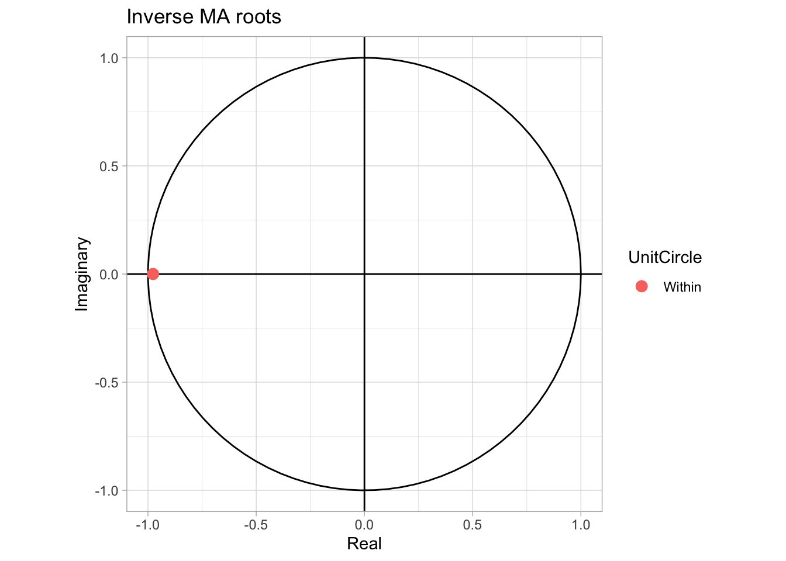
<p class="caption">(\#fig:amazn20rootma11)Raices MA(1) Inversas de la serie de tiempo</p>
</div>

Dado que el valor de la raiz inversa de MA(1) en la Figura \@ref(fig:amazn20rootma11) sabemos que tenemos una serie convergente y estable.

Plot:

```r
plot(MA_price_amazn_pl_1$x,col="black", main = "Diferencia entre la serie de tiempo original y MA(1)",xlab="Tiempo",ylab="Precio")+lines(fitted(MA_price_amazn_pl_1),col="red")
```

<div class="figure" style="text-align: center">
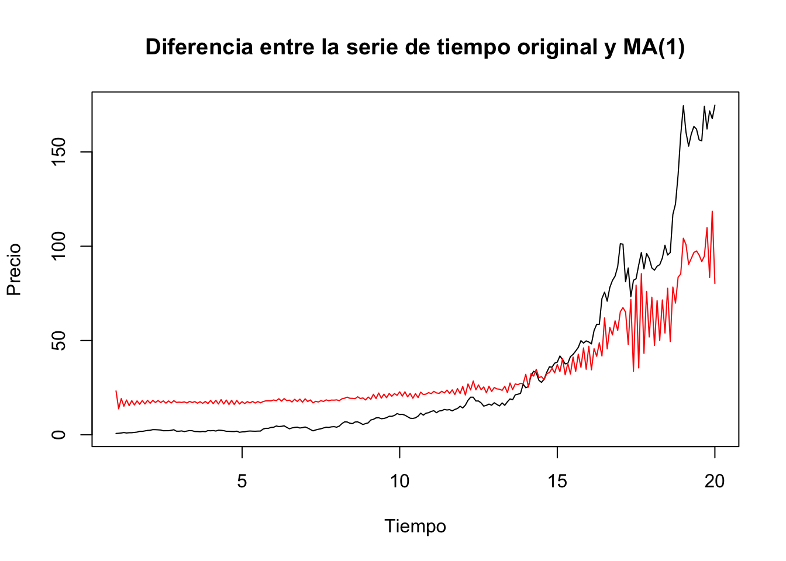
<p class="caption">(\#fig:amazn20AR1)Diferencia entre la serie de tiempo original de precios de AMZN y su AR(1)</p>
</div>

```
#> integer(0)
```
En la Figura \@ref(fig:amazn20AR1), es muy fácil ver que los efectos de los picos son muy bajos ahora, lo cual nos permitirá hacer mejores estimaciones. __Evidentemente querremos hacer el proceso AR(p) y MA(q) simultaneamente para obtener los mejores resultados.__

## Procesos ARMA(p, q) y ARIMA(p, d, q)

Hemos establecido algunas relaciones las de los porcesos AR y los procesos MA, es decir, cómo un $MA(q)$ de la serie $X_t$ puede ser reexpresada como un $AR(\infty)$ de la serie $U_t$, y viceversa un $AR(p)$ de la serie $X_t$ puede ser reeexpresada como un $MA(\infty)$.

En este sentido, para cerrar esta sección veámos el caso de la especificación que conjunta ambos modelos en un modelo general conocido como $ARMA(p, q)$ o $ARIMA(p, d, q)$. La diferencia entre el primero y el segundo es las veces que su tuvo que diferenciar la serie analizada, registro que se lleva en el índice $d$ de los paramétros dentro del concepto $ARIMA(p, d, q)$. No obstante, en general nos referiremos al modelo como $ARMA(p, q)$ y dependerá del analista si modela la serie en niveles (por ejemplo, en logaritmos) o en diferencias logarítmicas (o diferencias sin logaritmos).


### ARMA(1, 1)

Dicho lo anterior vamos a empezar con el análisis de un $ARMA(1, 1)$. Un proceso $ARMA(1, 1)$ puede verse como:
\begin{equation}
    X_t = \delta + a_1 X_{t - 1} + U_t - b_1 U_{t - 1}
    (\#eq:ARMA11Eq)
\end{equation}

Aplicando el operado rezago podemos rescribir la ecuación \@ref(eq:ARMA11Eq) como:
\begin{equation}
    (1 - a_1 L) X_t = \delta + (1 - b_1 L) U_t
     (\#eq:ARMA11Eq1)
\end{equation}

Donde $U_t$ es un proceso pueramente aleatorio como en los casos de $AR(p)$ y $MA(q)$, y $X_t$ puede ser una serie en niveles o en diferencias (ambas, en términos logarítmicos). 

Así, el modelo $ARIMA (p, q)$ también tiene una representación de Wold que estará dada por las siguientes expresiones:
\begin{equation}
    X_t = \frac{\delta}{1 - a_1} + \frac{1 - b_1 L}{1 - a_1 L} U_t
    (\#eq:ARMA11Prev)
\end{equation}

Donde $a_1 \neq b_1$, puesto que en caso contrario $X_t$ sería un proceso puramente aleatorio con una media $\mu = \frac{\delta}{1 - a_1}$. Así, podemos reescribir la descomposición de Wold a partir del componente de la ecuación \@ref(eq:ARMA11Prev)
\begin{equation}
    \frac{1 - b_1 L}{1 - a_1 L} = \psi_0 + \psi_1 L + \psi_2 L^2 + \psi_3 L^3 + \ldots 
    (\#eq:ARMA11EQWold)
\end{equation}

Está ecuación es equivalente a la expresión:
\begin{eqnarray}
    (1 - b_1 L) & = & (1 - a_1 L)(\psi_0 + \psi_1 L + \psi_2 L^2 + \psi_3 L^3 + \ldots) \nonumber \\
    & = & \psi_0 + \psi_1 L + \psi_2 L^2 + \psi_3 L^3 + \ldots \nonumber \\
    &   & - a_1 \psi_0 L - a_1 \psi_1 L^2 - a_2 \psi_2 L^3 - a_1 \psi_3 L^4 - \ldots \nonumber
\end{eqnarray}

De esta forma podemos establecer el siguiente sistema de coeficientes indeterminados:
\begin{eqnarray}
    L^0 : &   & \Rightarrow  &  \psi_0 = 1  \\
     L^1 :  &  \psi_1 - a_1 \psi_0 = - b_1  &  \Rightarrow  &  \psi_1 = a_1 - b_1  \\
     L^2 :  &  \psi_2 - a_1 \psi_1 = 0  &  \Rightarrow  &  \psi_2 = a_1(a_1 - b_1)  \\
     L^3 :  &  \psi_3 - a_1 \psi_2 = 0  &  \Rightarrow  &  \psi_3 = a^2_1(a_1 - b_1)  \\
     \vdots  &  \vdots  &  \vdots  &  \vdots  \\
     L^j :  &  \psi_j - a_1 \psi_{j - 1} = 0  &  \Rightarrow  &  \psi_j = a^{j - 1}_1(a_1 - b_1) 
\end{eqnarray}


Así, la solución a la ecuación \@ref(eq:ARMA11Eq) estará dada por la siguiente generalización:
\begin{equation}
    X_t = \frac{\delta}{1 - a_1} + U_t + (a_1 - b_1) U_{t - 1} + a_1(a_1 - b_1) U_{t - 2} + a_1^2(a_1 - b_1) U_{t - 3} + \ldots
(\#eq:ARMA11Sol)
\end{equation}

En la ecuación \@ref(eq:ARMA11Sol) las condiciones de estabilidad y de invertibilidad del sistema (de un MA a un AR, y viceversa) estarán dadas por: $\lvert a_1 \lvert < 1$ y $\lvert b_1 \lvert< 1$. Adicionalmente, la ecuación \@ref(eq:ARMA11Sol) expresa cómo una serie que tiene un comportamiento $ARMA(1, 1)$ es equivalente a una serie modelada bajo un $MA(\infty)$.

Al igual que en los demás modelos, ahora determinaremos los momentos del proceso $ARMA(1, 1)$. La media estará dada por:
\begin{eqnarray}
    \mathbb{E}[X_t] & = & \mathbb{E}[\delta + a_1 X_{t-1} + U_t - b_1 U_{t-1}] \nonumber \\
    & = & \delta + a_1 \mathbb{E}[X_{t-1}] \nonumber \\
    & = & \frac{\delta}{1 - a_1} \nonumber \\
    & = & \mu
    (\#eq:ARMA11Sol1)
\end{eqnarray}

Donde hemos utilizado que $\mathbb{E}[X_t] = \mathbb{E}[X_{t-1}] = \mu$. Es decir, la media de un $ARMA(1, 1)$ es idéntica a la de un $AR(1)$.

Para determinar la varianza tomaremos una estrategía similar a los casos de $AR(p)$ y $MA(q)$. Por lo que para todo $\tau \geq 0$, y suponiendo por simplicidad que $\delta = 0$ (lo que implica que $\mu = 0$) tendremos:
\begin{eqnarray}
    \mathbb{E}[X_{t-\tau} X_t] & = & \mathbb{E}[(X_{t-\tau}) \cdot (a_1 X_{t-1} + U_t - b_1 U_{t-1})] \nonumber \\
    & = & a_1 \mathbb{E}[X_{t-\tau} X_{t-1}] + \mathbb{E}[X_{t-\tau} U_t] - b_1 \mathbb{E}[X_{t-\tau} U_{t-1}]
    (\#eq:ARMA11Cov)
\end{eqnarray}

De la ecuación \@ref(eq:ARMA11Cov) podemos determinar una expresión para el caso de $\tau = 0$:
\begin{eqnarray}
    \mathbb{E}[X_{t} X_t] & = & \gamma(0) \nonumber \\
    & = & a_1 \gamma(1) + \mathbb{E}[U_t X_t] - b_1 \mathbb{E}[X_t U_{t-1}] \nonumber \\
    & = & a_1 \gamma(1) + \sigma^2 + b_1 \mathbb{E}[U_{t-1} (a_1 X_{t-1} + U_t - b_1 U_{t-1})] \nonumber \\
    & = & a_1 \gamma(1) + \sigma^2 - b_1 a_1 \sigma^2 + b_1 \sigma^2 \nonumber \\
    & = & a_1 \gamma(1) + (1 - b_1 (a_1 - b_1)) \sigma^2
        (\#eq:ARMA11Cov1)
\end{eqnarray}

Para el caso en que $\tau = 1$:
\begin{eqnarray}
    \mathbb{E}[X_{t-1} X_t] & = & \gamma(1) \nonumber \\
    & = & a_1 \gamma(0) + \mathbb{E}[X_{t-1} U_t] - b_1 \mathbb{E}[X_{t-1} U_{t-1}] \nonumber \\
    & = & a_1 \gamma(0) - b_1 \sigma^2
        (\#eq:ARMA11Cov2)
\end{eqnarray}

Estas últimas expresiones podemos resolverlas como sistema para determinar los siguientes valores:
\begin{eqnarray}
    \gamma(0) & = & \frac{1 + b_1^2 - 2 a_1 b_1}{1 - a_1^2} \sigma^2 
    (\#eq:ARMA11Cov3)
\end{eqnarray}

\begin{eqnarray}
    \gamma(1) & = & \frac{(a_1 - b_1)(1 - a_1 b_1)}{1 - a_1^2} \sigma^2
    (\#eq:ARMA11Cov4)
\end{eqnarray}

En general para cualquier valor $\tau \geq 2$ tenemos que la autocovarianza y la función de autocorrelación serán:
\begin{eqnarray}
    \gamma(\tau) = a_1 \gamma(\tau - 1) \\
    (\#eq:ARMA11Cov5)
    \end{eqnarray}
    
\begin{eqnarray}    
    \rho(\tau) = a_1 \rho(\tau - 1)
    (\#eq:ARMA11Cov6)
\end{eqnarray}

Por ejemplo, para el caso de $\tau = 1$ tendríamos:
\begin{equation}
    \rho(1) = \frac{(a_1 - b_1)(1 - a_1 b_1)}{1 + b_1^2 - 2 a_1 b_1}
    (\#eq:ARMA11Cov7)
\end{equation}

De esta forma, la función de autocorrelación oscilará en razón de los valores que tome $a_1$ y $b_1$.

### ARMA(p, q)

La especificación general de un $ARMA(p, q)$ (donde $p, q \in \mathbb{N}$) puede ser descrita por la siguiente ecuación:
\begin{eqnarray}
    X_t & = & \delta + a_1 X_{t - 1} + a_2 X_{t - 2} + \ldots + a_p X_{t - p} \nonumber \\
    &   & + U_t - b_1 U_{t - 1} - b_2  U_{t - 2} - \ldots - b_q  U_{t - q}
    (\#eq:ARMApqEq)
\end{eqnarray}

Donde $U_t$ es un proceso puramente aleatorio, y $X_t$ puede ser modelada en niveles o en diferencias (ya sea en logaritmos o sin transformación logarítmica). 

Mediante el uso del operador rezago se puede escribir la ecuación \@ref(eq:ARMApqEq) como:
\begin{equation}
    (1 - a_1 L - a_2 L^2 - \ldots - a_p L^p) X_t = \delta + (1 - b_1 L - b_2 L^2 - \ldots - b_q L^q) U_t 
    (\#eq:ARMApqEQLag)
\end{equation}

En la ecuación \@ref(eq:ARMApqEQLag) definamos dos polinomios: $\alpha(L) = (1 - a_1 L - a_2 L^2 - \ldots - a_p L^p)$ y $\beta(L) = (1 - b_1 L - b_2 L^2 - \ldots - b_q L^q)$. Así, podemos reescribir la ecuación \@ref(eq:ARMApqEQLag) como:
\begin{equation}
    \alpha(L) X_t = \delta + \beta(L) U_t 
    (\#eq:ARMApqEQLag1)
\end{equation}

Asumiendo que existe el polinomio inverso tal que: $\alpha(L)^{-1}\alpha(L) = 1$.La solución entonces puede ser escrita como:
\begin{eqnarray}
    X_t & = & \alpha(L)^{-1} \delta + \alpha(L)^{-1} \beta(L) U_t \nonumber \\
    & = & \frac{\delta}{1 - a_1 - a_2 - \ldots - a_p} + \frac{\beta(L)}{\alpha(L)} U_t \nonumber \\
    & = & \frac{\delta}{1 - a_1 - a_2 - \ldots - a_p} + U_t + \psi_1 L U_t + \psi_2 L^2 U_t + \ldots
    (\#eq:ARMApqWold)
\end{eqnarray}

Donde la ecuación \@ref(eq:ARMApqWold) nos permite interpretar que un ARMA(p, q) se puede reexpresar e interpreetar como un $MA(\infty)$ y donde las condiciones para la estabilidad de la solución y la invertibilidad es que las ráices de los polinomios característicos $\alpha(L)$ y $\beta(L)$ son en valor absoluto menores a 1.

Adicionalmente, la fracción en la ecuación \@ref(eq:ARMApqWold) se puede descomponer como en la forma de Wold:
\begin{equation}
    \frac{\beta(L)}{\alpha(L)} = 1 + \psi_1 L + \psi_2 L^2 + \ldots
    (\#eq:ARMApqWold1)
\end{equation}

Bajo los supuestos de estacionariedad del componente $U_t$, los valores de la media y varianza de un proceso $ARMA(p, q)$ serán como describimos ahora. Para el caso de la media podemos partir de la ecuación \@ref(eq:ARMApqWold) para generar:
\begin{eqnarray}
    \mathbb{E}[X_t] & = & \mathbb{E}\left[ \frac{\delta}{1 - a_1 - a_2 - \ldots - a_p} + U_t + \psi_1 U_{t-1} + \psi_2 U_{t-2} + \ldots \right] \nonumber \\
    & = & \frac{\delta}{1 - a_1 - a_2 - \ldots - a_p} \nonumber \\
    & = & \mu
    (\#eq:ARMApqWold2)
\end{eqnarray}

Esta expresión indica que en general un proceso $ARMA(p, q)$ converge a una media idéntica a la de un porceso $AR(p)$. Para determinar la varianza utilizaremos la misma estratégia que hemos utilizado para otros modelos $AR(p)$ y $MA(q)$.

Sin pérdida de generalidad podemos asumir que $\delta = 0$, lo que implica que $\mu = 0$, de lo que podemos establecer una expresión de autocovarianzas para cualquier valor $\tau = 0, 1, 2, \ldots$:
\begin{eqnarray}
    \gamma(\tau) & = & \mathbb{E}[X_{t-\tau} X_t] \nonumber \\
    & = & \mathbb{E}[X_{t-\tau} (\delta + a_1 X_{t - 1} + a_2 X_{t - 2} + \ldots + a_p X_{t - p} \nonumber \\
    &   & + U_t - b_1 U_{t - 1} - b_2  U_{t - 2} - \ldots - b_q  U_{t - q})] \nonumber \\
    & = & a_1 \gamma(\tau - 1) + a_2 \gamma(\tau - 2) + \ldots + a_p \gamma(\tau - p) \nonumber \\
    &   & + \mathbb{E}[X_{t-\tau} U_{t}] - b_1  \mathbb{E}[X_{t-\tau} U_{t-1}] - \ldots  - b_q  \mathbb{E}[X_{t-\tau} U_{t-q}] 
    (\#eq:ARMApqWold3)
\end{eqnarray}


## Selección de las constantes p, q, d en un AR(p), un MA(q), un ARMA(p, q) o un ARIMA(p, d, q)

Respecto de cómo estimar un proceso ARMA(p, q) --en general utilizaremos este modelo para discutir, pero lo planteado en esta sección es igualmente aplicable en cualquier otro caso como aquellos modelos que incluyen variables exogénas-- existen diversas formas de estimar los paramétros $a_i$ y $b_i$: i) por máxima verosimilitd y ii) por mínimos cuadrados órdinarios. El primer caso requiere que conozcamos la distribución del proceso aleatorio $U_t$. El segundo, por el contrario, no requiere el mismo supuesto. No obstante, para el curso utilizaremos el método de máxima verosimilitud.

Otra duda que debe quedar hasta el momento es ¿cómo determinar el orden $p$ y $q$ del proceso ARMA(p, q)? La manera más convencional y formal que existe para tal efecto es utilizar los criterios de información. Así, el orden se elije de acuerdo a aquel críterio de información que resulta ser el mínimo. En el caso de $d$ se selecciona revisando la gráfica que parezca más estacionaria--más adelante mostraremos un proceso más formal para su selección.

Los criterios de información más comunes son los siguientes:

1. FPE (Final Prediction Error):
\begin{equation}
    FPE = \frac{T+m}{T-m}\frac{1}{T}\sum_{t=1}^{T} \left( \hat{U}_t^{(p)} \right) ^2
    (\#eq:ls1)
\end{equation}

2. Akaike:
\begin{equation}
    AIC = ln \left[ \frac{1}{T} \sum_{t=1}^{T} \left( \hat{U}_t^{(p)} \right) ^2 \right] + m \frac{2}{T}
        (\#eq:ls2)
\end{equation}

3. Schwarz:
\begin{equation}
    SC = ln \left[ \frac{1}{T} \sum_{t=1}^{T} \left( \hat{U}_t^{(p)} \right) ^2 \right] + m \frac{ln(T)}{T}
      (\#eq:ls3)
\end{equation}

4. Hannan - Quinn:
\begin{equation}
    HQ = ln \left[ \frac{1}{T} \sum_{t=1}^{T} \left( \hat{U}_t^{(p)} \right) ^2 \right] + m \frac{2 ln(ln(T))}{T}
      (\#eq:ls4)
\end{equation}

Donde $\hat{U}_t^{(p)}$ son los residuales estimados mediante un proceso ARIMA y $m$ es el número de parametros estimados: $m = p + q + 0 + 1$ (ya que asumimos que $d = 0$). Una propiedad que no se debe perder de vista es que los criterios de información cumplen la siguiente relación:
\begin{equation}
    orden(SC) \leq orden(HQ) \leq orden(AIC)
    (\#eq:ls5)
\end{equation}

Por esta razón, durante el curso solo utilizaremos el criterio se Akaike para determinar el orden óptimo del proceso ARMA, ya que ello garantiza el orden más grande posible.

Veamos el ejemplo.

### Ejemplo ARMA
Para este caso coemzaremos por agregar dos series de tiempo. Una correspone a una transformación logarítmica de los valores de los precios y, otra, corresponde la diferentcia logaritmica. Esto dado que:
$$log(X_t)-log(X_{t-k})\sim\frac{X_t-X_{t-k}}{X_t}$$.


Tranformacion de la serie original

```r
#original
price_amazn_ts<-ts(data_precio_amzn$price.open, frequency = 12, start=c(2002,09))
#logartimo
lprice_amazn_ts<-ts(log(data_precio_amzn$price.open), frequency = 12)
#diferencias logaritmicas(cambio porcential)
dlprice_amazn_ts<-ts(log(data_precio_amzn$price.open)-lag(log(data_precio_amzn$price.open),1), frequency = 12)
```

Las tres series

```r
par(mfrow = c(3,1))
plot(price_amazn_ts, xlab = "Tiempo", 
     main = "Precios de apertura",
     col = "darkgreen")

plot(lprice_amazn_ts, xlab = "Tiempo", 
     main = "LN Precios de apertura",
     col = "darkblue")

plot(dlprice_amazn_ts, xlab = "Tiempo", 
     main = "Diff LN de precios de apertura", 
     col = "darkred")
```


Veamos con detenimiento el pico de la gráfica original.

Es claro que este pico se da en 2020 desde junio hasta julio, probablemente causado por el aumento del uso en amzn durante la pandemia. Esos son outlier que debemos considerar. Por ello hay que marcarlos con una variable dummy.

```r
#Generamos el rango de tiempo
junio2020 <- seq.Date(
  from=as.Date("2020-06-01"),
  to=as.Date("2020-6-29"),
  by="day")
julio2020 <- seq.Date(
  from=as.Date("2020-07-01"),
  to=as.Date("2020-07-29"),
  by="day")
agosto2020 <- seq.Date(
  from=as.Date("2020-08-01"),
  to=as.Date("2020-08-29"),
  by="day")
sept2020 <- seq.Date(
  from=as.Date("2020-09-01"),
  to=as.Date("2020-09-29"),
  by="day")
oct2020 <- seq.Date(
  from=as.Date("2020-10-01"),
  to=as.Date("2020-10-29"),
  by="day")
nov2020 <- seq.Date(
  from=as.Date("2020-11-01"),
  to=as.Date("2020-11-29"),
  by="day")
diciembre2020 <- seq.Date(
  from=as.Date("2020-12-01"),
  to=as.Date("2020-12-29"),
  by="day")
#Añadimos valores 1 y 0 dependiento si estan dentro(1) o no
data_precio_amzn$junio2020<-ifelse(data_precio_amzn$ref.date%in%junio2020,1,0)
data_precio_amzn$julio2020<-ifelse(data_precio_amzn$ref.date%in%julio2020,1,0)
data_precio_amzn$agosto2020<-ifelse(data_precio_amzn$ref.date%in%agosto2020,1,0)
data_precio_amzn$sept2020<-ifelse(data_precio_amzn$ref.date%in%sept2020,1,0)
data_precio_amzn$oct2020<-ifelse(data_precio_amzn$ref.date%in%oct2020,1,0)
data_precio_amzn$nov2020<-ifelse(data_precio_amzn$ref.date%in%nov2020,1,0)
data_precio_amzn$diciembre2020<-ifelse(data_precio_amzn$ref.date%in%diciembre2020,1,0)
#ts
junio2020ts<-ts(data_precio_amzn$junio2020, frequency = 12, start=c(2002,10))
julio2020ts<-ts(data_precio_amzn$julio2020, frequency = 12, start=c(2002,10))
agosto2020ts<-ts(data_precio_amzn$agosto2020, frequency = 12, start=c(2002,10))
sep2020ts<-ts(data_precio_amzn$sept2020, frequency = 12, start=c(2002,10))
oct2020ts<-ts(data_precio_amzn$oct2020, frequency = 12, start=c(2002,10))
nov2020ts<-ts(data_precio_amzn$nov2020, frequency = 12, start=c(2002,10))
diciembre2020ts<-ts(data_precio_amzn$diciembre2020, frequency = 12, start=c(2002,10))
#espacio de prediccion
#dummies
timepred <- seq.Date(
  from=as.Date("2022-10-01"),
  to=as.Date("2023-10-10"),
  by="month")
junio2020 <- rep(0,13)
julio2020 <- rep(0,13)
agosto2020 <- rep(0,13)
sep2020 <- rep(0,13)
oct2020 <- rep(0,13)
nov2020 <- rep(0,13)
diciembre2020 <- rep(0,13)
#data frame
pred.df <- data.frame(timepred,junio2020,julio2020, agosto2020,sep2020, oct2020, nov2020, diciembre2020)
#dummies
d.enero <- seq.Date(
  from=as.Date("2023-01-01"),
  to=as.Date("2023-01-29"),
  by="day")
d.junio <- seq.Date(
  from=as.Date("2023-06-01"),
  to=as.Date("2023-06-29"),
  by="day")
d.dic <- seq.Date(
  from=as.Date("2023-12-01"),
  to=as.Date("2023-12-29"),
  by="day")
pred.df$d.enero<-ifelse(pred.df$timepred%in%d.enero,1,0)
pred.df$d.junio<-ifelse(pred.df$timepred%in%d.junio,1,0)
pred.df$d.dic<-ifelse(pred.df$timepred%in%d.dic,1,0)
#series de tiempo predictivas
f.junio2020 <- ts(pred.df$junio2020, frequency = 12, start=c(2022,10))
f.agosto2020 <- ts(pred.df$junio2020, frequency = 12, start=c(2022,10))
f.sep2020 <- ts(pred.df$junio2020, frequency = 12, start=c(2022,10))
f.oct2020 <- ts(pred.df$junio2020, frequency = 12, start=c(2022,10))
f.nov2020 <- ts(pred.df$junio2020, frequency = 12, start=c(2022,10))
f.julio2020 <- ts(pred.df$junio2020, frequency = 12, start=c(2022,10))
f.enero <- ts(pred.df$d.enero, frequency = 12, start=c(2022,10))
f.junio <- ts(pred.df$d.junio, frequency = 12, start=c(2022,10))
f.diciembre <- ts(pred.df$d.dic, frequency = 12, start=c(2022,10))
```


Como lo vimos en las figuras \@ref(fig:pacfamzn) y \@ref(fig:acfamzn), es claro que debemos usar un valor $q$ de $1$ y $p$ de $0$, esto debido a que cuando vemos \@ref(fig:pacfamzn) no hay una correlación de ninguno de los valores. Asímismo, también necesitamos diferenciar, lo cual corresponde al valor $d$. Así pues, dado que en las funciones de autocorrelacion solo vemos uno o dos picos arriba de la linea punteada azul, podemos asumir que el valor de diferenciación debe ser uno o dos, en este caso dos. Esto se debe seguir como regla de dedo, pero en general se debe usar el valor que minimice la desviacion estandar y también el que minimice AIC. Por tanto nuestro modelo debe ser $arima(0,2,1)$.

Utilizamos la funcion "auto.arima" para confirmar que nuestra serie de tiempo deba ser $arima(0,2,1)$, el arima que debos usar es aquel que minimize el indice AIC.

```r
auto.arima(price_amazn_ts, trace=TRUE)
#> 
#>  Fitting models using approximations to speed things up...
#> 
#>  ARIMA(2,2,2)(1,0,1)[12]                    : Inf
#>  ARIMA(0,2,0)                               : 1458.056
#>  ARIMA(1,2,0)(1,0,0)[12]                    : 1396.532
#>  ARIMA(0,2,1)(0,0,1)[12]                    : 1296.885
#>  ARIMA(0,2,1)                               : 1295.472
#>  ARIMA(0,2,1)(1,0,0)[12]                    : 1308.746
#>  ARIMA(0,2,1)(1,0,1)[12]                    : Inf
#>  ARIMA(1,2,1)                               : 1297.615
#>  ARIMA(0,2,2)                               : 1296.649
#>  ARIMA(1,2,0)                               : 1382.899
#>  ARIMA(1,2,2)                               : 1299.616
#> 
#>  Now re-fitting the best model(s) without approximations...
#> 
#>  ARIMA(0,2,1)                               : 1305.63
#> 
#>  Best model: ARIMA(0,2,1)
#> Series: price_amazn_ts 
#> ARIMA(0,2,1) 
#> 
#> Coefficients:
#>           ma1
#>       -0.9716
#> s.e.   0.0140
#> 
#> sigma^2 = 17.95:  log likelihood = -650.79
#> AIC=1305.58   AICc=1305.63   BIC=1312.43
```

```r
#sin embargo hay que controlar con nuestra variable dummy
ARIMA_price_amzn_ts_111<-arima(price_amazn_ts,order=c(0,2,1),
                               method = "ML",xreg=cbind(julio2020ts,agosto2020ts,sep2020ts,oct2020ts))
ARIMA_price_amzn_pl_111<-Arima(price_amazn_ts,order=c(0,2,1),
                               method = "ML",xreg=cbind(julio2020ts,agosto2020ts,sep2020ts,oct2020ts))
```


<table style="text-align:center"><caption><strong>ARMA(0,2,1) de los precios de apertura de AMZN</strong></caption>
<tr><td colspan="2" style="border-bottom: 1px solid black"></td></tr><tr><td style="text-align:left"></td><td><em>Dependent variable:</em></td></tr>
<tr><td></td><td colspan="1" style="border-bottom: 1px solid black"></td></tr>
<tr><td style="text-align:left"></td><td>price_amazn_ts</td></tr>
<tr><td colspan="2" style="border-bottom: 1px solid black"></td></tr><tr><td style="text-align:left">ma1</td><td>-0.966<sup>***</sup></td></tr>
<tr><td style="text-align:left"></td><td>(0.015)</td></tr>
<tr><td style="text-align:left"></td><td></td></tr>
<tr><td style="text-align:left">julio2020ts</td><td>9.383<sup>***</sup></td></tr>
<tr><td style="text-align:left"></td><td>(3.220)</td></tr>
<tr><td style="text-align:left"></td><td></td></tr>
<tr><td style="text-align:left">agosto2020ts</td><td>24.377<sup>***</sup></td></tr>
<tr><td style="text-align:left"></td><td>(3.946)</td></tr>
<tr><td style="text-align:left"></td><td></td></tr>
<tr><td style="text-align:left">sep2020ts</td><td>33.689<sup>***</sup></td></tr>
<tr><td style="text-align:left"></td><td>(3.946)</td></tr>
<tr><td style="text-align:left"></td><td></td></tr>
<tr><td style="text-align:left">oct2020ts</td><td>13.462<sup>***</sup></td></tr>
<tr><td style="text-align:left"></td><td>(3.220)</td></tr>
<tr><td style="text-align:left"></td><td></td></tr>
<tr><td colspan="2" style="border-bottom: 1px solid black"></td></tr><tr><td style="text-align:left">Observations</td><td>227</td></tr>
<tr><td style="text-align:left">Log Likelihood</td><td>-617.954</td></tr>
<tr><td style="text-align:left">sigma<sup>2</sup></td><td>13.393</td></tr>
<tr><td style="text-align:left">Akaike Inf. Crit.</td><td>1,247.908</td></tr>
<tr><td colspan="2" style="border-bottom: 1px solid black"></td></tr><tr><td style="text-align:left"><em>Note:</em></td><td style="text-align:right"><sup>*</sup>p<0.1; <sup>**</sup>p<0.05; <sup>***</sup>p<0.01</td></tr>
<tr><td style="text-align:left"></td><td style="text-align:right">(p<0.1)=[*], (p<0.05)=[**], (p<0.01)=[***]</td></tr>
</table>

Raices MA(A):

```r
autoplot(ARIMA_price_amzn_ts_111)+theme_light()
```

<div class="figure" style="text-align: center">
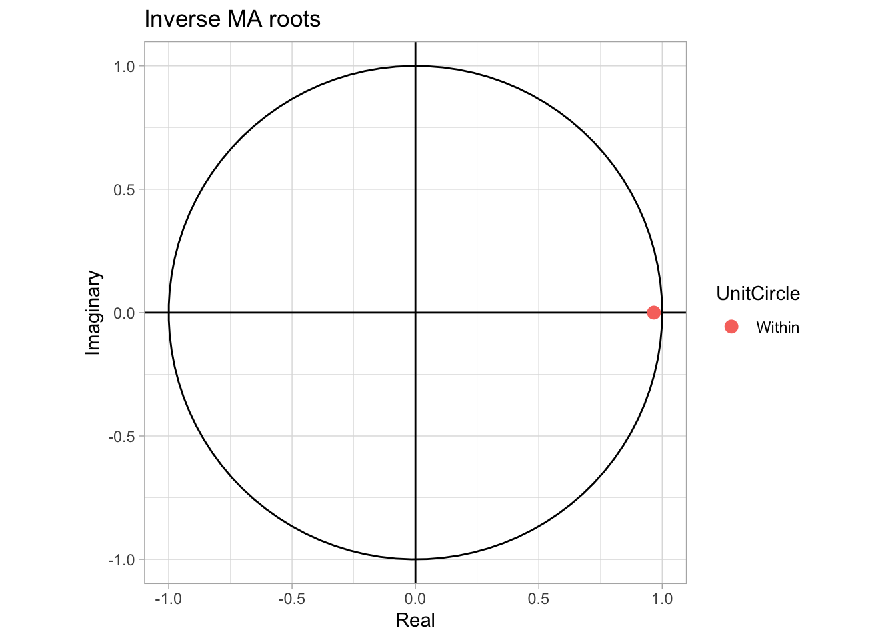
<p class="caption">(\#fig:amazn20rootma1)Raices ARMA(1) Inversas de la serie de tiempo</p>
</div>

Dado esto, sabemos claramente que podremos analizar de mejor manera estos valores y, en consecuencia, hacer mejores estimaciones.


### Pronósticos

Para pronósticar el valor de la serie es necesario determinar cuál es el valor esperado de la serie en un momento $t + \tau$ condicional en que ésta se comporta como un $AR(p)$, un $MA(q)$ o un $ARMA(p, q)$ y a que los valores antes de $t$ están dados. Por lo que el pronóstico de la serie estará dado por una expresión:

\begin{eqnarray}
    \mathbb{E}_t[X_{t+\tau}] = \delta + a_1 \mathbb{E}_t[X_{t+\tau-1}] + a_2 \mathbb{E}_t[X_{t+\tau-2}] + \ldots + + a_p \mathbb{E}_t[X_{t+\tau-p}]
    (\#eq:ARMApqFor)
\end{eqnarray}

```r
ARIMA_price_amzn_ts_111_F<-predict(ARIMA_price_amzn_ts_111,n.ahead=13,newxreg=cbind(f.julio2020,f.agosto2020,f.sep2020,f.oct2020))

forecast.Arima <- forecast(ARIMA_price_amzn_pl_111,h=13, xreg=cbind(f.julio2020,f.agosto2020,f.sep2020,f.oct2020))
```

Valores:

```r
kable(forecast.Arima,"html")
```

<table>
 <thead>
  <tr>
   <th style="text-align:left;">   </th>
   <th style="text-align:right;"> Point Forecast </th>
   <th style="text-align:right;"> Lo 80 </th>
   <th style="text-align:right;"> Hi 80 </th>
   <th style="text-align:right;"> Lo 95 </th>
   <th style="text-align:right;"> Hi 95 </th>
  </tr>
 </thead>
<tbody>
  <tr>
   <td style="text-align:left;"> Oct 2021 </td>
   <td style="text-align:right;"> 177.2339 </td>
   <td style="text-align:right;"> 172.4914 </td>
   <td style="text-align:right;"> 181.9763 </td>
   <td style="text-align:right;"> 169.9809 </td>
   <td style="text-align:right;"> 184.4869 </td>
  </tr>
  <tr>
   <td style="text-align:left;"> Nov 2021 </td>
   <td style="text-align:right;"> 179.6477 </td>
   <td style="text-align:right;"> 172.8267 </td>
   <td style="text-align:right;"> 186.4688 </td>
   <td style="text-align:right;"> 169.2158 </td>
   <td style="text-align:right;"> 190.0796 </td>
  </tr>
  <tr>
   <td style="text-align:left;"> Dec 2021 </td>
   <td style="text-align:right;"> 182.0616 </td>
   <td style="text-align:right;"> 173.5670 </td>
   <td style="text-align:right;"> 190.5562 </td>
   <td style="text-align:right;"> 169.0702 </td>
   <td style="text-align:right;"> 195.0530 </td>
  </tr>
  <tr>
   <td style="text-align:left;"> Jan 2022 </td>
   <td style="text-align:right;"> 184.4754 </td>
   <td style="text-align:right;"> 174.5036 </td>
   <td style="text-align:right;"> 194.4473 </td>
   <td style="text-align:right;"> 169.2248 </td>
   <td style="text-align:right;"> 199.7261 </td>
  </tr>
  <tr>
   <td style="text-align:left;"> Feb 2022 </td>
   <td style="text-align:right;"> 186.8893 </td>
   <td style="text-align:right;"> 175.5573 </td>
   <td style="text-align:right;"> 198.2213 </td>
   <td style="text-align:right;"> 169.5584 </td>
   <td style="text-align:right;"> 204.2202 </td>
  </tr>
  <tr>
   <td style="text-align:left;"> Mar 2022 </td>
   <td style="text-align:right;"> 189.3032 </td>
   <td style="text-align:right;"> 176.6880 </td>
   <td style="text-align:right;"> 201.9183 </td>
   <td style="text-align:right;"> 170.0099 </td>
   <td style="text-align:right;"> 208.5964 </td>
  </tr>
  <tr>
   <td style="text-align:left;"> Apr 2022 </td>
   <td style="text-align:right;"> 191.7170 </td>
   <td style="text-align:right;"> 177.8725 </td>
   <td style="text-align:right;"> 205.5615 </td>
   <td style="text-align:right;"> 170.5436 </td>
   <td style="text-align:right;"> 212.8904 </td>
  </tr>
  <tr>
   <td style="text-align:left;"> May 2022 </td>
   <td style="text-align:right;"> 194.1309 </td>
   <td style="text-align:right;"> 179.0958 </td>
   <td style="text-align:right;"> 209.1659 </td>
   <td style="text-align:right;"> 171.1368 </td>
   <td style="text-align:right;"> 217.1250 </td>
  </tr>
  <tr>
   <td style="text-align:left;"> Jun 2022 </td>
   <td style="text-align:right;"> 196.5447 </td>
   <td style="text-align:right;"> 180.3479 </td>
   <td style="text-align:right;"> 212.7415 </td>
   <td style="text-align:right;"> 171.7738 </td>
   <td style="text-align:right;"> 221.3156 </td>
  </tr>
  <tr>
   <td style="text-align:left;"> Jul 2022 </td>
   <td style="text-align:right;"> 198.9586 </td>
   <td style="text-align:right;"> 181.6215 </td>
   <td style="text-align:right;"> 216.2957 </td>
   <td style="text-align:right;"> 172.4437 </td>
   <td style="text-align:right;"> 225.4735 </td>
  </tr>
  <tr>
   <td style="text-align:left;"> Aug 2022 </td>
   <td style="text-align:right;"> 201.3724 </td>
   <td style="text-align:right;"> 182.9111 </td>
   <td style="text-align:right;"> 219.8338 </td>
   <td style="text-align:right;"> 173.1382 </td>
   <td style="text-align:right;"> 229.6067 </td>
  </tr>
  <tr>
   <td style="text-align:left;"> Sep 2022 </td>
   <td style="text-align:right;"> 203.7863 </td>
   <td style="text-align:right;"> 184.2127 </td>
   <td style="text-align:right;"> 223.3599 </td>
   <td style="text-align:right;"> 173.8511 </td>
   <td style="text-align:right;"> 233.7216 </td>
  </tr>
  <tr>
   <td style="text-align:left;"> Oct 2022 </td>
   <td style="text-align:right;"> 206.2002 </td>
   <td style="text-align:right;"> 185.5232 </td>
   <td style="text-align:right;"> 226.8772 </td>
   <td style="text-align:right;"> 174.5774 </td>
   <td style="text-align:right;"> 237.8229 </td>
  </tr>
</tbody>
</table>

```r
plot(forecast.Arima, main ="Forecast ARIMA(0,2,1) de los precios de AMZN")
```

<div class="figure" style="text-align: center">
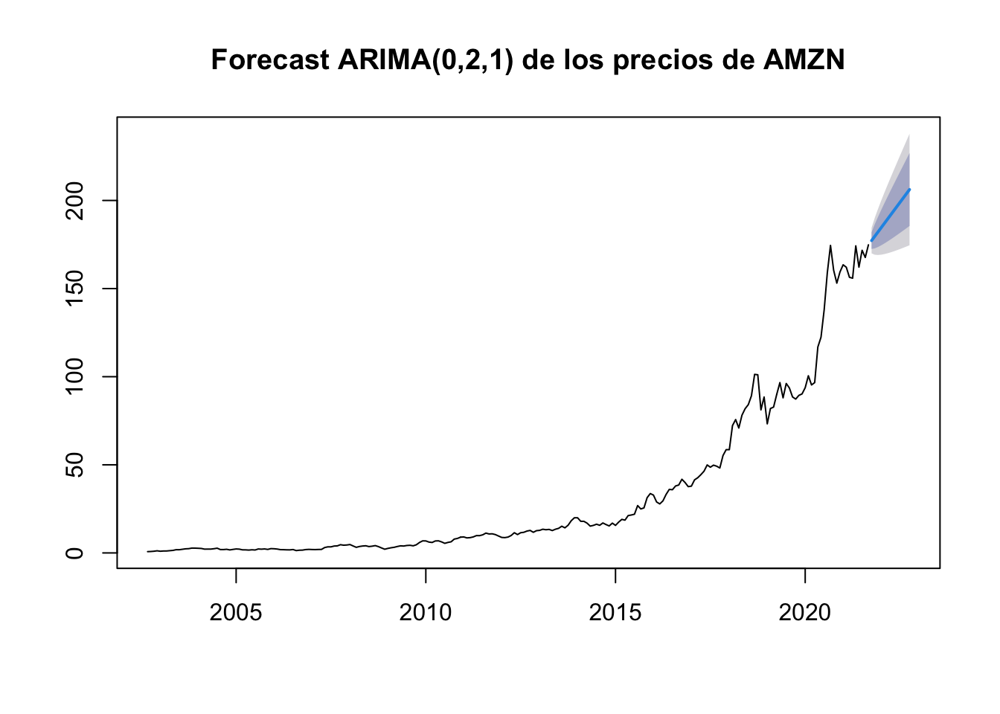
<p class="caption">(\#fig:predarima111)Predicción de $Arima(1,1,1)$</p>
</div>
