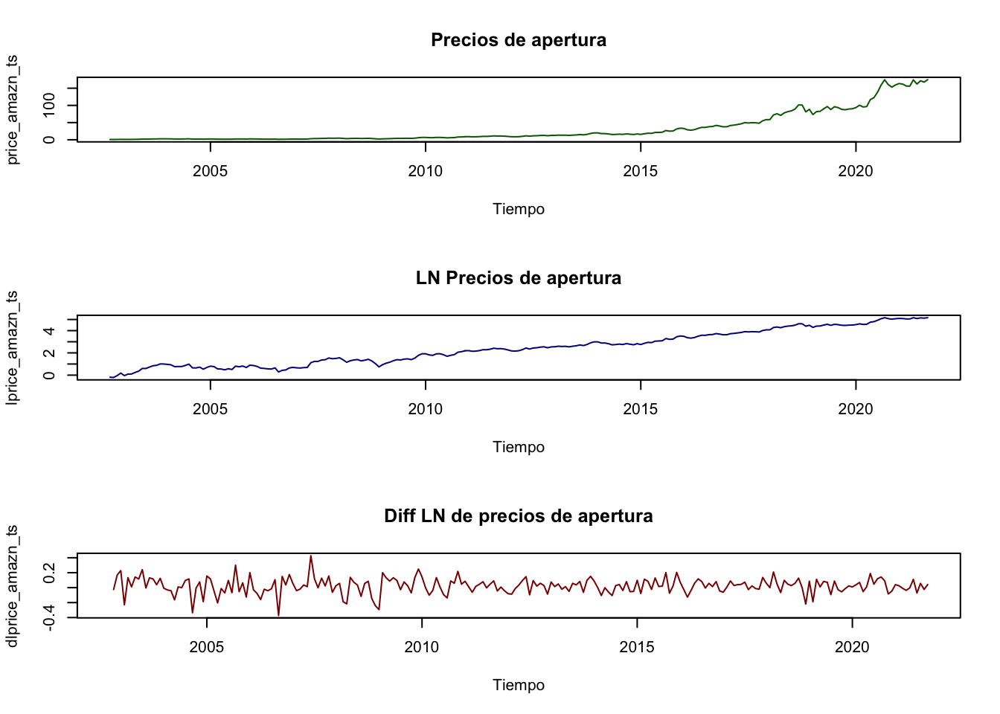
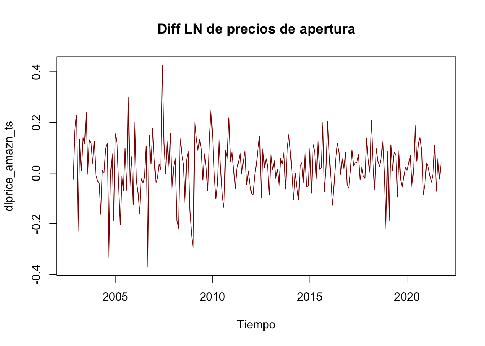
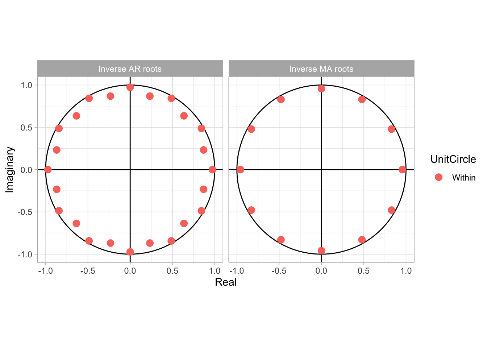

# ESTACIONALIDAD
Recordando el tema pasado y la serie en la que evaluamos los cambios de
precio del ACTIVO AMZN como si fueran retornos:


```r
#install.packages("pacman")
#pacman nos permite cargar varias librerias en una sola línea
library(pacman)
pacman::p_load(tidyverse,BatchGetSymbols,ggplot2,lubridate,readxl,forecast,stats,stargazer,knitr)
```


```r
#Primero determinamos el lapso de tiempo
pd<-as.Date("2002/9/30") #primer fecha
pd
#> [1] "2002-09-30"
#> [1] "2021-09-18"
ld<- as.Date("2021/09/30")#última fecha
ld
#> [1] "2021-09-30"
#Intervalos de tiempo
int<-"monthly"

#Datos a elegir
dt<-c("AMZN")

#Descargando los valores
data1<- BatchGetSymbols(tickers = dt,
                       first.date = pd,
                       last.date = ld,
                       freq.data = int,
                       do.cache = FALSE,
                       thresh.bad.data = 0)

#Generando data frame con los valores
data_precio_amzn<-data1$df.tickers
colnames(data_precio_amzn)
#>  [1] "ticker"              "ref.date"           
#>  [3] "volume"              "price.open"         
#>  [5] "price.high"          "price.low"          
#>  [7] "price.close"         "price.adjusted"     
#>  [9] "ret.adjusted.prices" "ret.closing.prices"
```

Para este caso coemzaremos por agregar dos series de tiempo. Una correspone a una transformación logarítmica de los valores de los precios y, otra, corresponde la diferentcia logaritmica. Esto dado que:
$$log(X_t)-log(X_{t-k})\sim\frac{X_t-X_{t-k}}{X_t}$$.


Tranformacion de la serie original


```r
#original
price_amazn_ts<-ts(data_precio_amzn$price.open, frequency = 12, start=c(2002,09))
#logartimo
lprice_amazn_ts<-ts(log(data_precio_amzn$price.open), frequency = 12, , start=c(2002,09))
#diferencias logaritmicas(cambio porcential)
dlprice_amazn_ts<-ts(log(data_precio_amzn$price.open)-lag(log(data_precio_amzn$price.open),1), frequency = 12, , start=c(2002,10))
```


Las tres series

```r
par(mfrow = c(3,1))
plot(price_amazn_ts, xlab = "Tiempo", 
     main = "Precios de apertura",
     col = "darkgreen")

plot(lprice_amazn_ts, xlab = "Tiempo", 
     main = "LN Precios de apertura",
     col = "darkblue")

plot(dlprice_amazn_ts, xlab = "Tiempo", 
     main = "Diff LN de precios de apertura", 
     col = "darkred")
```

<div class="figure" style="text-align: center">

<p class="caption">(\#fig:3series)Serie de timpo LN, DiffLn y AMZN</p>
</div>

Tomemos la de diferencias logarítmicas como ejemplo.

```r
plot(dlprice_amazn_ts, xlab = "Tiempo", 
     main = "Diff LN de precios de apertura", 
     col = "darkred")
```

<div class="figure" style="text-align: center">

<p class="caption">(\#fig:amzndiffln)Diff LN de precios de apertura de AMZN</p>
</div>

Aquí es posible ver que hay un proceso estacional muy claro. Cuando vemos el plot \@ref(eq:ARMA11Eq) es dificil verlo con exactitud. Sin embargo altas y bajas constantes como lo vemos en la figura son buenos indicadores de que puede haber un proceso estacional: de estaciones.


```r
auto.arima(dlprice_amazn_ts, trace=TRUE)
#> 
#>  Fitting models using approximations to speed things up...
#> 
#>  ARIMA(2,0,2)(1,0,1)[12] with non-zero mean : Inf
#>  ARIMA(0,0,0)            with non-zero mean : -372.9626
#>  ARIMA(1,0,0)(1,0,0)[12] with non-zero mean : -383.6435
#>  ARIMA(0,0,1)(0,0,1)[12] with non-zero mean : -373.4978
#>  ARIMA(0,0,0)            with zero mean     : -364.0697
#>  ARIMA(1,0,0)            with non-zero mean : -370.14
#>  ARIMA(1,0,0)(2,0,0)[12] with non-zero mean : -391.6751
#>  ARIMA(1,0,0)(2,0,1)[12] with non-zero mean : -396.7544
#>  ARIMA(1,0,0)(1,0,1)[12] with non-zero mean : -381.5713
#>  ARIMA(1,0,0)(2,0,2)[12] with non-zero mean : -395.4488
#>  ARIMA(1,0,0)(1,0,2)[12] with non-zero mean : -382.5532
#>  ARIMA(0,0,0)(2,0,1)[12] with non-zero mean : -400.4947
#>  ARIMA(0,0,0)(1,0,1)[12] with non-zero mean : -384.7126
#>  ARIMA(0,0,0)(2,0,0)[12] with non-zero mean : -394.407
#>  ARIMA(0,0,0)(2,0,2)[12] with non-zero mean : -399.2569
#>  ARIMA(0,0,0)(1,0,0)[12] with non-zero mean : -386.7607
#>  ARIMA(0,0,0)(1,0,2)[12] with non-zero mean : -385.6341
#>  ARIMA(0,0,1)(2,0,1)[12] with non-zero mean : -398.8431
#>  ARIMA(1,0,1)(2,0,1)[12] with non-zero mean : -394.6581
#>  ARIMA(0,0,0)(2,0,1)[12] with zero mean     : -391.1477
#> 
#>  Now re-fitting the best model(s) without approximations...
#> 
#>  ARIMA(0,0,0)(2,0,1)[12] with non-zero mean : -375.1609
#> 
#>  Best model: ARIMA(0,0,0)(2,0,1)[12] with non-zero mean
#> Series: dlprice_amazn_ts 
#> ARIMA(0,0,0)(2,0,1)[12] with non-zero mean 
#> 
#> Coefficients:
#>          sar1     sar2    sma1    mean
#>       -0.9433  -0.0537  0.8062  0.0233
#> s.e.   0.1790   0.0869  0.1669  0.0062
#> 
#> sigma^2 estimated as 0.01094:  log likelihood=192.72
#> AIC=-375.43   AICc=-375.16   BIC=-358.28
```

Como lo sospechabamos este proceso es puramente estacional y se utilizan estaciones AR(p) y MA(p), pero de manera estacional. 


<table style="text-align:center"><caption><strong>ARMA(1,1,1) de los precios de apertura de AMZN</strong></caption>
<tr><td colspan="2" style="border-bottom: 1px solid black"></td></tr><tr><td style="text-align:left"></td><td><em>Dependent variable:</em></td></tr>
<tr><td></td><td colspan="1" style="border-bottom: 1px solid black"></td></tr>
<tr><td style="text-align:left"></td><td>dlprice_amazn_ts</td></tr>
<tr><td colspan="2" style="border-bottom: 1px solid black"></td></tr><tr><td style="text-align:left">sar1</td><td>0.441</td></tr>
<tr><td style="text-align:left"></td><td>(0.305)</td></tr>
<tr><td style="text-align:left"></td><td></td></tr>
<tr><td style="text-align:left">sar2</td><td>0.201<sup>***</sup></td></tr>
<tr><td style="text-align:left"></td><td>(0.074)</td></tr>
<tr><td style="text-align:left"></td><td></td></tr>
<tr><td style="text-align:left">sma1</td><td>-0.595<sup>*</sup></td></tr>
<tr><td style="text-align:left"></td><td>(0.309)</td></tr>
<tr><td style="text-align:left"></td><td></td></tr>
<tr><td style="text-align:left">intercept</td><td>0.023<sup>***</sup></td></tr>
<tr><td style="text-align:left"></td><td>(0.007)</td></tr>
<tr><td style="text-align:left"></td><td></td></tr>
<tr><td colspan="2" style="border-bottom: 1px solid black"></td></tr><tr><td style="text-align:left">Observations</td><td>228</td></tr>
<tr><td style="text-align:left">Log Likelihood</td><td>193.026</td></tr>
<tr><td style="text-align:left">sigma<sup>2</sup></td><td>0.011</td></tr>
<tr><td style="text-align:left">Akaike Inf. Crit.</td><td>-376.052</td></tr>
<tr><td colspan="2" style="border-bottom: 1px solid black"></td></tr><tr><td style="text-align:left"><em>Note:</em></td><td style="text-align:right">(p<0.1)=[*], (p<0.05)=[**], (p<0.01)=[***]</td></tr>
</table>
 

```r
SARIMA_price_amzn_ts_201<-arima(dlprice_amazn_ts,
                        order=c(0,0,0), 
                        seasonal = c(2,0,1),
                        method = "ML")
SARIMA_price_amzn_pl_201<-Arima(dlprice_amazn_ts,
                        order=c(0,0,0), 
                        seasonal = c(2,0,1),
                        method = "ML")
```

 Raices MA(A):

```r
autoplot(SARIMA_price_amzn_ts_201)+theme_light()
```

<div class="figure" style="text-align: center">

<p class="caption">(\#fig:amazn20rootma1)Raices ARMA(1) Inversas de la serie de tiempo</p>
</div>
 

```r
SARIMA_price_amzn_ts_201_F<-predict(SARIMA_price_amzn_ts_201,n.ahead=13)
SARIMA_price_amzn_ts_201_F
```

$pred
             Jan         Feb         Mar         Apr
2021                                                
2022 0.024195377 0.007637307 0.045710596 0.023410540
             May         Jun         Jul         Aug
2021                                                
2022 0.027143074 0.036196514 0.035377125 0.031611992
             Sep         Oct         Nov         Dec
2021                         0.033631775 0.023154560
2022 0.043629025 0.025191369 0.006187273            

$se
           Jan       Feb       Mar       Apr       May
2021                                                  
2022 0.1035781 0.1035781 0.1035781 0.1035781 0.1035781
           Jun       Jul       Aug       Sep       Oct
2021                                                  
2022 0.1035781 0.1035781 0.1035781 0.1035781 0.1035781
           Nov       Dec
2021 0.1035781 0.1035781
2022 0.1047972          

```r
SARIMA_price_amzn_PL_201_F <-forecast(SARIMA_price_amzn_pl_201,h=13)
kable(SARIMA_price_amzn_PL_201_F,"html")
```

<table>
 <thead>
  <tr>
   <th style="text-align:left;">   </th>
   <th style="text-align:right;"> Point Forecast </th>
   <th style="text-align:right;"> Lo 80 </th>
   <th style="text-align:right;"> Hi 80 </th>
   <th style="text-align:right;"> Lo 95 </th>
   <th style="text-align:right;"> Hi 95 </th>
  </tr>
 </thead>
<tbody>
  <tr>
   <td style="text-align:left;"> Nov 2021 </td>
   <td style="text-align:right;"> 0.0336318 </td>
   <td style="text-align:right;"> -0.1002889 </td>
   <td style="text-align:right;"> 0.1675524 </td>
   <td style="text-align:right;"> -0.1711822 </td>
   <td style="text-align:right;"> 0.2384457 </td>
  </tr>
  <tr>
   <td style="text-align:left;"> Dec 2021 </td>
   <td style="text-align:right;"> 0.0231546 </td>
   <td style="text-align:right;"> -0.1107661 </td>
   <td style="text-align:right;"> 0.1570752 </td>
   <td style="text-align:right;"> -0.1816594 </td>
   <td style="text-align:right;"> 0.2279685 </td>
  </tr>
  <tr>
   <td style="text-align:left;"> Jan 2022 </td>
   <td style="text-align:right;"> 0.0241954 </td>
   <td style="text-align:right;"> -0.1097253 </td>
   <td style="text-align:right;"> 0.1581160 </td>
   <td style="text-align:right;"> -0.1806186 </td>
   <td style="text-align:right;"> 0.2290093 </td>
  </tr>
  <tr>
   <td style="text-align:left;"> Feb 2022 </td>
   <td style="text-align:right;"> 0.0076373 </td>
   <td style="text-align:right;"> -0.1262833 </td>
   <td style="text-align:right;"> 0.1415580 </td>
   <td style="text-align:right;"> -0.1971766 </td>
   <td style="text-align:right;"> 0.2124513 </td>
  </tr>
  <tr>
   <td style="text-align:left;"> Mar 2022 </td>
   <td style="text-align:right;"> 0.0457106 </td>
   <td style="text-align:right;"> -0.0882100 </td>
   <td style="text-align:right;"> 0.1796312 </td>
   <td style="text-align:right;"> -0.1591034 </td>
   <td style="text-align:right;"> 0.2505245 </td>
  </tr>
  <tr>
   <td style="text-align:left;"> Apr 2022 </td>
   <td style="text-align:right;"> 0.0234105 </td>
   <td style="text-align:right;"> -0.1105101 </td>
   <td style="text-align:right;"> 0.1573312 </td>
   <td style="text-align:right;"> -0.1814034 </td>
   <td style="text-align:right;"> 0.2282245 </td>
  </tr>
  <tr>
   <td style="text-align:left;"> May 2022 </td>
   <td style="text-align:right;"> 0.0271431 </td>
   <td style="text-align:right;"> -0.1067776 </td>
   <td style="text-align:right;"> 0.1610637 </td>
   <td style="text-align:right;"> -0.1776709 </td>
   <td style="text-align:right;"> 0.2319570 </td>
  </tr>
  <tr>
   <td style="text-align:left;"> Jun 2022 </td>
   <td style="text-align:right;"> 0.0361965 </td>
   <td style="text-align:right;"> -0.0977241 </td>
   <td style="text-align:right;"> 0.1701172 </td>
   <td style="text-align:right;"> -0.1686174 </td>
   <td style="text-align:right;"> 0.2410105 </td>
  </tr>
  <tr>
   <td style="text-align:left;"> Jul 2022 </td>
   <td style="text-align:right;"> 0.0353771 </td>
   <td style="text-align:right;"> -0.0985435 </td>
   <td style="text-align:right;"> 0.1692978 </td>
   <td style="text-align:right;"> -0.1694368 </td>
   <td style="text-align:right;"> 0.2401911 </td>
  </tr>
  <tr>
   <td style="text-align:left;"> Aug 2022 </td>
   <td style="text-align:right;"> 0.0316120 </td>
   <td style="text-align:right;"> -0.1023087 </td>
   <td style="text-align:right;"> 0.1655326 </td>
   <td style="text-align:right;"> -0.1732020 </td>
   <td style="text-align:right;"> 0.2364259 </td>
  </tr>
  <tr>
   <td style="text-align:left;"> Sep 2022 </td>
   <td style="text-align:right;"> 0.0436290 </td>
   <td style="text-align:right;"> -0.0902916 </td>
   <td style="text-align:right;"> 0.1775497 </td>
   <td style="text-align:right;"> -0.1611849 </td>
   <td style="text-align:right;"> 0.2484430 </td>
  </tr>
  <tr>
   <td style="text-align:left;"> Oct 2022 </td>
   <td style="text-align:right;"> 0.0251914 </td>
   <td style="text-align:right;"> -0.1087293 </td>
   <td style="text-align:right;"> 0.1591120 </td>
   <td style="text-align:right;"> -0.1796226 </td>
   <td style="text-align:right;"> 0.2300053 </td>
  </tr>
  <tr>
   <td style="text-align:left;"> Nov 2022 </td>
   <td style="text-align:right;"> 0.0061873 </td>
   <td style="text-align:right;"> -0.1293096 </td>
   <td style="text-align:right;"> 0.1416841 </td>
   <td style="text-align:right;"> -0.2010372 </td>
   <td style="text-align:right;"> 0.2134118 </td>
  </tr>
</tbody>
</table>

Valores:

```r
plot(SARIMA_price_amzn_PL_201_F, main ="Forecast SARIMA(0,0,0)(2,0,1)  de los precios de AMZN")
```

<div class="figure" style="text-align: center">

<p class="caption">(\#fig:predarima111)Predicción de $Arima(1,1,1)$</p>
</div>
