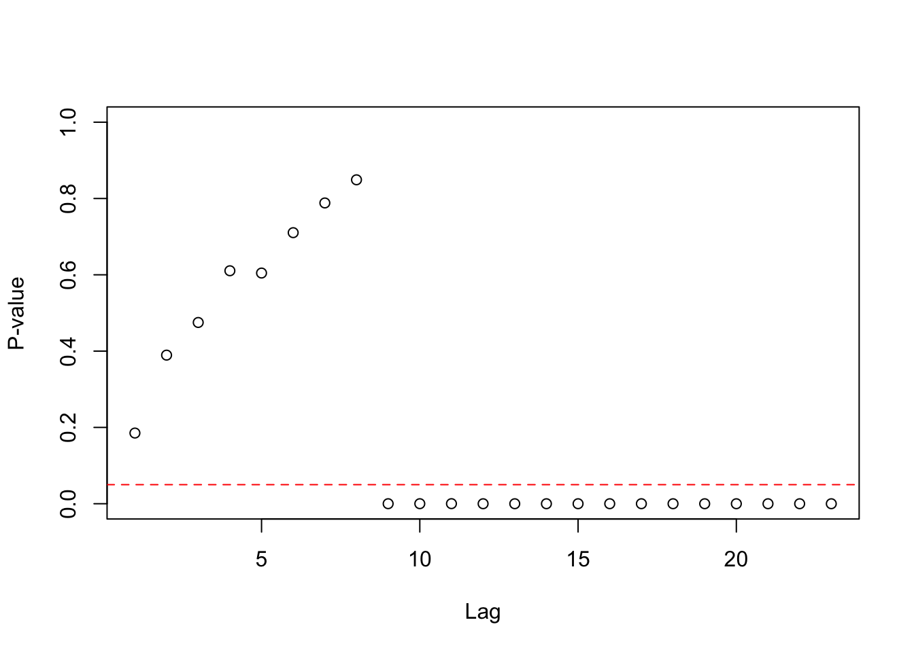
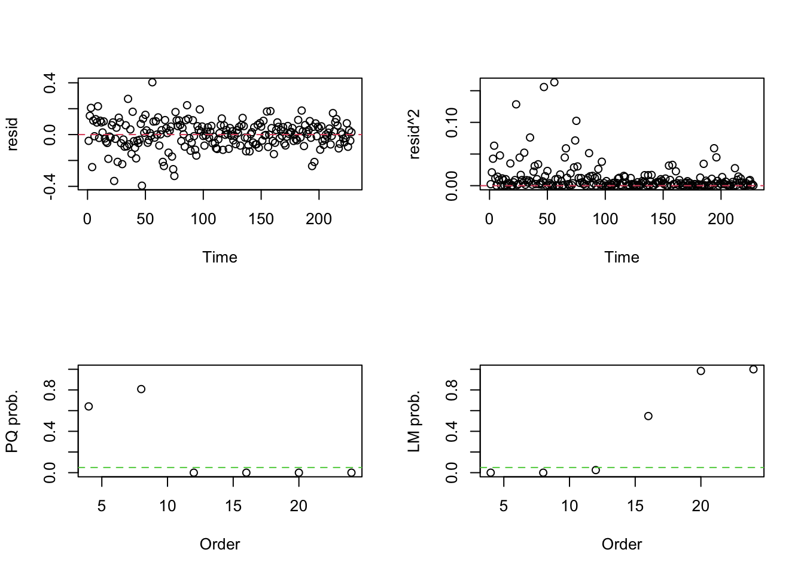

# Volatilidad y Heterocedasticidad

En esta lección analizaremos la manera en la que la volatilidad puede afectar la manera en la que estudiamos las series de tiempo. Como definición, la volatilidad es la desviación estándar de un determinado activo. Lo que quiere decir esto es que la desviación estándar de los activos no es siempre constante y, por consiguiente, puede reaccionar de distintas manera a distintos cambios de precio. Esto es de relevancia para los siguientes modelos que utilizaremos llamados Auto Regressive Conditional Heteroskedasticity  (ARCH) y Generalized Auto Regressive Conditional Heteroskedasticity (GARCH), pues intentan modelar la heterocedasticidad condicional de los modelos.

Algunos de los problemas de la volatilidad es que no es directamente observable porque la volatilidad de un activo depende de valores entre días o de la noche a la mañana, por lo que es difícil ver qué tanto afecta o cambia.

Aquí las principales características de la volatilidad.

La volatilidad puede ser alta o baja en ciertos periodos de tiempo. A esto se le conoce como _volatility clusters_.
- La volatilidad evoluciona continuamente con el tiempo, por lo que los picos de volatilidad son raros.
- La volatilidad no tiene al infinito, tiene una varianza alrededor de un valor fijo. En términos que hemos mencionado antes, la volatilidad es estacionaria.
- La volatilidad reacciona de maneras diferentes a picos o valles en los valores de los precios. A esto se le conoce como _leverage effect_.

Sean $a_t=r_t-\mu_t$ los residuales de una ecuación de media. La serie $a_t^2$ es utilizada para determinar la heterocedasticidad condicional, lo cual se conoce como __el efecto ARCH__. Existen dos tests:
- El test se aplica el Ljung-Box estadístico $Q(m)$ a la serie ${a_t^2}$ y fue construido por Mcleod y Li (1983). La hipótesis nula es que los primeros $m$ lags de la Función de Autocorrelación de la serie $a_t^2$ son iguales a cero.
- El segundo esta basado en el Multiplicador de Lagrange de Engle (1982) y es equivalente a utilizar un $F$ test para probar que $\alpha_i=0$ donde $(i=1,\dots,m)$ en  $$a_t^2=\alpha_0+\alpha_1a_{t-1}^2+\dots+\alpha_m a_{t-m}^2+e_t$$
Por lo que los test funcionan igual.  Específicamente, la hipótesis nula es $H_0:\alpha_0=\dots=\alpha_m=0$. Determinemos que $SSR_0=\sum_{t=m+1}^T(a_t^2-\bar{w})^2$, donde $\bar{w}=\frac{1}{T}\sum_{t=1}^Ta_t^2$  es la media muestral de $a_t^2$ y $SSR_1=\sum_{t=m+1}^Te_t^2$. Por lo que F es igual a $$F=\frac{(SSR_0-SSR_1)/m}{SSR_1/(T-2m-1)}$$. De esa manera rechazamos la hipotesis nula, como regla de dedo si $F>X_m^2(\alpha)$ y decimos que existe un efecto ARCH. Cabe aclarar que $X_m^2(\alpha)$ es el porcentíl $100(1-\alpha)$esimo alto de $X_m^2$. O el $p$-value de F es menor que $\alpha$.

## Ejemplo

```r
#install.packages("pacman")
#pacman nos permite cargar varias librerias en una sola línea
library(pacman)
pacman::p_load(tidyverse,BatchGetSymbols,ggplot2,lubridate,readxl,forecast,stats,stargazer,knitr,tseries, aTSA, TSA)
```


```r
#Primero determinamos el lapso de tiempo
pd<-as.Date("2002/9/30") #primer fecha
pd
#> [1] "2002-09-30"
#> [1] "2021-09-18"
ld<- as.Date("2021/09/30")#última fecha
ld
#> [1] "2021-09-30"
#Intervalos de tiempo
int<-"monthly"

#Datos a elegir
dt<-c("AMZN")

#Descargando los valores
data1<- BatchGetSymbols(tickers = dt,
                       first.date = pd,
                       last.date = ld,
                       freq.data = int,
                       do.cache = FALSE,
                       thresh.bad.data = 0)

#Generando data frame con los valores
data_precio_amzn<-data1$df.tickers
colnames(data_precio_amzn)
#>  [1] "ticker"              "ref.date"           
#>  [3] "volume"              "price.open"         
#>  [5] "price.high"          "price.low"          
#>  [7] "price.close"         "price.adjusted"     
#>  [9] "ret.adjusted.prices" "ret.closing.prices"
```


```r
#original
price_amazn_ts<-ts(data_precio_amzn$price.open, frequency = 12, start=c(2002,09))
#logartimo
lprice_amazn_ts<-ts(log(data_precio_amzn$price.open), frequency = 12,start=c(2002,09))
#diferencias logaritmicas(cambio porcential)
dlprice_amazn_ts<-ts(log(data_precio_amzn$price.open)-lag(log(data_precio_amzn$price.open),1), frequency = 12, start=c(2002,10))
dlprice_amazn_ts<-na.omit(dlprice_amazn_ts)
```

## Pruebas de Heterocedasticidad Condicionada


### McLeod & Li

```r
McLeod.Li.test(y=dlprice_amazn_ts)
```



```r
Box.test(lprice_amazn_ts,lag=12,type="Ljung")
#> 
#> 	Box-Ljung test
#> 
#> data:  lprice_amazn_ts
#> X-squared = 2310.6, df = 12, p-value < 2.2e-16
McLeod.Li.test(y=lprice_amazn_ts)
```


```r
McLeod.Li.test(y=price_amazn_ts)
```


### Engels

```r
mod1 <- arima(dlprice_amazn_ts,order = c(1,0,0))
arch.test(mod1, output = TRUE)
#> ARCH heteroscedasticity test for residuals 
#> alternative: heteroscedastic 
#> 
#> Portmanteau-Q test: 
#>      order    PQ  p.value
#> [1,]     4  2.52 6.41e-01
#> [2,]     8  4.51 8.08e-01
#> [3,]    12 46.10 6.68e-06
#> [4,]    16 48.74 3.63e-05
#> [5,]    20 71.95 8.74e-08
#> [6,]    24 85.13 9.07e-09
#> Lagrange-Multiplier test: 
#>      order     LM  p.value
#> [1,]     4 149.98 0.00e+00
#> [2,]     8  70.53 1.15e-12
#> [3,]    12  21.89 2.52e-02
#> [4,]    16  13.71 5.48e-01
#> [5,]    20   8.27 9.84e-01
#> [6,]    24   5.99 1.00e+00
```




```r
mod2 <- arima(lprice_amazn_ts,order = c(1,0,0))
arch.test(mod2, output = TRUE)
#> ARCH heteroscedasticity test for residuals 
#> alternative: heteroscedastic 
#> 
#> Portmanteau-Q test: 
#>      order    PQ  p.value
#> [1,]     4  2.67 6.15e-01
#> [2,]     8  4.04 8.54e-01
#> [3,]    12 43.16 2.12e-05
#> [4,]    16 45.87 1.02e-04
#> [5,]    20 64.29 1.51e-06
#> [6,]    24 79.84 6.45e-08
#> Lagrange-Multiplier test: 
#>      order     LM  p.value
#> [1,]     4 122.98 0.00e+00
#> [2,]     8  60.92 9.88e-11
#> [3,]    12  21.53 2.83e-02
#> [4,]    16  13.25 5.83e-01
#> [5,]    20   8.46 9.81e-01
#> [6,]    24   6.14 1.00e+00
```


```r
#mod3 <- estimate(price_amazn_ts,p = 1)
#arch.test(mod3, output = TRUE)
```
Dadas todas las pruebas podemos ver que hay heterocedasticidad menos en el de diferencias de logaritmos.
