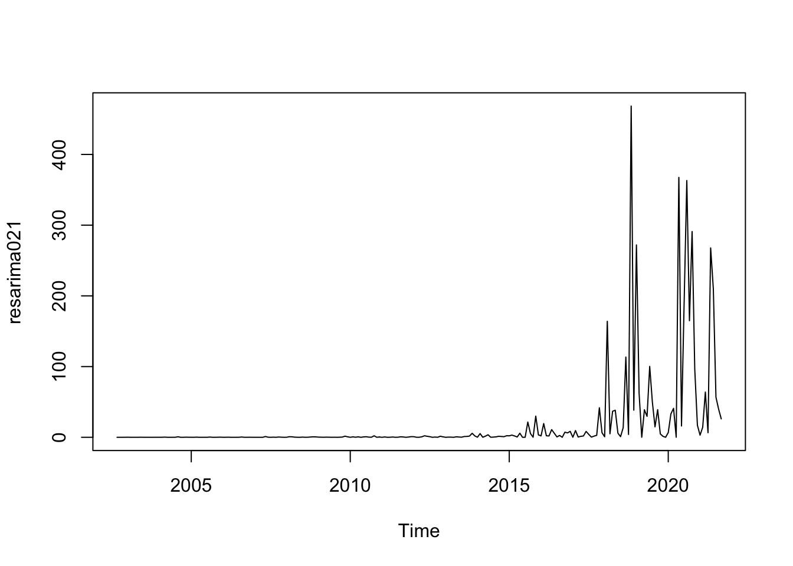

# Heterocedasticidad condicionada

## Modelos ARCH y GARCH Univariados

Estos modelos de Heterocedásticidad Condicional Autoregresiva (ARCH, por sus siglas en inglés) y modelos Heterocedásticidad Condicional Autoregresiva Generalizados (GARCH, por sus siglas en inglés) tienen la característica de modelar situaciones como las que ilustra la Figutra \@ref(fig:GARCHReturn). Es decir: 1) existen zonas donde la variación de los datos es mayor y zonas donde la variación es más estable --a estas situaciones se les conoce como de variabilidad por clúster--, y 2) los datos corresponden a innformación de alta frecuencia.

<div class="figure" style="text-align: center">

<p class="caption">(\#fig:GARCHReturn)Rendimientos (diferenccias logarítmicas) de tres acciones seleccionadas: Apple, Pfizer, Tesla, enero 2011 a noviembre de 2020</p>
</div>


Para plantear el modelo supongamos --por simplicidad-- que hemos construido y estimado un modelo AR(1). Es decir, asumamos que el proceso subyacente para la media condicional está dada por:
\begin{equation}
    X_t = a_0 + a_1 X_{t-1} + U_t
    (\#eq:em1)
\end{equation}

Donde $|a_1|< 1$ para garantizar la convergencia del proceso en el largo plazo, en el cual:
\begin{eqnarray*}
    \mathbb{E}[X_t] & = & \frac{a_0 }{1 - a_1} = \mu \\
    Var[X_t] & = & \frac{\sigma^2}{1 - a_1^2}
\end{eqnarray*}

Ahora, supongamos que este tipo de modelos pueden ser extendidos y generalizados a un modelo ARMA(p, q), que incluya otras variables exogénas. Denotemos a como $\mathbf{Z}_t$ al conjunto que incluye los componentes AR, MA y variables exogénas que pueden explicar a $X_t$ de forma que el proceso estará dado por:
\begin{equation}
    X_t = \mathbf{Z}_t \boldsymbol{\beta} + U_t
        (\#eq:em2)
\end{equation}

Donde $U_t$ es un proceso estacionario que representa el error asociado a un proceso ARMA(p, q) y donde siguen diendo válidos los supuestos:
\begin{eqnarray*}
    \mathbb{E}[U_t] & = & 0 \\
    Var[U_t^2] & = & \sigma^2
\end{eqnarray*}

No obstante, en este caso podemos suponer que existe autocorrelación en el término de error que puede ser capturada por un porceso similar a uno de medias móviles (MA) dado por:
\begin{equation}
    U_t^2 = \gamma_0 + \gamma_1 U_{t-1}^2 + \gamma_2 U_{t-2}^2 + \ldots + \gamma_q U_{t-q}^2 + \nu_t
        (\#eq:em3)
\end{equation}

Donde $\nu_t$ es un ruido blanco y $U_{t-i} = X_{t-i} - \mathbf{Z}_{t-i} \boldsymbol{\beta}$, $i = 1, 2 ,\ldots $. Si bien los procesos son estacionarios por los supuestos antes enunciados, la varianza condicional estará dada por:
\begin{eqnarray*}
    \sigma^2_{t | t-1} & = & Var[ U_t | \Omega_{t-1} ] \\
    & = & \mathbb{E}[ U^2_t | \Omega_{t-1} ]
\end{eqnarray*}

Donde $\Omega_{t-1} = \{U_{t-1}, U_{t-2}, \ldots \}$ es el conjunto de toda la información pasada de $U_t$ y observada hasta el momento $t-1$, por lo que:
\begin{equation*}
    U_t | \Omega_{t-1} \sim \mathbb{D}(0, \sigma^2_{t | t-1})
\end{equation*}

Así, de forma similar a un proceso MA(q) podemos decir que la varianza condicional tendrá efectos ARCH de orden $q$ (ARCH(q)) cuando:
\begin{equation}
    \sigma^2_{t | t-1} = \gamma_0 + \gamma_1 U_{t-1}^2 + \gamma_2 U_{t-2}^2 + \ldots + \gamma_q U_{t-q}^2
        (\#eq:ARCHEffect)
\end{equation}

Donde $\mathbb{E}[\nu_t] = 0$ y $\gamma_0$ y $\gamma_i \geq 0$, para $i = 1, 2, \ldots, q-1$ y  $\gamma_q > 0$. Estas condiciones son necesarias para garantizar que la varianza sea positiva. En general, la varianza condicional se expresa de la forma $\sigma^2_{t | t-1}$, no obstante, para facilitar la notación, nos referiremos en cada caso a esta simplemente como $\sigma^2_{t}$.

Podemos generalizar está situación si asumimos a la varianza condicional como dependiente de lo valores de la varianza rezagados, es decir, como si fuera un proceso AR de orden $p$ para la varianza y juntandolo con la ecuación \@ref(eq:ARCHEffect). Bollerslev (1986) y Taylor (1986) generalizaron el problema de heterocedásticidad condicional. El modelo se conoce como GARCH(p, q), el cual se especifica como:
\begin{equation}
    \sigma^2_t = \gamma_0 + \gamma_1 U_{t-1}^2 + \gamma_2 U_{t-2}^2 + \ldots + \gamma_q U_{t-q}^2 + \beta_1 \sigma^2_{t-1} + \beta_2 \sigma^2_{t-2} + \ldots + \beta_p \sigma^2_{t-p}
    (\#eq:GARCHEffect)
\end{equation}

Donde las condiciones de no negatividad son que $\gamma_0 > 0$, $\gamma_i \geq 0$, $i = 1, 2, \ldots, q-1$, $\beta_j \geq 0$, $j = 1, 2, \ldots, p-1$, $\gamma_q > 0$ y $\beta_p > 0$. Además, otra condición de convergencia es que:
\begin{equation*}
    \gamma_1 + \ldots + \gamma_q + \beta_1 + \ldots + \beta_p < 1
\end{equation*}

Usando el operador rezago $L$ en la ecuación \@ref(eq:GARCHEffect) podemos obtener:
\begin{equation}
    \sigma^2_t = \gamma_0 + \alpha(L) U_t^2 + \beta(L) \sigma^2_t
        (\#eq:GARCHEffectL)
\end{equation}

De donde podemos establecer:
\begin{equation}
    \sigma^2_t = \frac{\gamma_0}{1 - \beta(L)} + \frac{\alpha(L)}{1 - \beta(L)} U_t^2         (\#eq:em4)
\end{equation}

Por lo que la ecuación \@ref(eq:GARCHEffect) del GARCH(p, q) representa un ARCH($\infty$):
\begin{equation}
    \sigma^2_t = \frac{a_0}{1 - b_1 - b_2 - \ldots - b_p} + \sum_{i = 1}^\infty U_{t-i}^2 
            (\#eq:em5)
\end{equation}

## Ejemplo

```r
#install.packages("pacman")
#pacman nos permite cargar varias librerias en una sola línea
library(pacman)
pacman::p_load(tidyverse,BatchGetSymbols,ggplot2,lubridate,readxl,forecast,stats,stargazer,knitr,tseries, aTSA, TSA, rugarch)
```


```r
#Primero determinamos el lapso de tiempo
pd<-as.Date("2002/9/30") #primer fecha
pd
#> [1] "2002-09-30"
#> [1] "2021-09-18"
ld<- as.Date("2021/09/30")#última fecha
ld
#> [1] "2021-09-30"
#Intervalos de tiempo
int<-"monthly"

#Datos a elegir
dt<-c("AMZN")

#Descargando los valores
data1<- BatchGetSymbols(tickers = dt,
                       first.date = pd,
                       last.date = ld,
                       freq.data = int,
                       do.cache = FALSE,
                       thresh.bad.data = 0)

#Generando data frame con los valores
data_precio_amzn<-data1$df.tickers
colnames(data_precio_amzn)
#>  [1] "ticker"              "ref.date"           
#>  [3] "volume"              "price.open"         
#>  [5] "price.high"          "price.low"          
#>  [7] "price.close"         "price.adjusted"     
#>  [9] "ret.adjusted.prices" "ret.closing.prices"
```


```r
#original
price_amazn_ts<-ts(data_precio_amzn$price.open, frequency = 12, start=c(2002,09))
#logartimo
lprice_amazn_ts<-ts(log(data_precio_amzn$price.open), frequency = 12,start=c(2002,09))
#diferencias logaritmicas(cambio porcential)
dlprice_amazn_ts<-ts(log(data_precio_amzn$price.open)-lag(log(data_precio_amzn$price.open),1), frequency = 12, start=c(2002,10))
dlprice_amazn_ts<-na.omit(dlprice_amazn_ts)
```


```r
auto.arima(price_amazn_ts)
#> Series: price_amazn_ts 
#> ARIMA(0,2,1) 
#> 
#> Coefficients:
#>           ma1
#>       -0.9716
#> s.e.   0.0140
#> 
#> sigma^2 = 17.95:  log likelihood = -650.79
#> AIC=1305.58   AICc=1305.63   BIC=1312.43
arima021 <- arima(price_amazn_ts,
                  order=c(0,2,1),
                  method = "ML")
```


```r
plot(arima021)
```

<div class="figure" style="text-align: center">

<p class="caption">(\#fig:unnamed-chunk-5)Serie de tiempo de los precios en los últimos 20 años</p>
</div>


```r
resarima021 <- resid(arima021)^2
```


```r
plot(resarima021)
```

<div class="figure" style="text-align: center">

<p class="caption">(\#fig:amazn20)Serie de tiempo de los residuos al cuadrado ${a^2}$</p>
</div>


```r
auto.arima(resarima021, trace = T)
#> 
#>  Fitting models using approximations to speed things up...
#> 
#>  ARIMA(2,1,2)(1,0,1)[12] with drift         : Inf
#>  ARIMA(0,1,0)            with drift         : 2580.559
#>  ARIMA(1,1,0)(1,0,0)[12] with drift         : 2483.806
#>  ARIMA(0,1,1)(0,0,1)[12] with drift         : 2459.32
#>  ARIMA(0,1,0)                               : 2578.524
#>  ARIMA(0,1,1)            with drift         : 2457.799
#>  ARIMA(0,1,1)(1,0,0)[12] with drift         : 2471.589
#>  ARIMA(0,1,1)(1,0,1)[12] with drift         : Inf
#>  ARIMA(1,1,1)            with drift         : 2462.02
#>  ARIMA(0,1,2)            with drift         : 2468.224
#>  ARIMA(1,1,0)            with drift         : 2469.957
#>  ARIMA(1,1,2)            with drift         : 2463.999
#>  ARIMA(0,1,1)                               : 2457.284
#>  ARIMA(0,1,1)(1,0,0)[12]                    : 2471.293
#>  ARIMA(0,1,1)(0,0,1)[12]                    : 2458.924
#>  ARIMA(0,1,1)(1,0,1)[12]                    : 2472.638
#>  ARIMA(1,1,1)                               : 2459.962
#>  ARIMA(0,1,2)                               : 2466.155
#>  ARIMA(1,1,0)                               : 2467.907
#>  ARIMA(1,1,2)                               : 2461.911
#> 
#>  Now re-fitting the best model(s) without approximations...
#> 
#>  ARIMA(0,1,1)                               : 2467.364
#> 
#>  Best model: ARIMA(0,1,1)
#> Series: resarima021 
#> ARIMA(0,1,1) 
#> 
#> Coefficients:
#>           ma1
#>       -0.8877
#> s.e.   0.0418
#> 
#> sigma^2 = 2875:  log likelihood = -1231.66
#> AIC=2467.31   AICc=2467.36   BIC=2474.17
garch.amzn <- ugarchspec(mean.model = list(armaOrder=c(0,2,1)),
                         variance.model = list(garchOrder=c(0,1,1)))
garch.amzn011 <- ugarchfit(spec = garch.amzn, 
                           data = price_amazn_ts)
garch.amzn011
#> 
#> *---------------------------------*
#> *          GARCH Model Fit        *
#> *---------------------------------*
#> 
#> Conditional Variance Dynamics 	
#> -----------------------------------
#> GARCH Model	: sGARCH(0,1)
#> Mean Model	: ARFIMA(0,0,2)
#> Distribution	: norm 
#> 
#> Optimal Parameters
#> ------------------------------------
#>        Estimate  Std. Error   t value Pr(>|t|)
#> mu     24.95198    3.157546    7.9023    0e+00
#> ma1     1.30976    0.030288   43.2438    0e+00
#> ma2     0.92045    0.027681   33.2521    0e+00
#> omega   0.85535    0.187792    4.5547    5e-06
#> beta1   0.99900    0.000742 1345.5614    0e+00
#> 
#> Robust Standard Errors:
#>        Estimate  Std. Error   t value Pr(>|t|)
#> mu     24.95198    4.118254    6.0589 0.000000
#> ma1     1.30976    0.025642   51.0793 0.000000
#> ma2     0.92045    0.026220   35.1049 0.000000
#> omega   0.85535    0.331671    2.5789 0.009912
#> beta1   0.99900    0.000605 1651.1260 0.000000
#> 
#> LogLikelihood : -944.8252 
#> 
#> Information Criteria
#> ------------------------------------
#>                    
#> Akaike       8.2954
#> Bayes        8.3704
#> Shibata      8.2945
#> Hannan-Quinn 8.3257
#> 
#> Weighted Ljung-Box Test on Standardized Residuals
#> ------------------------------------
#>                         statistic p-value
#> Lag[1]                      121.1       0
#> Lag[2*(p+q)+(p+q)-1][5]     419.8       0
#> Lag[4*(p+q)+(p+q)-1][9]     673.2       0
#> d.o.f=2
#> H0 : No serial correlation
#> 
#> Weighted Ljung-Box Test on Standardized Squared Residuals
#> ------------------------------------
#>                         statistic p-value
#> Lag[1]                      75.93       0
#> Lag[2*(p+q)+(p+q)-1][2]    140.42       0
#> Lag[4*(p+q)+(p+q)-1][5]    289.77       0
#> d.o.f=1
#> 
#> Weighted ARCH LM Tests
#> ------------------------------------
#>             Statistic Shape Scale P-Value
#> ARCH Lag[2]     126.7 0.500 2.000       0
#> ARCH Lag[4]     239.1 1.397 1.611       0
#> ARCH Lag[6]     322.8 2.222 1.500       0
#> 
#> Nyblom stability test
#> ------------------------------------
#> Joint Statistic:  75.7755
#> Individual Statistics:              
#> mu    12.39823
#> ma1    0.01388
#> ma2    0.61855
#> omega  4.26665
#> beta1  3.42184
#> 
#> Asymptotic Critical Values (10% 5% 1%)
#> Joint Statistic:     	 1.28 1.47 1.88
#> Individual Statistic:	 0.35 0.47 0.75
#> 
#> Sign Bias Test
#> ------------------------------------
#>                      t-value      prob sig
#> Sign Bias            1.17559 2.410e-01    
#> Negative Sign Bias   0.08769 9.302e-01    
#> Positive Sign Bias   8.59226 1.470e-15 ***
#> Joint Effect       175.55530 8.040e-38 ***
#> 
#> 
#> Adjusted Pearson Goodness-of-Fit Test:
#> ------------------------------------
#>   group statistic p-value(g-1)
#> 1    20     305.9    1.214e-53
#> 2    30     315.1    8.413e-50
#> 3    40     331.2    5.579e-48
#> 4    50     337.6    9.995e-45
#> 
#> 
#> Elapsed time : 0.1353078
summary(garch.amzn011)
#>    Length     Class      Mode 
#>         1 uGARCHfit        S4
```

```r
f.garch.amzn011 <- ugarchforecast(garch.amzn011, n.ahead=12)
f.garch.amzn011
#> 
#> *------------------------------------*
#> *       GARCH Model Forecast         *
#> *------------------------------------*
#> Model: sGARCH
#> Horizon: 12
#> Roll Steps: 0
#> Out of Sample: 0
#> 
#> 0-roll forecast [T0=Sep 2021]:
#>      Series Sigma
#> T+1  113.91 19.11
#> T+2   60.07 19.12
#> T+3   24.95 19.13
#> T+4   24.95 19.14
#> T+5   24.95 19.16
#> T+6   24.95 19.17
#> T+7   24.95 19.18
#> T+8   24.95 19.20
#> T+9   24.95 19.21
#> T+10  24.95 19.22
#> T+11  24.95 19.23
#> T+12  24.95 19.25
```

## Ejemplo
Realice el mismo procedimiento pero con la serie de tiempo de diferencias logaritmicas.
