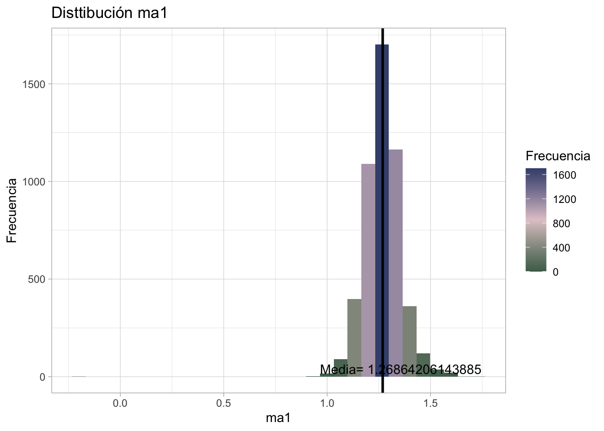

# Markov Switching Regime Model

## Motivación

Conforme vamos avanzando en las lecciones hemos construido modelos que consideran --concretamente-- más y más particularidades de las series de tiempo. Realmente, lo más complicado de las series de tiempo es la presencia de la volatilidad. Cuando vimos $GARCH$ pudimos ver una manera de modelarla; sin embargo, en esta lección consideraremos distintas dinámicas de volatilidad y como -- puede haber comportamientos distintos en momentos de expansión y contracción económica. Veremos en concreto qué tan posible es ver estos cambios de una dinámica a otra --cambios de régimen-- y adaptarnos a estos cambios para hacer mejores ajustes y predicciones.

  Supongamos que tenemos una serie de rendimientos $r_t$ que tiene dos estados de Markov con diferentes primas de riesgo y diferentes dinámicas GARCH:
    \begin{equation}
    (\#eq:GARCHM)
r_t = \left\lbrace
\begin{array}{ll}
\beta_1\sqrt{h_t}+\sqrt{h_t}\epsilon_t, \quad h_t=\alpha_{10}+\alpha_{11}h_{t-1}+\alpha_{12}a^2_{t-1}\quad\mathrm{ si } \quad s_t=1\\
\beta_2\sqrt{h_t}+\sqrt{h_t}\epsilon_t,\quad h_t=\alpha_{20}+\alpha_{21}h_{t-1}+\alpha_{22}a^2_{t-1}\quad\mathrm{ si } \quad s_t=2
\end{array}
\right.
\end{equation}

Donde $a_t=\sqrt{h_t}\epsilon_t$ son los residuos y ${\epsilon_t}$ es una secuencia Gausiana de ruido blanco con media $0$ y varianza $1$. La probabilidad de transicionar de un régimen a otro esta descrita por:
\begin{equation}
    P(s_t=2|s_{t-1}=1)=e_1,\quad P(s_t=1|s_{t-1}=2)=e_2
\end{equation}

Donde $e_i$ va de 0 a 1 y un valor muy pequeño de $e_i$ significa que la serie de tiempo tiene una tendencia muy alta de quedarse en el régimen i con una duración de $\frac{1}{e_i}$. Asumiendo que $\beta_1<\beta_2$ por lo que el régimen 2 tiene una prima por riesgo mayor. Un caso particular e interesante es si $\alpha_{1j}=\alpha_{2j}$ para todas las jotas entonces tenemos un simple GARCH. Por lo que si $\beta_i\sqrt{h_t}$ es remplazado por $\beta_i$, entonces el modelo \@ref(eq:GARCHM) es un Modelo de cambio de régimen de Markov: $GARCH-M$.

 Por simplicidad, asumiremos que la volatilidad $h_1$ tiene el mismo valor que la varianza muestral de $r_t$. El modelo tradicional la volatilidad debe ser calculada como un parámetro cualquiera. Sin embargo, al fijar $h_1$ simplificamos las cosas y con una muestra grande no debería importar.
    
Así pues, los modelos de $GARCH-M$ son $\beta=(\beta_1,\beta_2)^{'}$, $\alpha=(\alpha_{i0},alpha_{i1},alpha_{i2})^{'}$, vector de transición $e=(e_1,e_2)^{'}$, el vector de estado $S=(s_1,s_2,\dots,s_n)^{'}$ y el vector de volatilidad es $H=(h_2,\dots,h_n)^{'}$. Dado que hay dependencia del retorno en la volatilidad, entonces también sabemos que esta serialmente correlacionado, por lo que se puede predecir el retorno. Sin embargo, la predicción es complicada debido a que hay muchas combinaciones entre todos las configuraciones. Por ello, usaremos el método de Gibbs solo las siguientes:
    $$f(\beta|R,S,H,\alpha_1,\alpha_2), \quad f(\alpha_1|R,S,H,\alpha_{j\neq i}),$$
    $$P(S|R,h_1,\alpha_1,\alpha_2),\quad f(e_i|S), \quad\mathrm{ para } i=1,2$$
    Donde R es la colección de todos los retornos observados y las distribuciones son:
    $$\beta_i\sim N(\beta_{io},\sigma^2_{io}), \quad e_i\sim Beta(\gamma{i1},\gamma{i2})$$ Cabe mencionar que la distribucion anterior de $\alpha_{ij}$ es uniforme sobre un intervalo bien especificado
    

La distribución posterior de $\beta_i$ depende solamente del régimen i en el que está. 
   \begin{equation}
r_t = \left\lbrace
\begin{array}{ll}
\frac{r_t}{\sqrt{h_t}} \quad\mathrm{ si } s_t=i\\
0\quad\mathrm{ c.o.c }
\end{array}
\right.
\end{equation}
Por lo que tenemos:
\begin{equation}
    r_{it}=\beta_i+\epsilon_t,\quad \mathrm{si }s_t=i
\end{equation}

En consecuencia, la informacion en $\beta_i$ está contenida en la media muestral de $r_{it}$. $\bar{r_i}=(\sum_{s_t=i}r_{it}/n_i$ donde la suma son los puntos en el régimen i y $n_i$ es la cantidad de numero es ese punto. Por lo mimso, la distribucion posterior condicional de $\beta_i$ es normal con media en $\beta_i^*$ y varianza $\sigma^{2*}_i$, donde,

\begin{equation}
    \frac{1}{\sigma^{2*}_i}=n_i+\frac{1}{\sigma^{2*}_{io}}, \quad \beta_i^*=\sigma^{2*}_{i}(n_i\bar{r_i}+\beta{io}/\sigma^{2}_{io})
\end{equation}

Los parametros $\alpha_ij$ pueden ser definidos usando el metodo _Griddy Gibbs_. Dado $h_i,S,\alpha_{v\neq i}$y $\alpha_{iv}$ tenemos la distribucion condicional posterior se ve:
    

$$ f(\alpha_{ij}|.) \alpha - \frac{1}{2} \left[ ln(h_t) + \frac{(r_t-\beta_i \sqrt{ht})^{2}}{h_t}\right],  \quad \mathrm{ para } \quad s_t=i $$

    
Y se evaluan estos puntos en un intervalo bien definido porque $0\geq\alpha_{11}<\alpha_{12}$\\

La distribucion condicional posterior de $e_i$ solo toma en cuenta $S$. Donde $l_t$ es el numero de cambios del regimen 1 a 2 y $l_2$ al revés, tenemos que $n_i$ es el numero de puntos en el estado i.Su distribución es $Beta(\gamma_{i1}+l_i,\gamma_{i2}+n_i-l_i)$.

Finalmente, los elementos de S de pueden definir uno por uno. Donde $S_{-j}$ es el vector al quitar $s_j$ de S, $s_j$ tiene dos posibilidades ($s_j=1$ o $s_j=2$) y si distribución condicional posterior es:
    \begin{equation}
        P(s_j|.)\alpha\prod_{t=j}^nf(a_t|H)P(s_j|S_{-j})    
        \end{equation}
  
La probabilidad esta dada por:
$$P(s:j=i|s_{-k}=P(s_{j=i}|s_{j-1},s_{j+1}),\quad i=1,2$$
Adicionalmente, asumiento que $s_j=i$, uno puede computar h_t para $t\geq j$. La funcion de verosimilitud, denodtada por $L(S_j)$ está dada por:

\begin{equation}
    L(s_j=i)\equiv\prod_{t=j}^nf(a_t|H)\alpha exp(f_{ji}), \quad f_{ji}=\sum_{t=j}^n
-\frac{1}{2}\left[ln(h_t)+\frac{a_t^2}{h_t}\right]
\end{equation}

Donde $a_t$ puede ser $a_t=r_t-\beta_1\sqrt{h_t}$ o $a_t=r_t-\beta_2\sqrt{h_t}$, por lo que la probabilidad de estar en el régimen $s_j=1$ es:

\begin{equation}
    P(s_j=1|.)=\frac{P(s_j=1|s_{j-1},s_{j+1})L(s_j=1)}{P(s_j=1|s_{j-1},s_{j+1})L(s_j=1)+P(s_j=2|s_{j-1},s_{j+1})L(s_j=2)}
\end{equation}

Por lo que el régimen $s_j$ puede ser dibujado fácilmente como una distribución uniforme con intervalo $[0,1]$.

## Ejemplo

```r
#install.packages("pacman")
#pacman nos permite cargar varias librerias en una sola línea
library(pacman)
pacman::p_load(tidyverse,BatchGetSymbols,ggplot2,lubridate,readxl,forecast,stats,stargazer,knitr,tseries,aTSA, TSA, rugarch, MSwM, MSGARCH, fGarch, ggpubr, knitr, MSGARCH,paletteer,MetBrewer)
library(MSGARCH)
```


```r
#Primero determinamos el lapso de tiempo
pd<-as.Date("2002/9/30") #primer fecha
pd
#> [1] "2002-09-30"
#> [1] "2021-09-18"
ld<- as.Date("2021/09/30")#última fecha
ld
#> [1] "2021-09-30"
#Intervalos de tiempo
int<-"monthly"

#Datos a elegir
dt<-c("AMZN")

#Descargando los valores
data1<- BatchGetSymbols(tickers = dt,
                       first.date = pd,
                       last.date = ld,
                       freq.data = int,
                       do.cache = FALSE,
                       thresh.bad.data = 0)

#Generando data frame con los valores
data_precio_amzn<-data1$df.tickers
colnames(data_precio_amzn)
#>  [1] "ticker"              "ref.date"           
#>  [3] "volume"              "price.open"         
#>  [5] "price.high"          "price.low"          
#>  [7] "price.close"         "price.adjusted"     
#>  [9] "ret.adjusted.prices" "ret.closing.prices"
```


```r
#original
price_amazn_ts<-ts(data_precio_amzn$price.open, frequency = 12, start=c(2002,09))
#logartimo
lprice_amazn_ts<-ts(log(data_precio_amzn$price.open), frequency = 12,start=c(2002,09))
#diferencias logaritmicas(cambio porcential)
dlprice_amazn_ts<-ts(log(data_precio_amzn$price.open)-lag(log(data_precio_amzn$price.open),1), frequency = 12, start=c(2002,10))
dlprice_amazn_ts<-na.omit(dlprice_amazn_ts)
```


```r
# GARCH creado el capitulo pasado
garch.amzn <- ugarchspec(mean.model = list(armaOrder=c(0,2,1)),
                         variance.model = list(garchOrder=c(0,1,1)))
garch.amzn011 <- ugarchfit(spec = garch.amzn, 
                           data = price_amazn_ts)
garch.amzn011
#> 
#> *---------------------------------*
#> *          GARCH Model Fit        *
#> *---------------------------------*
#> 
#> Conditional Variance Dynamics 	
#> -----------------------------------
#> GARCH Model	: sGARCH(0,1)
#> Mean Model	: ARFIMA(0,0,2)
#> Distribution	: norm 
#> 
#> Optimal Parameters
#> ------------------------------------
#>        Estimate  Std. Error   t value Pr(>|t|)
#> mu     24.95198    3.157546    7.9023    0e+00
#> ma1     1.30976    0.030288   43.2438    0e+00
#> ma2     0.92045    0.027681   33.2521    0e+00
#> omega   0.85535    0.187792    4.5547    5e-06
#> beta1   0.99900    0.000742 1345.5614    0e+00
#> 
#> Robust Standard Errors:
#>        Estimate  Std. Error   t value Pr(>|t|)
#> mu     24.95198    4.118254    6.0589 0.000000
#> ma1     1.30976    0.025642   51.0793 0.000000
#> ma2     0.92045    0.026220   35.1049 0.000000
#> omega   0.85535    0.331671    2.5789 0.009912
#> beta1   0.99900    0.000605 1651.1260 0.000000
#> 
#> LogLikelihood : -944.8252 
#> 
#> Information Criteria
#> ------------------------------------
#>                    
#> Akaike       8.2954
#> Bayes        8.3704
#> Shibata      8.2945
#> Hannan-Quinn 8.3257
#> 
#> Weighted Ljung-Box Test on Standardized Residuals
#> ------------------------------------
#>                         statistic p-value
#> Lag[1]                      121.1       0
#> Lag[2*(p+q)+(p+q)-1][5]     419.8       0
#> Lag[4*(p+q)+(p+q)-1][9]     673.2       0
#> d.o.f=2
#> H0 : No serial correlation
#> 
#> Weighted Ljung-Box Test on Standardized Squared Residuals
#> ------------------------------------
#>                         statistic p-value
#> Lag[1]                      75.93       0
#> Lag[2*(p+q)+(p+q)-1][2]    140.42       0
#> Lag[4*(p+q)+(p+q)-1][5]    289.77       0
#> d.o.f=1
#> 
#> Weighted ARCH LM Tests
#> ------------------------------------
#>             Statistic Shape Scale P-Value
#> ARCH Lag[2]     126.7 0.500 2.000       0
#> ARCH Lag[4]     239.1 1.397 1.611       0
#> ARCH Lag[6]     322.8 2.222 1.500       0
#> 
#> Nyblom stability test
#> ------------------------------------
#> Joint Statistic:  75.7755
#> Individual Statistics:              
#> mu    12.39823
#> ma1    0.01388
#> ma2    0.61855
#> omega  4.26665
#> beta1  3.42184
#> 
#> Asymptotic Critical Values (10% 5% 1%)
#> Joint Statistic:     	 1.28 1.47 1.88
#> Individual Statistic:	 0.35 0.47 0.75
#> 
#> Sign Bias Test
#> ------------------------------------
#>                      t-value      prob sig
#> Sign Bias            1.17559 2.410e-01    
#> Negative Sign Bias   0.08769 9.302e-01    
#> Positive Sign Bias   8.59226 1.470e-15 ***
#> Joint Effect       175.55530 8.040e-38 ***
#> 
#> 
#> Adjusted Pearson Goodness-of-Fit Test:
#> ------------------------------------
#>   group statistic p-value(g-1)
#> 1    20     305.9    1.214e-53
#> 2    30     315.1    8.413e-50
#> 3    40     331.2    5.579e-48
#> 4    50     337.6    9.995e-45
#> 
#> 
#> Elapsed time : 0.1398311
```

### Cambio de Régimen
Asumiendo que es de GARCH(1,1) y que no ha ARIMA, podemos calcular la cantidad de regímenes con el paquete MSGARCH.

```r
#Definimos las caracteristicas
spec <- CreateSpec(
      variance.spec = list(model = c("sGARCH")),
      distribution.spec = list(distribution = c("norm")),
      switch.spec = list(do.mix = FALSE, K = 2),
      constraint.spec = list(fixed = list(), regime.const = NULL),
      prior = list(mean = list(), sd = list())
)
summary(spec)
#> Specification type: Markov-switching
#> Specification name: sGARCH_norm sGARCH_norm
#> Number of parameters in each variance model: 3 3
#> Number of parameters in each distribution: 0 0
#> ------------------------------------------
#> Fixed parameters:
#> None
#> ------------------------------------------
#> Across regime constrained parameters:
#> None
#> ------------------------------------------
#Corremos el calculo de los regímenes
#maximum likelihood
fit.ml <- FitML(spec, dlprice_amazn_ts, ctr = list())
fit.ml
#> Specification type: Markov-switching
#> Specification name: sGARCH_norm sGARCH_norm
#> Number of parameters in each variance model: 3 3
#> Number of parameters in each distribution: 0 0
#> ------------------------------------------
#> Fixed parameters:
#> None
#> ------------------------------------------
#> Across regime constrained parameters:
#> None
#> ------------------------------------------
#> Fitted parameters:
#>          Estimate Std. Error  t value  Pr(>|t|)
#> alpha0_1   0.0018     0.0018   0.9788 1.638e-01
#> alpha1_1   0.0457     0.0935   0.4885 3.126e-01
#> beta_1     0.6847     0.2768   2.4734 6.693e-03
#> alpha0_2   0.0000     0.0020   0.0053 4.979e-01
#> alpha1_2   0.0000     0.0043   0.0043 4.983e-01
#> beta_2     0.9994     0.1040   9.6103    <1e-16
#> P_1_1      0.9954     0.0069 144.2269    <1e-16
#> P_2_1      0.0056     0.0060   0.9408 1.734e-01
#> ------------------------------------------
#> Transition matrix:
#>       t+1|k=1 t+1|k=2
#> t|k=1  0.9954  0.0046
#> t|k=2  0.0056  0.9944
#> ------------------------------------------
#> Stable probabilities:
#> State 1 State 2 
#>  0.5521  0.4479 
#> ------------------------------------------
#> LL: 194.849
#> AIC: -373.6981
#> BIC: -346.2633
#> ------------------------------------------

#simulación bayesiana de monte carlo
set.seed(1234)
fit.mcmc <- FitMCMC(spec, dlprice_amazn_ts, ctr = list())
fit.mcmc
#> Specification type: Markov-switching
#> Specification name: sGARCH_norm sGARCH_norm
#> Number of parameters in each variance model: 3 3
#> Number of parameters in each distribution: 0 0
#> ------------------------------------------
#> Fixed parameters:
#> None
#> ------------------------------------------
#> Across regime constrained parameters:
#> None
#> ------------------------------------------
#> Posterior sample (size: 1000)
#>            Mean     SD     SE   TSSE    RNE
#> alpha0_1 0.0041 0.0022 0.0001 0.0002 0.0875
#> alpha1_1 0.1429 0.0785 0.0025 0.0039 0.4022
#> beta_1   0.4299 0.2350 0.0074 0.0277 0.0719
#> alpha0_2 0.1164 0.2122 0.0067 0.0178 0.1426
#> alpha1_2 0.2857 0.2169 0.0069 0.0122 0.3181
#> beta_2   0.4039 0.1613 0.0051 0.0095 0.2856
#> P_1_1    0.9577 0.0315 0.0010 0.0017 0.3345
#> P_2_1    0.7307 0.2221 0.0070 0.0124 0.3196
#> ------------------------------------------
#> Posterior mean transition matrix:
#>       t+1|k=1 t+1|k=2
#> t|k=1  0.9577  0.0423
#> t|k=2  0.7307  0.2693
#> ------------------------------------------
#> Posterior mean stable probabilities:
#> State 1 State 2 
#>  0.9453  0.0547 
#> ------------------------------------------
#> Acceptance rate MCMC sampler: 28.2%
#> nmcmc: 10000
#> nburn: 5000
#> nthin: 10
#> ------------------------------------------
#> DIC: -366.1017
#> ------------------------------------------

P.matrix <- matrix(c(0.9577,0.7307,0.0423,0.2693),2,2)
t.end <- 100

s0 <- 1 
st <- function(i) sample(1:2,1,prob = P.matrix[i,])

s <- st(s0)
for(t in 2:t.end) {
  s <- c(s,st(s[t-1]))
}
```


```r
plot(s, pch = 20,cex = 0.5)
```

<div class="figure">

<p class="caption">(\#fig:simplot)Simulacion de las trancisiones del primer y segundo régimen</p>
</div>

### Simulación de Monte Carlo
Utilizando el modelo GARCH utilizado en el capítulo pasado podemos haccer una simulacion de los coeficientes. Esto para ver si, dado una simulacion Monte Carlo, son consistentes a lo que calculamos.


```r
#-------------------------
# SIMULACIÓN
#-------------------------
dist <- ugarchdistribution(garch.amzn011, n.sim = 100, m.sim = 5000, n.start = 10, rseed = 1234)
dist.garch.amzn011 <- as.data.frame(dist)

#-------------------------
# Coeficientes iterados
#-------------------------
head(dist.garch.amzn011)
#>          mu      ma1       ma2        omega     beta1
#> 1 -3.100545 1.291266 0.9193533 1.141042e-04 0.9989541
#> 2 40.541769 1.273353 0.8643736 4.861132e+00 0.9952600
#> 3 11.815010 1.300380 1.0229470 1.883227e-05 0.9987412
#> 4  4.943115 1.354630 1.0343739 6.946167e+00 0.9912582
#> 5 41.911480 1.267513 0.8490696 4.929588e-05 0.9964037
#> 6 24.796880 1.224390 0.7188740 1.122114e-05 0.9957013
```


```r
kable(as.data.frame(cbind(mu=mean(dist.garch.amzn011$mu,na.rm=TRUE),ma1=mean(dist.garch.amzn011$ma1,na.rm=TRUE),ma2=mean(dist.garch.amzn011$ma2,na.rm=TRUE),omega=mean(dist.garch.amzn011$omega,na.rm=TRUE),beat1=mean(dist.garch.amzn011$beta1,na.rm=TRUE))), "html", caption = "Medias estándar de los coeficientes")
```

<table>
<caption>(\#tab:unnamed-chunk-7)Medias estándar de los coeficientes</caption>
 <thead>
  <tr>
   <th style="text-align:right;"> mu </th>
   <th style="text-align:right;"> ma1 </th>
   <th style="text-align:right;"> ma2 </th>
   <th style="text-align:right;"> omega </th>
   <th style="text-align:right;"> beat1 </th>
  </tr>
 </thead>
<tbody>
  <tr>
   <td style="text-align:right;"> 24.99298 </td>
   <td style="text-align:right;"> 1.268642 </td>
   <td style="text-align:right;"> 0.8640634 </td>
   <td style="text-align:right;"> 9.965659 </td>
   <td style="text-align:right;"> 0.9874355 </td>
  </tr>
</tbody>
</table>


```r
kable(as.data.frame(cbind(mu=sd(dist.garch.amzn011$mu,na.rm=TRUE),ma1=sd(dist.garch.amzn011$ma1,na.rm=TRUE),ma2=sd(dist.garch.amzn011$ma2,na.rm=TRUE),omega=sd(dist.garch.amzn011$omega,na.rm=TRUE),beat1=sd(dist.garch.amzn011$beta1,na.rm=TRUE))),"html", caption = "Desviaciones estándar de los coeficientes")
```

<table>
<caption>(\#tab:unnamed-chunk-8)Desviaciones estándar de los coeficientes</caption>
 <thead>
  <tr>
   <th style="text-align:right;"> mu </th>
   <th style="text-align:right;"> ma1 </th>
   <th style="text-align:right;"> ma2 </th>
   <th style="text-align:right;"> omega </th>
   <th style="text-align:right;"> beat1 </th>
  </tr>
 </thead>
<tbody>
  <tr>
   <td style="text-align:right;"> 13.2315 </td>
   <td style="text-align:right;"> 0.0877943 </td>
   <td style="text-align:right;"> 0.1069285 </td>
   <td style="text-align:right;"> 37.35116 </td>
   <td style="text-align:right;"> 0.0442266 </td>
  </tr>
</tbody>
</table>


```r
#-------------
# PALETTE
#-------------
palette <- met.brewer(name="Monet", n=3)
```

Veamos los histogramas de los coeficientes

```
#> Warning: Using `size` aesthetic for lines was deprecated in ggplot2
#> 3.4.0.
#> ℹ Please use `linewidth` instead.
#> Warning: The dot-dot notation (`..count..`) was deprecated in
#> ggplot2 3.4.0.
#> ℹ Please use `after_stat(count)` instead.
#> `stat_bin()` using `bins = 30`. Pick better value with
#> `binwidth`.
#> Warning: Removed 2 rows containing non-finite values
#> (`stat_bin()`).
```

<div class="figure">

<p class="caption">(\#fig:Mu)Histograma de $\mu$</p>
</div>


```
#> `stat_bin()` using `bins = 30`. Pick better value with
#> `binwidth`.
#> Warning: Removed 2 rows containing non-finite values
#> (`stat_bin()`).
```

<div class="figure">

<p class="caption">(\#fig:Ma1)Histograma de $MA_1$</p>
</div>


```
#> `stat_bin()` using `bins = 30`. Pick better value with
#> `binwidth`.
#> Warning: Removed 2 rows containing non-finite values
#> (`stat_bin()`).
```

<div class="figure">

<p class="caption">(\#fig:Ma2)Histograma de $MA_2$</p>
</div>


```
#> `stat_bin()` using `bins = 30`. Pick better value with
#> `binwidth`.
#> Warning: Removed 2 rows containing non-finite values
#> (`stat_bin()`).
```

<div class="figure">

<p class="caption">(\#fig:omega)Histograma de $\Omega$</p>
</div>


```
#> `stat_bin()` using `bins = 30`. Pick better value with
#> `binwidth`.
#> Warning: Removed 2 rows containing non-finite values
#> (`stat_bin()`).
```

<div class="figure">

<p class="caption">(\#fig:beta1)Histograma de $eta_1$</p>
</div>

Evidentemente esto demuestra que si convergen a los valores estimados.
