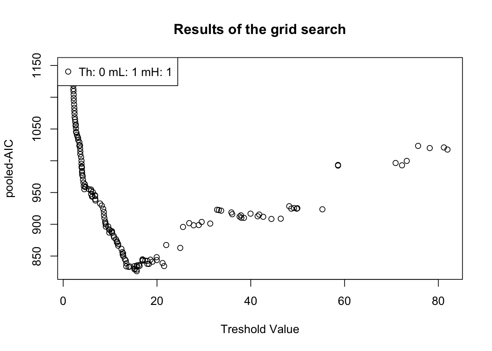
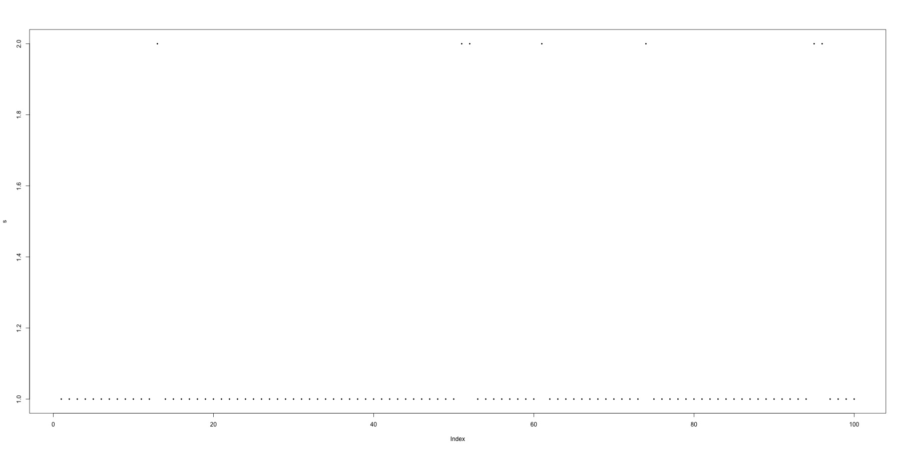

# SETAR-STAR-LINEAR-TEST

## SETAR Y STAR

Como lo estudiamos en el capitulo anterior, existen muchos modelos de cambio de régimen.
Otro de los modelos más utilizados es el _Self-Exciting Threshold Autorregressive model_ o (SETAR) por sus siglas. Este modelo se denota de la siguiente manera, veamos AR(1):

\begin{equation}
y_t = \left\lbrace
\begin{array}{ll}
\phi_{0,1}+\phi_{1,1}y_{t-1}+\epsilon_t\mathrm{ si }  y_{t-1}\leq c\\
\phi_{0,2}+\phi_{1,2}y_{t-1}+\epsilon_t\mathrm{ si }  y_{t-1}>c
\end{array}
\right.
\end{equation}

Donde c representa un limite el cual determina el régimen en el que nos encontramos y $\epsilon$ es una serie de ruido blanco condicional a la historia que esta denotada por $\Omega_{t-1}=(y_{t-1},y_{t-2}, \dots, y_{1-(p-1)}, y_{t-p})$ y su valor esperado $E[\epsilon_t|\Omega_{t-1}]=0$ y $E[\epsilon_t^2|\Omega_{t-1}]=\sigma^2$.

Queda claro que el cambio se hace de manera discreta; sin embargo, se puede construir un modelo continuo donde se construye un indicador contiunuo $G(y_t-1;\gamma,c)$ que cambia suavizadamente a  de 0 a 1 cuando $y_{t-1}$ aumenta. Se ve así y se le conoce como __Smooth Transition Auto-Regressive Model__ (STAR):

\begin{equation}
    y_t=(\phi_{0,1}+\phi_{1,1}y_{t-1})(1-G(y_t-1;\gamma,c)+ y_t=(\phi_{0,2}+\phi_{1,2}y_{t-1})(G(y_t-1;\gamma,c))
\end{equation}

En práctica realmente no siempre se utilizan modelos de AR(1), por lo mismo de órdenes más altos vemos:
    \begin{equation}
y_t = \left\lbrace
\begin{array}{ll}
\phi_{0,1}+\phi_{1,1}y_{t-1}+\dots+\phi_{p_{1},1}y_{t-p_1}+\epsilon_t\mathrm{ si }  y_{t-1}\leq c\\
\phi_{0,2}+\phi_{1,2}y_{t-1}+\dots+\phi_{p_{2},2}y_{t-p_2}+\epsilon_t\mathrm{ si }  y_{t-1}>c
\end{array}
\right.
\end{equation}

SETAR(p) se ve así:

\begin{equation}
 
   y_t=(\phi_{0,1}+\phi_{1,1}y_{t-1}+\dots+\phi_{p_{1},1}y_{t-p_1})(1-G(y_t-1;\gamma,c)+ y_t=(\phi_{0,2}+\phi_{1,2}y_{t-1}+\dots+\phi_{p_{2},2}y_{t-p_2})(G(y_t-1;\gamma,c))
\end{equation}

### SETAR EJEMPLO


```r
#---------------------
# Dependencias
#---------------------

#install.packages("pacman")
#pacman nos permite cargar varias librerias en una sola línea
library(pacman)
pacman::p_load(tidyverse,BatchGetSymbols,ggplot2,lubridate,readxl,forecast,stats,stargazer,knitr,tseries,aTSA, TSA, rugarch, MSwM, MSGARCH, fGarch, ggpubr, knitr, MSGARCH, paletteer, MetBrewer, tsDyn, knitr)
```


```r
#Primero determinamos el lapso de tiempo
pd<-as.Date("2002/9/30") #primer fecha
pd
#> [1] "2002-09-30"
#> [1] "2021-09-18"
ld<- as.Date("2021/09/30")#última fecha
ld
#> [1] "2021-09-30"
#Intervalos de tiempo
int<-"monthly"

#Datos a elegir
dt<-c("AMZN")

#Descargando los valores
data1<- BatchGetSymbols(tickers = dt,
                       first.date = pd,
                       last.date = ld,
                       freq.data = int,
                       do.cache = FALSE,
                       thresh.bad.data = 0)

#Generando data frame con los valores
data_precio_amzn<-data1$df.tickers
colnames(data_precio_amzn)
#>  [1] "ticker"              "ref.date"           
#>  [3] "volume"              "price.open"         
#>  [5] "price.high"          "price.low"          
#>  [7] "price.close"         "price.adjusted"     
#>  [9] "ret.adjusted.prices" "ret.closing.prices"
```


```r
#original
price_amazn_ts<-ts(data_precio_amzn$price.open, frequency = 12, start=c(2002,09))
#logartimo
lprice_amazn_ts<-ts(log(data_precio_amzn$price.open), frequency = 12,start=c(2002,09))
#diferencias logaritmicas(cambio porcential)
dlprice_amazn_ts<-ts(log(data_precio_amzn$price.open)-lag(log(data_precio_amzn$price.open),1), frequency = 12, start=c(2002,10))
dlprice_amazn_ts<-na.omit(dlprice_amazn_ts)
```


```r
selectSETAR(price_amazn_ts, m=1)
#> Using maximum autoregressive order for low regime: mL = 1 
#> Using maximum autoregressive order for high regime: mH = 1 
#> Searching on 158 possible threshold values within regimes with sufficient ( 15% ) number of observations
#> Searching on  158  combinations of thresholds ( 158 ), thDelay ( 1 ), mL ( 1 ) and MM ( 1 )
```



```
#> Results of the grid search for 1 threshold
#>    thDelay mL mH      th pooled-AIC
#> 1        0  1  1 15.6845   826.1945
#> 2        0  1  1 15.6295   828.5923
#> 3        0  1  1 15.2065   829.0579
#> 4        0  1  1 15.3120   830.3599
#> 5        0  1  1 13.9500   832.8452
#> 6        0  1  1 15.6290   833.4052
#> 7        0  1  1 14.2365   833.6059
#> 8        0  1  1 13.4480   833.8387
#> 9        0  1  1 15.1540   834.0295
#> 10       0  1  1 21.5200   834.2624
setar <- setar(price_amazn_ts, m=2, mL=1, MH=1, thDelay=0)
#> Warning: Possible unit root in the low regime. Roots are:
#> 0.9745
summary(setar)
#> 
#> Non linear autoregressive model
#> 
#> SETAR model ( 2 regimes)
#> Coefficients:
#> Low regime:
#>      const.L       phiL.1 
#> -0.002008592  1.026173699 
#> 
#> High regime:
#>   const.H    phiH.1 
#> 4.9224719 0.9787845 
#> 
#> Threshold:
#> -Variable: Z(t) = + (1) X(t)+ (0)X(t-1)
#> -Value: 49.93
#> Proportion of points in low regime: 79.74% 	 High regime: 20.26% 
#> 
#> Residuals:
#>         Min          1Q      Median          3Q         Max 
#> -22.7005989  -0.7170736  -0.0014706   0.4991115  19.1291281 
#> 
#> Fit:
#> residuals variance = 16.9,  AIC = 657, MAPE = 8.001%
#> 
#> Coefficient(s):
#> 
#>           Estimate  Std. Error  t value Pr(>|t|)    
#> const.L -0.0020086   0.4190008  -0.0048  0.99618    
#> phiL.1   1.0261737   0.0245249  41.8421  < 2e-16 ***
#> const.H  4.9224719   1.9252131   2.5568  0.01122 *  
#> phiH.1   0.9787845   0.0166682  58.7215  < 2e-16 ***
#> ---
#> Signif. codes:  
#> 0 '***' 0.001 '**' 0.01 '*' 0.05 '.' 0.1 ' ' 1
#> 
#> Threshold
#> Variable: Z(t) = + (1) X(t) + (0) X(t-1)
#> 
#> Value: 49.93
```

### STAR Ejemplo

```r
star <- star(price_amazn_ts, m=2, noRegimes=2, d = 1, trace=TRUE)
#> Using default threshold variable: thDelay=0
#> Testing linearity...   p-Value =  3.966884e-10 
#> The series is nonlinear. Incremental building procedure:
#> Building a 2 regime STAR.
#> Using default threshold variable: thDelay=0
#> Performing grid search for starting values...
#> Starting values fixed: gamma =  100 , th =  88.33759 ; SSE =  3795.842 
#> Grid search selected lower/upper bound gamma (was:  1 100 ]). 
#> 					  Might try to widen bound with arg: 'starting.control=list(gammaInt=c(1,200))'
#> Optimization algorithm converged
#> Optimized values fixed for regime 2  : gamma =  100 , th =  88.33716 ; SSE =  3795.842 
#> Finished building a MRSTAR with 2 regimes
summary(star)
#> 
#> Non linear autoregressive model
#> 
#> Multiple regime STAR model
#> 
#> Regime  1 :
#>     Linear parameters: -0.179361, 0.8515913, 0.2003287 
#> 
#> Regime  2 :
#>     Linear parameters: 0.9058675, 0.1825174, -0.2279061 
#>     Non-linear parameters:
#> 100.0000006, 88.3371573
#> 
#> Residuals:
#>          Min           1Q       Median           3Q 
#> -21.30360652  -0.79297830   0.08150576   0.50008703 
#>          Max 
#>  19.07138218 
#> 
#> Fit:
#> residuals variance = 16.58,  AIC = 659, MAPE = 8.584%
```

## Pruebas de detección lineal.

### Test SETAR

Concretamente, utilizamos los estimados del modelo SETAR para definir F que comprueba las restricciones de la hipótesis nula.
    \begin{equation}
        F(\hat{c})=n\left(\frac{\tilde{\sigma^2}-\hat{\sigma^2}}{\hat{\sigma^2}} \right)
    \end{equation}
Donde $\tilde{\sigma^2}$ es un estimado de la varianza residual. $\tilde{\sigma^2}=\sum a_{t=1}^n\tilde{\varepsilon^2_t}$ donde $\tilde{\varepsilon^2_t}=y_t-\hat{\phi^{'}}x_t$ y $\hat{\sigma^2}=\sum a_{t=1}^n\hat{\varepsilon^2_t}(c)$.

#### Ejemplo

```r
#1vs2 para indicar ARvsSETAR
setarTest(
      price_amazn_ts,
      m=1,
      thDelay = 0,
      trim = 0.1,
      nboot = 100,
      seed = 1234
)
#> Test of linearity against setar(2) and setar(3)
#> 
#>          Test Pval
#> 1vs2 7.364584 0.57
#> 1vs3 8.599106 0.97
```

Por tanto sabemos que no es lineal.


### Test STAR

 Aprovechando este test, resulta relevante tomar en cuenta variables problematicas que pueden colapsar un STAR a un simple AR. L hipótesis nula se puede expresar $H_0:\gamma=0$. Tambien si $\gamma=0$ entonces:
    \begin{equation}
        G(y_{t-1};\gamma,c)=\frac{1}{1+exp(-\gamma[t_{t-1}-c])}
    \end{equation}
    $G(y_{t-1};\gamma,c)=0.5$ para todo $x_t$ y los parámetros son iguales a $(\phi_1+\phi_2)/2$. Los parámetros $\gamma$ y $c$ pueden ser problemáticos y difíciles de identificar. Para resolver este problema se utiliza el Multiplicado de Lagrange (LM) que tiene una distribuscion $\chi^2$.
    El modelo STAR se puede reescribir:
    \begin{equation}
            (\#eq:mdstar)
    y_t=\frac{1}{2}(\phi_1+\phi_2)^{'}x_t+(\phi_2-\phi_1)^{'}x_tG^{*}(y_{t-1};\gamma,c)+\epsilon_t
\end{equation}
Donde $G^{*}(y_{t-1};\gamma,c)=G(y_{t-1};\gamma,c)-\frac{1}{2}$. La hipotesis nula hace que $G^{*}(y_{t-1};\gamma,c)=0$.  Si hacemos una aproximación de Taylor de $G^{*}(y_{t-1};\gamma,c)$:
\begin{eqnarray}
    T_1(t_{t-1};c)&\approx& G^{*}(y_{t-1};0,c)+\gamma\frac{\partial G^{*}(y_{t-1};\gamma,c)}{\partial\gamma}\bigg|_{\gamma=0}\\
    &=&\frac{1}{4}\gamma(y_{t-1}-c)
\end{eqnarray}


 Metiendo $T_1$ en $G_1^*$ obtenemos una regresión auxiliar.
    \begin{equation}
    (\#eq:regaux)
    y_t=\beta_{0,0}+\beta_0^{'}\tilde{x_t}+\beta_1^{'}\tilde{x_t}y_{t-1}+\eta
    \end{equation}
Donde $tilde{x_t}=(y_{t-1},\dots,y_{t-p})^{'}$ y $\beta_j=(\beta_{1,j},\dots,\beta_{p,j})^{'}$. La relación entre \@ref(eq:mdstar) y \@ref(eq:regaux) se ve:

\begin{eqnarray}
    \beta_{0,0}&=&(\phi_{0,1}+\phi_{0,2})/2-\frac{1}{4}\gamma c\gamma c(\phi_{0,2}-\phi_{0,1})\\
    \beta_{1,0}&=&(\phi_{1,1}+\phi_{1,2})/2-\frac{1}{4}\gamma (c(\phi_{1,2}-\phi_{1,1})-(\phi_{0,2}-\phi_{0,1}))\\
    \beta_{i,0}&=&(\phi_{i,1}+\phi_{i,2})/2-\frac{1}{4}\gamma c\gamma c(\phi_{i,2}-\phi_{i,1}),\quad i=2,\dots,p\\
    \beta_{i,1}&=&\gamma c\frac{1}{4}\gamma c(\phi_{i,2}-\phi_{i,1}),\quad i=1,\dots,p
\end{eqnarray}
En las ecuaciones de arriba podemos ver que si $\gamma=0$ en \@ref(eq:mdstar), entonces $\beta_{i,1}=0$ en \@ref(eq:regaux). Lo cual se refiere a nuestra variable de prueba en la \textbf{hipótesis nula}.$H_0^{'}:\gamma=0$ y $H_0^{''}:\beta_1=0$  Esto se distribuye como $\chi^2$ con $p$ grados de libertad. 

 Finalmente hay que hacer una especificación en la que se permite que el intercepto sea diferente, pero los coeficientes no. Es decir, $\phi_{0,1}\neq\phi_{0,2}$, pero $\phi_{i,1}=\phi_{i,2}$ donde $i=1,\dots,p$. Por su parte $G(y_{t-1};\gamma,c)$ es:
    \begin{eqnarray}
        T_3(y_{t-1};\gamma,c)&\approx&\gamma\frac{\partial G^{*}(y_{t-1};\gamma,c))}{\partial\gamma}\bigg|_{\gamma=0}+\frac{1}{6}\gamma^3\frac{\partial^3 G^{*}(y_{t-1};\gamma,c))}{\partial\gamma^3}\bigg|_{\gamma=0}\\
        &=&\frac{1}{4}\gamma(y_{t-1}-c)+\frac{1}{48}\gamma^3(y_{t-1}-c)^3
    \end{eqnarray}
    El modelo auxiliar se ve de la siguiente manera cuando evaluamos en 0.
    \begin{equation}
        (\#eq:regaux)
        y_t=\beta_{0,0}+\beta_0^{'}\tilde{x_t}+\beta_1^{'}\tilde{x_t}y_{t-1}+\beta_2^{'}\tilde{x_t}y_{t-2}+\beta_3^{'}\tilde{x_t}y_{t-3}+\eta_t.
    \end{equation}
De esta manera las pruebas son $H_0^{'}:\gamma=0$ y $H_0^{''}:\beta_1=\beta_2=\beta_3=0$ con distribución $\chi^2$ y $3p$ grados de libertad.

 Finalmente hay que hacer una especificación en la que se permite que el intercepto sea diferente, pero los coeficientes no. Es decir, $\phi_{0,1}\neq\phi_{0,2}$, pero $\phi_{i,1}=\phi_{i,2}$ donde $i=1,\dots,p$. Por su parte $G(y_{t-1};\gamma,c)$ es:
    \begin{eqnarray}
        T_3(y_{t-1};\gamma,c)&\approx&\gamma\frac{\partial G^{*}(y_{t-1};\gamma,c))}{\partial\gamma}\bigg|_{\gamma=0}+\frac{1}{6}\gamma^3\frac{\partial^3 G^{*}(y_{t-1};\gamma,c))}{\partial\gamma^3}\bigg|_{\gamma=0}\\
        &=&\frac{1}{4}\gamma(y_{t-1}-c)+\frac{1}{48}\gamma^3(y_{t-1}-c)^3
    \end{eqnarray}
    El modelo auxiliar se ve de la siguiente manera cuando evaluamos en 0.
    \begin{equation}
    (\#eq:regaux)
    y_t=\beta_{0,0}+\beta_0^{'}\tilde{x_t}+\beta_1^{'}\tilde{x_t}y_{t-1}+\beta_2^{'}\tilde{x_t}y_{t-2}+\beta_3^{'}\tilde{x_t}y_{t-3}+\eta_t.
    \end{equation}
De esta manera las pruebas son $H_0^{'}:\gamma=0$ y $H_0^{''}:\beta_1=\beta_2=\beta_3=0$ con distribución $\chi^2$ y $3p$ grados de libertad.

 El F test se puede computar 
- Estimar el modelo de la hipótesis nula regresando $y_t$ en $x_t$ y computar los residuales $\tilde{\epsilon}$ y el SSR (suma de residos al cuadrado: $SSR_0=\sum_{t=1}^n\tilde{\epsilon}^2$
-  Estimamos la regression auxiliar de $\tilde{\epsilon}$ en $x_t$ y $\tilde{x_t}y_{t-1}^j$ donde $j=1,2,3$ y obtener la suma de los errores al cuadrado $SSR_1$.
- Finalmente:
    \begin{equation}
        LM=\frac{(SSR_0-SSR_1)/3p}{SSR/(n-4p-1}
    \end{equation}

### Test MARKOV
 Ahora veamos el modelo de cambio de régimen de Markov. El test necesita de $h_t(\theta)$ que esta definido por la derivada del logaritmo de la densidad condicional definida como $f(y_t|\Omega_{t-1};\theta)$.
    
\begin{eqnarray}
    f(y_t|\Omega_{t-1};\theta)&=&f(y_t,st=1|\Omega_{t-1};\theta)+f(y_t,st=2|\Omega_{t-1};\theta)\\
    (\#eq:denscon)
    &=& \sum_{j=1}^2f(y_t,st=j|\Omega_{t-1};\theta)\cdot P(y_t|\Omega_{t-1};\theta)
\end{eqnarray}
\begin{equation}
    h_t(\theta)\equiv \frac{\partial ln[f(y_t|\Omega_{t-1};\theta)]}{\partial\theta}
\end{equation}
Para dos regímenes:
\tiny{
\begin{eqnarray}
    \frac{\partial ln[f(y_t|\Omega_{t-1};\theta)]}{\partial\theta}=\frac{1}{\sigma^2}(y_t-\phi^{'}_jx_t)x_t\cdot P(st=j|\Omega)+\frac{1}{\sigma^2}(y_{\tau}-\phi^{'}_jx_{\tau})x_{\tau}\cdot (P(st=j|\Omega_t;\theta)-P(st=j|\Omega_{t-1};\theta)
\end{eqnarray}

Por construcción, el resultado evaluado por ML estima $\hat{\theta}$ tiene media cero. $\sum_{t-1}^nh_t(\hat{\theta})$.

 Por lo mismo, se construye las estadísticas LM. Para dos regímenes agregamos variables $z_t$ que se han omitido y queremos probar contra la alternativa:
    \begin{equation}
        y_t=\phi_{0,s_t}+\phi_{1,s_t}y_{t-1}+\dots+\phi_{p,s_t}y_{t-p}+\delta^{'}z_t+\epsilon_t.
    \end{equation}
La ecuación evaluada respecto a $\delta$ --que es un vector de variable omitidas-- construye la hipótesis $H_0:\delta=0$ es igual a:

\begin{equation}
    \frac{\partial ln[f(y_t|\Omega_{t-1};\theta)]}{\partial\theta}\bigg|_{\delta=0}=\sum_{j=1}^2(y_t-\phi_j^{'}x_t)z_t\cdot P(s_t=j|\Omega_n;\hat{\theta})
\end{equation}
Donde \hat{\theta} estima el vector $\theta^{'}=(\phi_1{'},\phi_2,p_{11},p_{22},\delta)$ debajo la hipótesis nula. Por lo mismo LM se obtiene con:
\begin{equation}
    n\left(\frac{1}{n}\sum_{t=1}^nh_t(\hat{\theta)}\right)^{'}\left(\frac{1}{n}\sum_{t=1}^nh_t(\hat{\theta})h_t(\hat{\theta}^{'})\right)\left(\frac{1}{n}\sum_{t=1}^nh_t(\hat{\theta})\right)
\end{equation}
se distribuye asintóticamente $\chi^2$ con el número de variables en $z_t$.

### Test GARCH

 El test está basado en el modelo de ARCH(q). La varianza condicional es constante si los parámetros de los residuos al cuadrado ($\epsilon_{t-1}^2,i=1,\dots,q$) son iguales a cero. Por tanto, la hipótesis nula de la heterocedasticidad condicional es $H_0:\alpha_1=\dots=\alpha_q$. El LM correspondiente se computa como $nR^2$ donde n es la cantidad de datos y $R^2$ se obtiene de de la regresión de los residuos al cuadrado respecto a los $q$ lags constantes:
    
\begin{equation}
\hat{\epsilon_t^2}=\omega+\alpha_1\hat{\epsilon_{t-1}^2}+\dots+\alpha_p\hat{\epsilon_{t-p}^2}+u_t
\end{equation}
    
Por lo que donde los residuales $\hat{\epsilon_t^2}$ se obtienen del  del modelo de media condicional de la serie de tiempo observada. Se distribuye $\chi^2(q)$. Este test es equivalente a hacer uno para el GARCH(p,q)

__En el capítulo anterior al hacer las simulaciones de Monte Carlo demostramos como nuestros estimadores son consistentes y, por consiguiente, se hace cierto test demostrando que no hay necesidad de cambiar de tener más de un régimen.__ Esto se puede ver en la Figura \@ref(fig:cambgarch).

 Con la matriz:


```r
kable(P.matrix <- matrix(c(0.9577,0.7307,0.0423,0.2693),2,2), caption = "Matriz de transicion GARCH", "html")
```

<table>
<caption>(\#tab:unnamed-chunk-7)Matriz de transicion GARCH</caption>
<tbody>
  <tr>
   <td style="text-align:right;"> 0.9577 </td>
   <td style="text-align:right;"> 0.0423 </td>
  </tr>
  <tr>
   <td style="text-align:right;"> 0.7307 </td>
   <td style="text-align:right;"> 0.2693 </td>
  </tr>
</tbody>
</table>

Y el plot de las transiciones:
<div class="figure" style="text-align: center">

<p class="caption">(\#fig:cambgarch)Cambios de régimen en el modelo GARCH</p>
</div>
