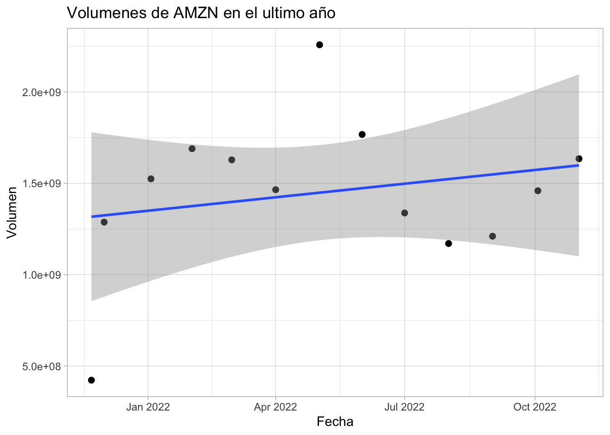

--- 
title: "Diplomado de Econometría Financiera"
author: "Benjamin Oliva y Emiliano Pérez Caullieres"
date: "2022-11-22"
site: bookdown::bookdown_site
documentclass: book
bibliography: [book.bib, packages.bib]
# url: your book url like https://bookdown.org/yihui/bookdown
# cover-image: path to the social sharing image like images/cover.jpg
description: |
  Este bookdown funciona como un recurso que muestra los códigos necesarios para el diplomado de Econometria Financiera.
biblio-style: apalike
csl: chicago-fullnote-bibliography.csl
---

# Mínimos Cuadrados Ordinarios
## El problema
Recordando que el método de MCO resulta en encontrar la combinación de valores de los estimadores de los parámetros $\hat{\boldsymbol{\beta}}$ que permita minimizar la suma de los residuales (estimadores de los términos de erro $\boldsymbol{\varepsilon}$) al cuadrado dada por:

$$
    \sum^{N}_{i=1}{e^2_i} = \sum^{N}_{i = 1}{(y_i - \mathbf{X}'_i \hat{\boldsymbol{\beta}})^2}
$$

Donde $\hat{\boldsymbol{\beta}}$ denota el vector de estimadores $\hat{\beta}_1, \ldots, \hat{\beta}_K$ y dado que $(e_1, e_2, \ldots, e_n)'(e_1, e_2, \ldots, e_n) = {\mathbf{e'e}}$, el problema del método de MCO consiste en resolver el problema de óptimización:

\begin{eqnarray*}
Minimizar_{\hat{\boldsymbol \beta}} S(\hat{\boldsymbol \beta})  =  Minimizar_{\hat{\boldsymbol \beta}} \mathbf{e'e} \\
    =  Minimizar_{\hat{\boldsymbol \beta}} (\mathbf{Y}-\mathbf{X}\hat{\boldsymbol \beta})'(\mathbf{Y}-\mathbf{X}\hat{\boldsymbol \beta})
\end{eqnarray*}

Expandiendo la expresión $\mathbf{e'e}$ obtenemos:
$$
    \mathbf{e'e} = \mathbf{Y'Y} - 2 \mathbf{Y'X} \hat{\boldsymbol \beta} + \hat{\boldsymbol \beta}' \mathbf{X'X}\hat{\boldsymbol \beta}
$$

De esta forma obtenemos que las condiciones necesarias de un mínimo son:

$$
    \frac{\partial S(\hat{\boldsymbol \beta})}{\partial \hat{\boldsymbol \beta}} = -2{\mathbf{X'Y}} + 2{\mathbf{X'X}} \hat{\boldsymbol{\beta}} = \mathbf{0}
$$
Y se pueden despejar las \textit{ecuaciones normales} dadas por:


Debido a que el objetivo es encontrar la matriz $\hat{\boldsymbol\beta}$ despejamos:

$$\hat{\boldsymbol \beta} = (\mathbf{X'X})^{-1}\mathbf{X'Y}
$$
$$
    \mathbf{X'X}\hat{\boldsymbol \beta} = \mathbf{X'Y}
$$

## Estimación R
Para la estimación utilizaremos el paquete "BatchGetSymbols". Este paquete nos permitirá descargar información acerca de la bolsa de valores internacional. 

### Dependencias

```r
#install.packages("pacman")
#pacman nos permite cargar varias librerias en una sola línea
library(pacman)
pacman::p_load(tidyverse,BatchGetSymbols,ggplot2, lubridate)
```

### Descarga de los valores


```r
#Primero determinamos el lapso de tiempo
pd<-Sys.Date()-365 #primer fecha
pd
#> [1] "2021-11-22"
ld<-Sys.Date() #última fecha
ld
#> [1] "2022-11-22"
#Intervalos de tiempo
int<-"monthly"
#Datos a elegir
dt<-c("AMZN")

#Descargando los valores
?BatchGetSymbols()
data<- BatchGetSymbols(tickers = dt,
                       first.date = pd,
                       last.date = ld,
                       freq.data = int,
                       do.cache = FALSE,
                       thresh.bad.data = 0)

#Generando data frame con los valores
data_precio<-data$df.tickers
colnames(data_precio)
#>  [1] "ticker"              "ref.date"           
#>  [3] "volume"              "price.open"         
#>  [5] "price.high"          "price.low"          
#>  [7] "price.close"         "price.adjusted"     
#>  [9] "ret.adjusted.prices" "ret.closing.prices"
```

### Gráficas


```r
sp_precio<-ggplot(data_precio, aes(x=ref.date, y=price.open))+geom_point(size =2, colour = "black")+labs(x="Fecha", y="Precio de apertura (USD)", title="Precio de apertura de AMZN en el ultimo año")+ theme_light()+ geom_smooth(method = lm, se = TRUE)
sp_precio
```


```r

sp_volumen<-ggplot(data_precio, aes(x=ref.date, y=volume))+geom_point(size =2, colour = "black")+labs(x="Fecha", y="Volumen", title="Volumenes de AMZN en el ultimo año")+ theme_light()+ geom_smooth(method = lm, se = TRUE)
sp_volumen
```



### Regresión lineal que optiene los coeficientes $\hat{\boldsymbol \beta}$

```r
#datos estadísticos
summary(data_precio[c("price.open","volume")])
#>    price.open        volume         
#>  Min.   :104.0   Min.   :4.224e+08  
#>  1st Qu.:122.3   1st Qu.:1.288e+09  
#>  Median :135.0   Median :1.465e+09  
#>  Mean   :140.4   Mean   :1.451e+09  
#>  3rd Qu.:164.1   3rd Qu.:1.635e+09  
#>  Max.   :183.8   Max.   :2.258e+09
#análisis de regresión lineal lm() y=precio,x=fecha
reg_tiempo_precio<-lm(price.open~ref.date, data=data_precio) 
#¡Siempre se pone dentro de lm() la variable dependiente primero y luego la independiete!
summary(reg_tiempo_precio)
#> 
#> Call:
#> lm(formula = price.open ~ ref.date, data = data_precio)
#> 
#> Residuals:
#>     Min      1Q  Median      3Q     Max 
#> -21.886  -9.705   1.750   9.191  16.846 
#> 
#> Coefficients:
#>               Estimate Std. Error t value Pr(>|t|)    
#> (Intercept) 4158.44364  605.82333   6.864 2.71e-05 ***
#> ref.date      -0.21019    0.03169  -6.633 3.70e-05 ***
#> ---
#> Signif. codes:  
#> 0 '***' 0.001 '**' 0.01 '*' 0.05 '.' 0.1 ' ' 1
#> 
#> Residual standard error: 12.71 on 11 degrees of freedom
#> Multiple R-squared:    0.8,	Adjusted R-squared:  0.7818 
#> F-statistic: 43.99 on 1 and 11 DF,  p-value: 3.697e-05

#análisis de regresión lineal lm() y=volumen,x=fecha
reg_tiempo_volumen<-lm(volume~ref.date, data=data_precio)
summary(reg_tiempo_volumen)
#> 
#> Call:
#> lm(formula = volume ~ ref.date, data = data_precio)
#> 
#> Residuals:
#>        Min         1Q     Median         3Q        Max 
#> -894976876 -160139242   36286886  230217822  809528583 
#> 
#> Coefficients:
#>               Estimate Std. Error t value Pr(>|t|)
#> (Intercept) -1.417e+10  2.035e+10  -0.696    0.501
#> ref.date     8.174e+05  1.065e+06   0.768    0.459
#> 
#> Residual standard error: 427100000 on 11 degrees of freedom
#> Multiple R-squared:  0.05085,	Adjusted R-squared:  -0.03543 
#> F-statistic: 0.5893 on 1 and 11 DF,  p-value: 0.4588
```

## Ejercicio
El objetivo de este ejrcicio es simplemente que indiquen y modifiquen los errores en el código. Así pues, deberán descomentar *-quitar las #antes del código-* para empezar el ejercicio.

### 1
El objetivo de este código es explicar  la variable __"volume"__ con la variable __"price.high"__.

```r
#reg_tiempo_ej1<-lm(price.high~volume, data=data_precio)
#sumary(reg_tiempo_ej1)

```
### 2
El objetivo de este código es explicar  la variable __"volume"__ con la variable __"price.low"__.

```r
#reg_tiempo_ej2<-lm(price.low~volume, data=data_precio)
#summary(reg_tiempo_ej1)

```

### 3 (opcional)
El objetivo de este ejercicio es descargar los valores del stock de Tesla *BMV: TSLA* en los últimos *dos años*.


```r
#dt_ej3<-("TSLA")
#pdej<-Sys.Date()-(365*3) #primer fecha
#pdej
#Descargando los valores
#dataej3<- BatchgetSymbols(tickers = dt_ej3,
                       #first.date = pdej,
                       #last.date = ld,
                       #freq.data = int,
                       #do.cache = FALSE,
                       #thresh.bad.data = 0)

#Generando data frame con los valores
#data_precio_ej2<-dataej3$df.tickers
#1colnames(data_precio_ej2)

```

