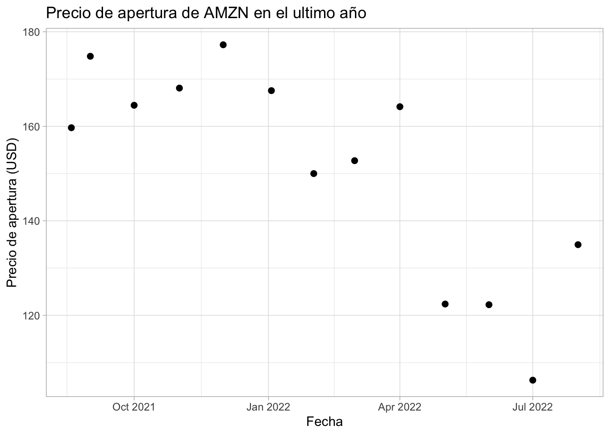
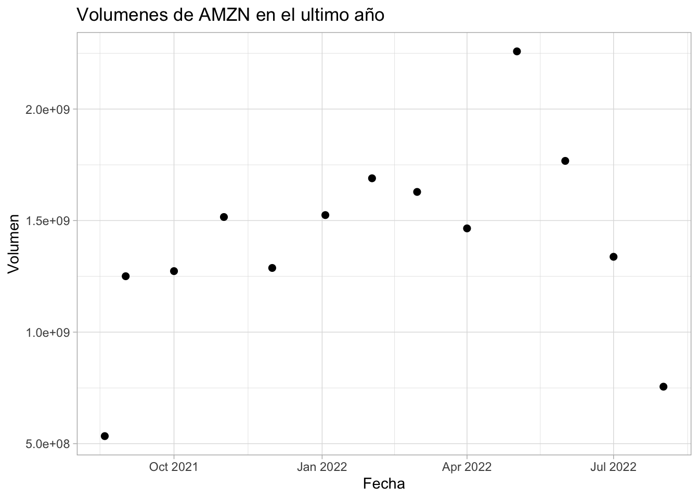

--- 
title: "A Minimal Book Example"
author: "John Doe"
date: "2022-08-19"
site: bookdown::bookdown_site
documentclass: book
bibliography: [book.bib, packages.bib]
# url: your book url like https://bookdown.org/yihui/bookdown
# cover-image: path to the social sharing image like images/cover.jpg
description: |
  This is a minimal example of using the bookdown package to write a book.
  The HTML output format for this example is bookdown::bs4_book,
  set in the _output.yml file.
biblio-style: apalike
csl: chicago-fullnote-bibliography.csl
---

# Mínimos Cuadrados Ordinarios
## El problema
Recrodando que el método de MCO resulta en encontrar la combinación de valores de los estimadores de los parámetros $\hat{\boldsymbol{\beta}}$ que permita minimizar la suma de los residuales (estimadores de los términos de erro $\boldsymbol{\varepsilon}$) al cuadrado dada por:

$$
    \sum^{N}_{i=1}{e^2_i} = \sum^{N}_{i = 1}{(y_i - \mathbf{X}'_i \hat{\boldsymbol{\beta}})^2}
$$

Donde $\hat{\boldsymbol{\beta}}$ denota el vector de estimadores $\hat{\beta}_1, \ldots, \hat{\beta}_K$ y dado que $(e_1, e_2, \ldots, e_n)'(e_1, e_2, \ldots, e_n) = {\mathbf{e'e}}$, el problema del método de MCO consiste en resolver el problema de óptimización:

\begin{eqnarray*}
Minimizar_{\hat{\boldsymbol \beta}} S(\hat{\boldsymbol \beta})  =  Minimizar_{\hat{\boldsymbol \beta}} \mathbf{e'e} \\
    =  Minimizar_{\hat{\boldsymbol \beta}} (\mathbf{Y}-\mathbf{X}\hat{\boldsymbol \beta})'(\mathbf{Y}-\mathbf{X}\hat{\boldsymbol \beta})
\end{eqnarray*}

Expandiendo la expresión $\mathbf{e'e}$ obtenemos:
$$
    \mathbf{e'e} = \mathbf{Y'Y} - 2 \mathbf{Y'X} \hat{\boldsymbol \beta} + \hat{\boldsymbol \beta}' \mathbf{X'X}\hat{\boldsymbol \beta}
$$

De esta forma obtenemos que las condiciones necesarias de un mínimo son:

$$
    \frac{\partial S(\hat{\boldsymbol \beta})}{\partial \hat{\boldsymbol \beta}} = -2{\mathbf{X'Y}} + 2{\mathbf{X'X}} \hat{\boldsymbol{\beta}} = \mathbf{0}
$$
Y se pueden despejar las \textit{ecuaciones normales} dadas por:


Debido a que el objetivo es encontrar la matriz $\hat{\boldsymbol\beta}$ despejamos:

$$\hat{\boldsymbol \beta} = (\mathbf{X'X})^{-1}\mathbf{X'Y}
$$
$$
    \mathbf{X'X}\hat{\boldsymbol \beta} = \mathbf{X'Y}
$$

##Estimación
Para la estimación utilizaremos el paquete "BatchGetSymbols". Este paquete nos permitirá descargar información acerca de la bolsa de valores internacional. 

### Dependencias

```r
#install.packages("pacman")
#pacman nos permite cargar varias librerias en una sola línea
library(pacman)
pacman::p_load(tidyverse,BatchGetSymbols,ggplot2, lubridate)
```
### Descarga de los valores

```r
#Primero determinamos el lapso de tiempo
pd<-Sys.Date()-365 #primer fecha
pd
#> [1] "2021-08-19"
ld<-Sys.Date() #última fecha
ld
#> [1] "2022-08-19"
#Intervalos de tiempo
int<-"monthly"
#Datos a elegir
dt<-c("AMZN")
#Descargando los valores
?BatchGetSymbols()
data<- BatchGetSymbols(tickers = dt,
                       first.date = pd,
                       last.date = ld,
                       freq.data = int,
                       do.cache = FALSE,
                       thresh.bad.data = 0)
#Generando data frame con los valores
data_precio<-data$df.tickers
```

### Gráficas

```r
sp_precio<-ggplot(data_precio, aes(x=ref.date, y=price.open))+geom_point(size =2, colour = "black")+labs(x="Fecha", y="Precio de apertura (USD)", title="Precio de apertura de AMZN en el ultimo año")+ theme_light()
sp_precio
```



```r

sp_volumen<-ggplot(data_precio, aes(x=ref.date, y=volume))+geom_point(size =2, colour = "black")+labs(x="Fecha", y="Volumen", title="Volumenes de AMZN en el ultimo año")+ theme_light()
sp_volumen
```



### Regresión lineal que optiene los coeficientes $\hat{\boldsymbol \beta}$

```r
#datos estadísticos
summary(data_precio[c("price.open","volume")])
#>    price.open        volume         
#>  Min.   :106.3   Min.   :5.338e+08  
#>  1st Qu.:135.0   1st Qu.:1.273e+09  
#>  Median :159.7   Median :1.465e+09  
#>  Mean   :151.1   Mean   :1.407e+09  
#>  3rd Qu.:167.6   3rd Qu.:1.628e+09  
#>  Max.   :177.2   Max.   :2.258e+09
#análisis de regresión lineal lm() y=precio,x=fecha
reg_tiempo_precio<-lm(price.open~ref.date, data=data_precio)
summary(reg_tiempo_precio)
#> 
#> Call:
#> lm(formula = price.open ~ ref.date, data = data_precio)
#> 
#> Residuals:
#>      Min       1Q   Median       3Q      Max 
#> -21.4042 -10.1319  -0.2814  11.8496  22.2175 
#> 
#> Coefficients:
#>               Estimate Std. Error t value Pr(>|t|)    
#> (Intercept) 3127.64731  671.24128   4.659 0.000694 ***
#> ref.date      -0.15646    0.03528  -4.434 0.001004 ** 
#> ---
#> Signif. codes:  
#> 0 '***' 0.001 '**' 0.01 '*' 0.05 '.' 0.1 ' ' 1
#> 
#> Residual standard error: 14.17 on 11 degrees of freedom
#> Multiple R-squared:  0.6413,	Adjusted R-squared:  0.6087 
#> F-statistic: 19.66 on 1 and 11 DF,  p-value: 0.001004

#análisis de regresión lineal lm() y=volumen,x=fecha
reg_tiempo_volumen<-lm(volume~ref.date, data=data_precio)
summary(reg_tiempo_volumen)
#> 
#> Call:
#> lm(formula = volume ~ ref.date, data = data_precio)
#> 
#> Residuals:
#>        Min         1Q     Median         3Q        Max 
#> -853671262  -49527288   15223912  212399437  751223038 
#> 
#> Coefficients:
#>               Estimate Std. Error t value Pr(>|t|)
#> (Intercept) -1.988e+10  2.050e+10  -0.970    0.353
#> ref.date     1.119e+06  1.077e+06   1.039    0.321
#> 
#> Residual standard error: 432700000 on 11 degrees of freedom
#> Multiple R-squared:  0.0893,	Adjusted R-squared:  0.006508 
#> F-statistic: 1.079 on 1 and 11 DF,  p-value: 0.3213
```

